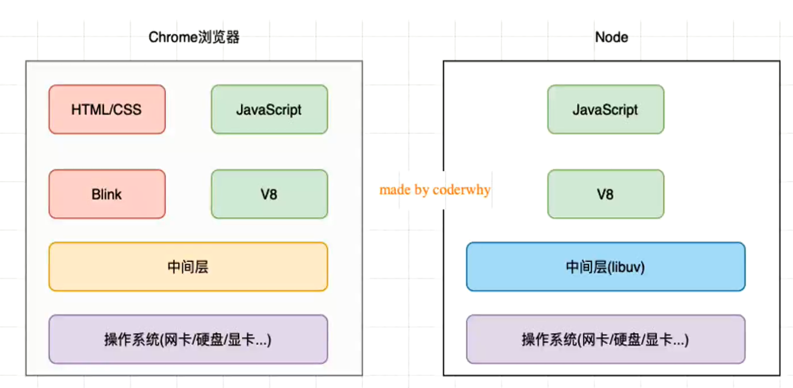

## JavaScript引擎

* **为什么需要JavaScript 引擎呢?**
  事实上我们编写的JavaScript无论你交给浏览器或者Node执行，最后都是需要被CPU执行的;

  但是CPU只认识自己的指令集，实际上是机器语言，才能被CPU所执行；
  所以我们需要JavaScript引擎帮助我们将JavaScript代码翻译成CPU指令来执行；

* 比较常见的JavaScript引擎有哪些呢?
  **SpiderMonkey**:第一款JavaScript引擎，由Brendan Eich开发（也就是JavaScript作者）;

  **Chakra**:微软开发，用于IT浏览器;
  **JavaScriptCore** : WebKit中的JavaScript引擎，Apple公司开发﹔
  **V8**: Google开发的强大JavaScript引擎，也帮助Chrome从众多浏览器中脱颖而出;

## 游览器内核与javascript引擎的关系

* 这里我们先以WebKit为例, WebKit事实上由两部分组成的:
  * WebCore : 负责HTML解析、布局、渲染等等相关的工作,当遇到<script>标签会转交给JS引擎解析
  
  * JavaScriptCore :解析、执行JavaScript代码 ;
  
    

## Node.js是什么

* 回顾:官方对Node.js的定义: 
  * Node.js是一 个基于V8 JavaScript引擎的JavaScript运行时环境。
    * Node.js@ is a JavaScript runtime built on Chrome's V8 JavaScript engine.
* 也就是说Node.js基于V8引擎来执行JavaScript的代码,但是不仅仅只有V8引擎:
  * 前面我们知道V8可以嵌入到任何C++应用程序中,无论是Chrome还是Node.js ,事实上都是嵌入了V8引擎来执行JavaScript代码;
  * 但是在Chrome浏览器中,还需要解析、渲染HTML、CSS等相关渲染引擎,另外还需要提供支持浏览器操作的API、浏览器自己的事件循环等; 
  * 另外,在Node.js中我们也需要进行一些额外的操作,比如文件系统读/写、网络IO、 加密、压缩解压文件等操作;

## 浏览器与Node.js架构的区别

## Node.js架构

* 我们来看一个单独的Node.js的架构图 :
  * 我们编写的JavaScript代码会经过V8引擎,再通过Node.js的Bindings ,将任务放到Libuv的事件循环中;
  *  libuv ( Unicorn Velociraptor-独角伶盗龙)是使用C语言编写的库;
  * libuv提供了事件循环、文件系统读写、网络IO、 线程池等等内容;

## Node的REPL

**什么是REPL?**

* REPL是Read-Eval-Print Loop的简称，翻译为“**读取-求值-输出**”循环;
* REPL是一个简单的、交互式的编程环境;