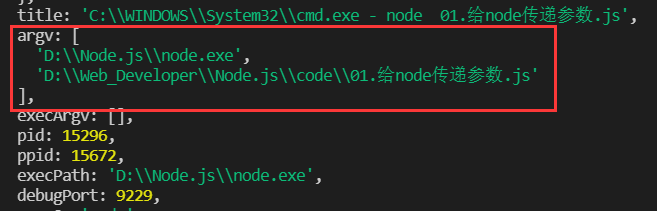
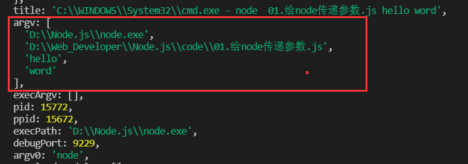

## 01、给node传递参数

node中有一个process对象，打印process会显示的process对象；// `console.log(process)` 其中有一个**argv**的对象属性

* **当执行node文件时没有传递参数时，argv数组只显示这两个，第一个表示全局node文件的位置，第二个表示所执行的js文件的位置；**
* **当使用node执行js文件时传递参数，对应的agrv数组也会添加对应的参数；**
* 
* 

**所以可以使用argv数组来调用传递的参数**