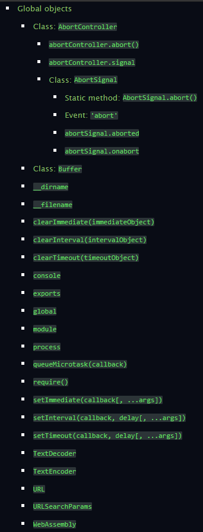
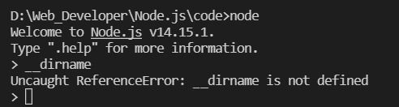

## 常见的全局对象

<br>

## 特殊的全局对象

* 为什么称之为特殊的全局对象呢?
  * 这些全局对象实际上是模块中的变量，**只是每个模块都有，看来像是全局变量;**
  * 在命令行交互中是不可以使用的;包括:**__dirname、__filename、exports、module、require()**

```js
console.log(__dirname); //D:\Web_Developer\Node.js\code  打印出所执行文件的绝对路径,没有文件名
console.log(__filename); //D:\Web_Developer\Node.js\code\03.特殊全局对象.js  打印出绝对路径且包括该文件名

//注意：这两个对象只能在模块中才能调用，不能直接在node命令行中调用，因为node命令行没有文件路径，所以称为特殊全局对象
```

直接在node命令行中调用结果，**__dirname is not defined**<br>