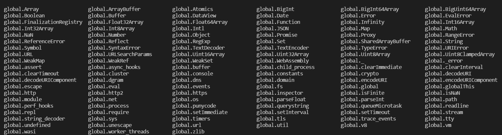
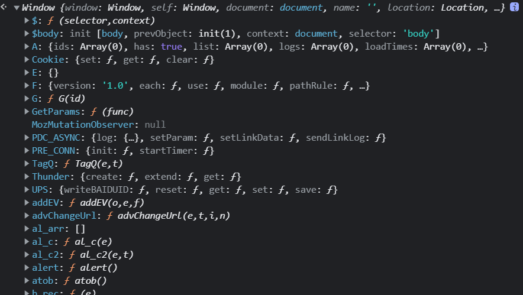
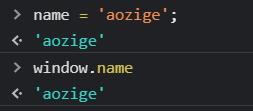
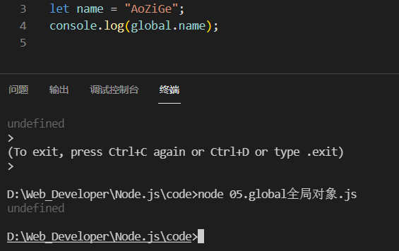

## global全局对象

* 该对象包含许多属性，在终端执行node，输入global. 再输入两次tab键即可看到所有的global对象属性

* **该对象类似于浏览器的window对象，所有的对象和属性都包含在window下面，**

* **在游览器的全局下添加一个属性也会被添加至window下面，但是在global对象下添加属性不会添加至global对象下面**

  **为什么global对象下面没有name属性了？**

  因为在游览器控制台中没有输入的变量没有模块的概念，统统都保存在window下面，而在node中是有模块的概念的，每一个js文件就是一个独立的模块互不干扰，所生成的变量只在自己的模块中。如果保存在global，则会相 互干扰，没准哪个js文件中相同的变量名就会替换掉以前的global中的变量 