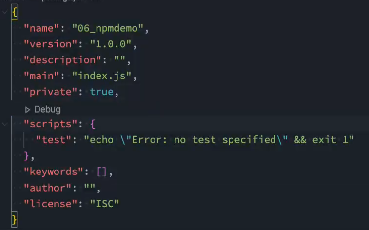

## package.json文件

- 01.npm init
  
  - 这个命令是一步步执行的，确认所配置文件的信息；
- 02.npm init -y
  
  - 默认配置package.json文件
- **常见的属性：**
  - **(必填)name**是项目的名称;
  
  - **(必填)version**是当前项目的版本号;
  
  - **(选填)description**是描述信息，很多时候是作为项目的基本描述;
  
  - **(选填)author**是作者相关信息（发布时用到);
  
  - **(选填)license**是开源协议（发布时用到);
  
  - **(选填)private属性∶**
    
    - private属性记录当前的项目是否是私有的;
    - 当值为true时，npm是不能发布它的，这是防止私有项目或模块发布出去的方式;
    
  - **(选填)scripts**属性
    
    - scripts属性用于配置一些脚本命令，以键值对的形式存在;配置后我们可以通过npm run命令的key来执行这个命令;
    - npm start和npm run start的区别是什么?
      - √它们是等价的;
      - √对于常用的start、 test、stop、restart可以省略掉run直接通过npm start等方式运行;
    
  - **(选填)dependencies**属性
    
    - dependencies属性是指定无论开发环境还是生成环境都需要依赖的包;
    - 通常是我们项目实际开发用到的一些库模块;
    - 与之对应的是devDependencies ; 
    - **如果在当前目录下面执行`npm install`则会直接安装dependencies里面所有的包版本**
    
  - **devDependencies**属性
    
    - 一些包在生成环境是不需要的，比如webpack、babel等;
    - 这个时候我们会通过npm install webpack --save-dev，将它安装到devDependencies属性中;
    - **使用`npm install`也会将所有的依赖都安装**
    
  - **我们会发现安装的依赖版本出现:^2.0.3或~2.0.3，这是什么意思呢?**
  
    - npm的包通常需要遵从semver版本规范︰
      **semver** : https://semver.org/lang/zh-CN/
      **npm semver** : https://docs.npmjs.com/misc/semver
  
    - **semver版本规范是X.Y.Z:**
      **X主版本号( major )**:当你做了不兼容的API修改（可能不兼容之前的版本）;
  
      **Y次版本号( minor )**:当你做了向下兼容的功能性新增（新功能增加，但是兼容之前的版本）;
  
      **Z修订号( patch )** :当你做了向下兼容的问题修正（没有新功能，修复了之前版本的bug ) ;
  
    - 这里解释一下^和~的区别:
      **^x.y.z**∶表示x是保持不变的，y和z永远安装最新的版本﹔
  
      **~x.y.z**∶表示x和y保持不变的，z永远安装最新的版本;
  
  - 


## package-lock.json文件

### **为什么会有package-lock.json文件**

>当我们使用了 `^` 或者 `~` 来控制依赖包版本号的时候 ，多人开发，就有可能存在大家安装的依赖包版本不一样的情况，就会存在项目运行的结果不一样。
>
>假设我们中安装了 `react`, 当我们运行安装 `npm install react -save` 的时候，在项目中的package.json 的 `react` 版本是  `react: ^18.0.0`, 我们电脑安装的vue版本就是 18.0.0 版本，我们把项目代码提交后，过了一段时间，`react `发布了新版本 18.0.1，这时新来一个同事，从新 git clone` 克隆项目，执行 `npm install`安装的时候，在他电脑的react版本就是 18.0.1了，因为^只是锁了主要版本，这样我们电脑中的react版本就会不一样，**从理论上讲（大家都遵循语义版本控制的话）**，它们应该仍然是兼容的，但也许 bugfix 会影响我们正在使用的功能，而且当使用react版本18.0.0和18.0.1运行时，我们的应用程序会产生不同的结果。

* 为了解决这个不同人电脑安装的所有依赖版本都是一致的，确保项目代码在安装所执行的运行结果都一样，这时 `package-lock.json` 就应运而生了。

### 介绍

* 官方解释
  * `package-lock.json` 它会**在 npm 更改 node_modules 目录树 或者 package.json 时自动生成的** ，它准确的描述了当前项目npm包的依赖树，并且在随后的安装中会根据 package-lock.json 来安装，保证是相同的一个依赖树，不考虑这个过程中是否有某个依赖有小版本的更新。
* 它的产生就是来对**整个依赖树进行版本固定的（锁死）**。当我们在一个项目中`npm install`时候，会自动生成一个`package-lock.json`文件，和`package.json`在同一级目录下。`package-lock.json`记录了项目的一些信息和所依赖的模块。**这样在每次安装都会出现相同的结果. 不管你在什么机器上面或什么时候安装。**当我们下次再`npm install`时候，npm 发现如果项目中有 `package-lock.json` 文件，会根据 `package-lock.json` 里的内容来处理和安装依赖而不再根据 `package.json`

### package-lock.json 生成逻辑

* 假设我们现在有三个 package，在项目 lock-test中，安装依赖A，A项目面有B，B项目面有C

  ```json
  // package lock-test
  { "name": "lock-test", "dependencies": { "A": "^1.0.0" }}
  // package A
  { "name": "A", "version": "1.0.0", "dependencies": { "B": "^1.0.0" }}
  // package B
  { "name": "B", "version": "1.0.0", "dependencies": { "C": "^1.0.0" }}
  // package C
  { "name": "C", "version": "1.0.0" }
  ```

* 在这种情况下 `package-lock.json`, 会生成类似下面铺平的结构

  ```json
  // package-lock.json
  { 
      "name": "lock-test",  
      "version": "1.0.0",  
      "dependencies": {    
          "A": { "version": "1.0.0" },
          "B": { "version": "1.0.0" },
          "C": { "version": "1.0.0" }  
      }
  }
  ```

* 如果后续无论是直接依赖的 A 发版，或者间接依赖的B, C 发版，只要我们不动 `package.json`, `package-lock.json` 都不会重新生成。

* A 发布了新版本 1.1.0，虽然我们 package.json 写的是 ^1.0.0 但是因为 `package-lock.json` 的存在，npm i 并不会自动升级，我们**可以手动运行 npm i [A@1.1.0](https://link.juejin.cn/?target=mailto%3AA%401.1.0) 来实现升级。**

* B 发布了新版本 1.0.1, 1.0.2, 1.1.0, 此刻如果我们不做操作是不会自动升级 B 的版本的，**但如果此刻 A 发布了 1.1.1，虽然并没有升级 B 的依赖，但是如果我们项目里升级 [A@1.1.1](https://link.juejin.cn?target=mailto%3AA%401.1.1)，此时 `package-lock.json` 里会把 B 直接升到 1.1.0 ,因为此刻^1.0.0的最新版本就是 1.1.0。**