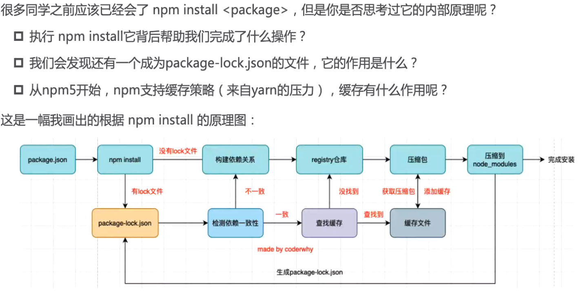

## npm install

### 01.安装npm包分两种情况:

**全局安装( global install)** : npm install yarn -g; //全局安装yarn
**全局安装( global install)** : npm install

### **02.局部安装分为开发时依赖和生产时依赖:**

* **安装开发和生产依赖**
  	`npm install axios`
  	`npm i axios`
* **开发依赖**
      `npm install webpack -- save-dev`
      `npm install webpack -D`
      `npm i webpack -D`

### 03、npm安装原理，这个很重要！！

 

- npm install会检测是有package-lock.json文件︰

  - 没有lock文件
    √分析依赖关系，这是因为我们可能包会依赖其他的包，并且多个包之间会产生相同依赖的情况;

    √从registry仓库中下载压缩包（如果我们设置了镜像，那么会从镜像服务器下载压缩包）;

    √获取到压缩包后会对压缩包进行缓存(从npm5开始有的);

    √将压缩包解压到项目的node_modules文件夹中（前面我们讲过，require的查找顺序会在该包下面查找)

  - 有lock文件

    √检测lock中包的版本是否和package.json中一致（会按照semver版本规范检测）;

    ​		>不一致，那么会重新构建依赖关系，直接会走顶层的流程;
    √一致的情况下，会去优先查找缓存
    ​		>没有找到，会从registry仓库下载，直接走顶层流程;
    √查找到，会获取缓存中的压缩文件，并且将压缩文件解压到node_modules文件夹中;

## npm与npx的区别：

* **npm执行命令会优先去全局寻找，而npx会在当前目录寻找;**
  1**.所以如果需要执行当前目录命令可以执行npx命令**
  **2.还有一种方法可以在package.json里面的script中添加自定义配置**
  	**例如：如果需要执行当前目录的webpack版本号命令，可以添加`'webpack_v':"webpack --version"`**
  	**然后执行`npm run webpcak_v`:注意：webpack_v是自定义的命令：npm在执行script命令时是优先在当前目录里面寻找，如果直接	在命令行执行`webpack --version`回优先去全局寻找的****

## npm run xxx 发生了什么

1. `npm run xxx`的时候，首先会去项目的`package.json`文件里找 `scripts` 里找对应的xxx，然后执行 xxx的命令，例如启动vue项目 `npm run serve` 的时候，实际上就是执行了`vue-cli-service serve` 这条命令。 

2. 由于操作系统中没有存在`vue-cli-service`这一条指令，会到 `node_modules/.bin/` 目录中找到`vue-cli-service` 可执行文件了。相当于执行了 `./node_modules/.bin/vue-cli-service serve`

3. 而`./node_modules/.bin/vue-cli-service serve`路径是根据安装vue是的源代码目录中的`package.json`里面得到的

   
