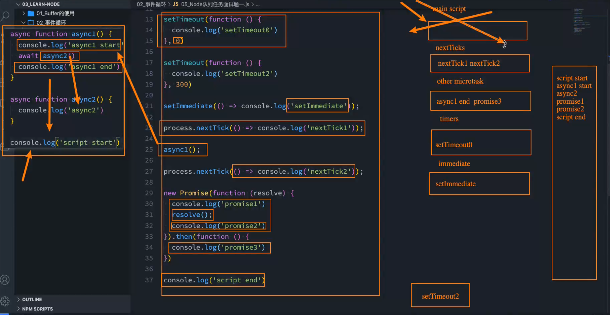

## Node事件循环阶段

**一次完整的时间循环Tick分为很多阶段**

* **定时器(Timers )**:本阶段执行已经被setTimeout()和setInterval()的调度回调函数。
* **待定回调**（ Pending Callback ):对某些系统操作（如TCP错误类型）执行回调，比如TCP连接时接收到ECONNREFUSED。
* **idle, prepare**:仅系统内部使用。
* **轮询（Poll )**:检索新的I/O事件;执行与I/O相关的回调;
* **检测**:setImmediate()回调函数在这里执行。
* **关闭的回调函数**︰一些关闭的回调函数，如: socket.on('close'，...)。

们会发现从一次事件循环的Tick来说，Node的事件循环更复杂，它也分为微任务和宏任务∶

* **宏任务( macrotask )** : setTimeout、setInterval、IO事件、setlmmediate、close事件;
* **微任务( microtask )** : Promise的then回调、process.nextTick、queueMicrotask ;  

## 事件循环面试题

```js
async function async1() {
  console.log("async1 start");
  await async2();
  console.log("async1 end");
}

async function async2() {
  console.log("async2");
}

console.log("start JS");

setTimeout(function () {
  console.log("setTimeout1");
}, 0);

setTimeout(function () {
  console.log("setTimeout2");
}, 300);

setImmediate(() => {
  console.log("setImmediate");
});

process.nextTick(() => {
  console.log("nextTick1");
});

async1();

process.nextTick(() => {
  console.log("nextTick2");
});

new Promise(function (resolve) {
  console.log("promise1");
  resolve();
  console.log("promise2");
}).then(function () {
  console.log("promise3");
});

console.log("script end");
/* 
start JS
async1 start
async2      
promise1    
promise2    
script end  
nextTick1   
nextTick2   
async1 end  
promise3    
setTimeout1
setImmediate
setTimeout2
*/
```



```js
setTimeout(() => {
  console.log("setTimeout");
}, 0);

setImmediate(() => {
  console.log("setImmediate");
});
//可能是setTimeout也可能是setImmediate先执行
```

