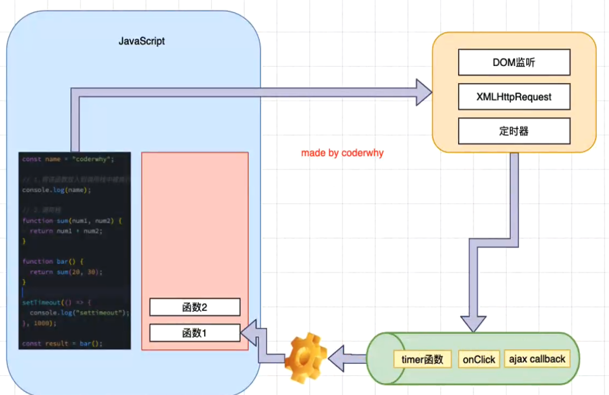
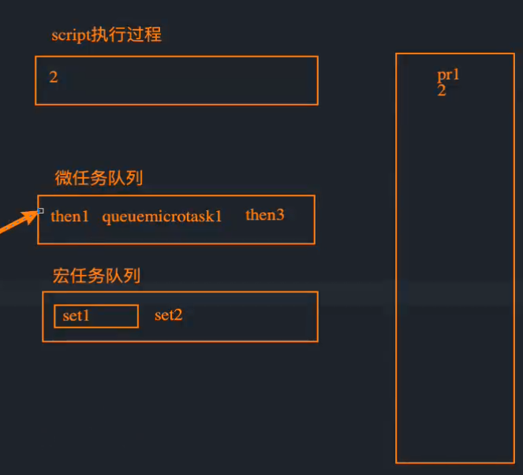
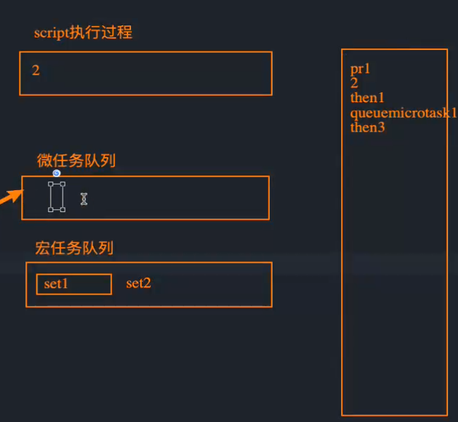
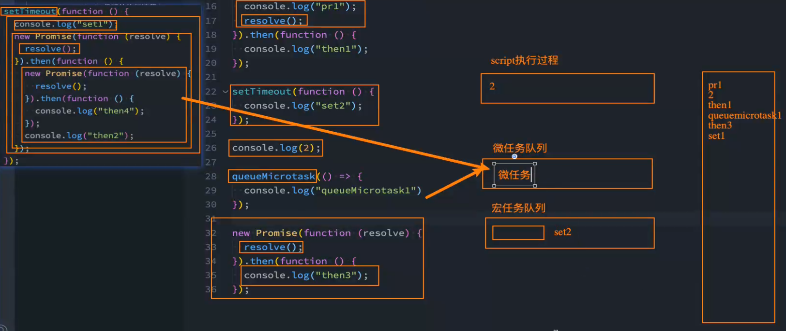
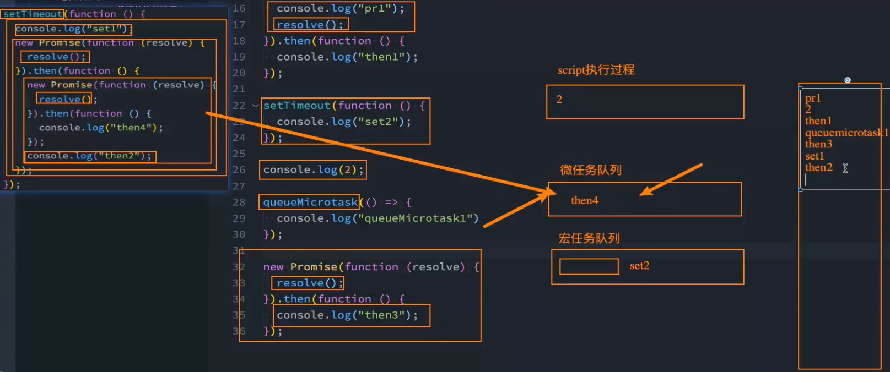
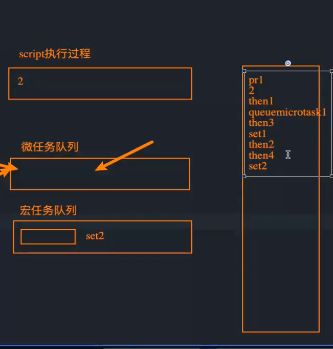

## n什么是事件循环

* **事件循环是什么?**
  	事实上我把事件循环理解成我们编写的JavaScript和浏览器或者Node之间的一个桥梁。
* **浏览器的事件循环**是一个我们编写的JavaScript代码和浏览器API调用(setTimeout/AJAX/监听事件等)的一个桥梁,桥梁之间他们通过回调函数进行沟通。
* **Node的事件循环**是一个我们编写的JavaScript代码和系统调用( file system、network等)之间的一个桥梁,桥梁之间他们通过回调函数进行沟通的.

 

* **但是事件循环中并非只维护着一个队列，事实上是有两个队列:**
  * **宏任务队列( macrotask queue )** : ajax、setTimeout、setInterval、DOM监听、UTI Rendering等
  * **微任务队列( microtask queue )** : Promise的then回调、 Mutation Observer API、queueMicrotask()等
* **那么事件循环对于两个队列的优先级是怎么样的呢?** 
  * 1.main script中的代码优先执行（编写的顶层script代码）;
  * 2.在执行任何一个宏任务之前(不是队列，是一个宏任务），都会先查看微任务队列中是否有任务需要执行
    **√也就是宏任务执行之前，必须保证微任务队列是空的;**
    **√如果不为空，那么久优先执行微任务队列中的任务（回调);**

## 关于事件循环、宏任务队列与微任务队列的面试题

### 面试题一：

```js
//setTimeout放入宏任务队列中  
setTimeout(function () {
    console.log("set1");
    new Promise(function (resolve) {
      resolve();
    }).then(function () {
      new Promise(function (resolve) {
        resolve();
      }).then(function () { 
        console.log("then4"); 
      });
      console.log("then2");
    });
  });

  //Promise执行器中的代码会与同步执行，resolve中的的代码会异步执行，放入微任务队列中
  new Promise(function (resolve) {
    console.log("pr1");//同步执行
    resolve();//异步执行，将then的代码放入微任务队列中
  }).then(function () {
    console.log("then1");
  });
	
  //放入宏任务队列
  setTimeout(function () {
    console.log("set2");
  });

  //代码同步执行
  console.log(2);

  //开启一个微任务队列，把该代码段放入微任务队列中
  queueMicrotask(() => {
    console.log("queueMicrotask1")
  });


  new Promise(function (resolve) {
    resolve();//将代码加入到微任务队列中
  }).then(function () {
    console.log("then3");
  })
/*
结果:
pr1
2
then1
queueMicrotask1
then3
set1
then2
then4
set2
*/
```

执行步骤<br>

<br>

<br>



<br>

### 面试题二

```js
  async function async1() {
    console.log('async1 start');
    await async2();
    console.log('async1 end');
  }

  async function async2() {
    console.log('async2')
  }

  console.log('script start');

  setTimeout(function () {
    console.log("setTimeout")
  }, 1)

  async1();

  new Promise(function (resolve) {
    console.log('promise1')
    resolve();
  }).then(function () {
    console.log('promise2')
  })

  console.log('script end');
/**
结果：
script start
async1 satrt
async2
promise1
script end
async1 end
promise2
setTimeout
*/
```

