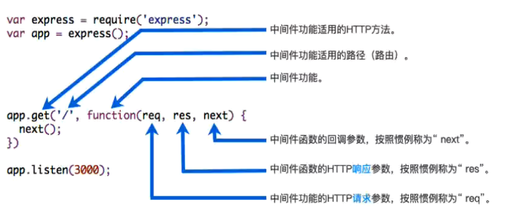

## 认识web框架

* **前面我们已经学习了使用http内置模块来搭建Web服务器，为什么还要使用框架?**
  * 原生http在进行很多处理时，会较为复杂;
  * 有URL判断、Method判断、参数处理、逻辑代码处理等，都需要我们自己来处理和封装;并且所有的内容都放在一起，会非常的混乱;
* **目前在Node中比较流行的Web服务器框架是express、koa ;**
  * 先学习express，后面再学习koa，并且对他们进行对比;express早于koa出现，并且在Node社区中迅速流行起来∶
  * 可以基于express快速、方便的开发自己的Web服务器;并且可以通过一些实用工具和中间件来扩展自己功能;

## Express安装

* **方式一：通过express提供的脚手架，直接创建应用的骨架；**
  * 安装脚手架：npm i -g express-generator
  * 创建项目：express "项目名称"
  * 安装依赖：npm install 
  * 启动项目：node bin/www
* **方式二：从零搭建自己的express应用结构；**

```js
//npm init //配置package.json文件
//npm i express //安装express
const express = require("express"); //express实际上是一个函数：createApplication,定义变量express为createApplication

const app = express(); //调用createApplication函数，返回值定位app

//app.get发送get请求回应，"/"代表监听默认路径,
app.get("/", (request, response, next) => {
  response.end("Hello Express GET");
});

//app.post发送post请求回应
app.post("/", (requset, response, next) => {
  response.end("Hello Express POST");
});

//“/login”路径发生变化
app.post("/login", (request, response, next) => {
  response.end("Welcome Back");
});

//开启监听：
app.listen(8888, () => {
  console.log("express服务器启动成功");
});
```

## 认识express中间件

* **Express是一个路由和中间件的Web框架，它本身的功能非常少:**

  * Express应用程序本质上是一系列中间件函数的调用;

  

* **中间件是什么呢?**

  * **中间件的本质就是一个回调函数;这个回调函数接受三个参数︰**

    **√请求对象(request对象）;**

    **√响应对象(response对象）;**

    **√ next函数（在express中定义的用于执行下一个中间件的函数）;**

  

* **中间件中可以执行哪些任务呢?**

  * 执行任何代码;
  * 更改请求( request )和响应(response )对象;
  * 结束请求-响应周期（返回数据）;
  * 调用栈中的下一个中间件;

* **!!!如果当前中间件功能没有结束请求-响应周期，则必须调用next()将控制权传递给下一个中间件功能，否则，请求将被挂起。**
  * 如何理解：列入在`app.get`请求中没有调用`response.end()`去结束请求，那么必须调用`next()`调用下一个中间件
  * 

