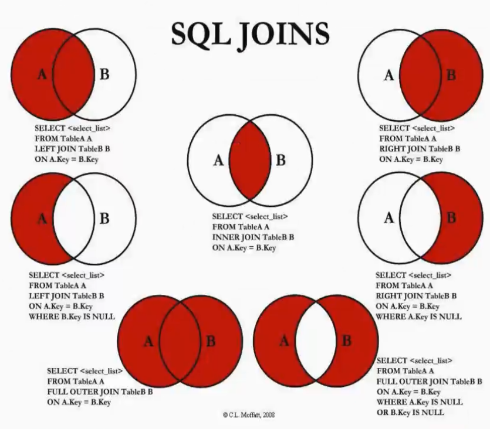

## 01、SQL语句的常用规范:

* 通常关键字是大写的，比如CREATE、TABLE、SHOW等等;
* 一条语句结束后，需要以 ; 结尾;
* 如果遇到关键字作为表明或者字段名称，可以使用 `` 包裹;


## 02、常见的SQL语句我们可以分成四类:

* **DDL** ( Data Definition Language )︰**数据定义语言**﹔
  * 可以通过DDL语句对数据库或者表进行︰创建、删除、修改等操作;
* **DML** ( Data Manipulation Language )︰**数据操作语言**;
  * 可以通过DML语句对表进行︰添加、删除、修改等操作;
* **DQL** ( Data Query Language )∶**数据查询语言**;
  * 可以通过DQL从数据库中查询记录;(重点)
* **DCL** ( Data Control Language )︰**数据控制语言**;
  * 对数据库、表格的权限进行相关访问控制操作; 


## 03、SQL数据类型

###  01、数字类型

* 整数数字类型:INTEGER，TINYINT(1bytes），SMALLIN(2bytes），MEDIUMINT(3bytes） ，**INT**(4bytes），BIGINT(8bytes）
* 浮点数字类型:FLOAT，DOUBLE ( FLOAT是4个字节，DOUBLE是8个字节

### 02、日期类型

* **YEAR**以**YYYY**格式显示值
  * **范围1901到2155，和0000**。
* **DATE**类型用于具有日期部分但没有时间部分的值︰
  * DATE以格式**YYYY-MM-DD**显示值;
  * 支持的范围是**'1000-01-01'到 9999-12-31';**
* **DATETIME**类型用于包含日期和时间部分的值:
  * DATETIME以格式'**YYYY-MM-DD hh:mm:ss**'显示值;
  * 支持的范围是**1000-01-01 00:00:00到9999-12-31 23:59:59;**

### 03、字符串类型

* **CHAR**类型在创建表时为固定长度，长度可以是0到255之间的任何值;
  * 在被查询时，会删除后面的空格;
* **VARCHAR**类型的值是可变长度的字符串，长度可以指定为0到65535之间的值
  * 在被查询时，不会删除后面的空格;
* BINARY和VARBINARY类型用于存储二进制字符串，存储的是字节字符串;
  * https://dev.mysql.com/doc/refman/8.0/en/binary-varbinary.html
* BLOB用于存储大的二进制类型;
* TEXT用于存储大的字符串类型;

## 04、表约束

### 主键：PRIMARY KEY

* 一张表中，我们为了区分每一条记录的唯一性，必须有一个字段是永远不会重复，并且不会为空的，这个字段我们通常会将它设置为主键
  * **主键是表中唯一的索引**;
  * **并且必须是NOT NULL的**，如果没有设置NOT NULL，那么MySQL也会隐式的设置为NOT NULL ;
  * 主键也可以是多列索引，PRIMARY KEY(key_part, ...)，我们一般称之为联合主键;
  * 建议∶开发中主键字段应该是和业务无关的，尽量不要使用业务字段来作为主键;

### 唯一: UNIQUE

某些字段在开发中我们希望是唯一的,不会重复的,比如手机号码、身份证号码等, 这个字段我们可以使用UNIQUE来约束:
使用UNIQUE约束的字段在表中必须是不同的;
对于所有引擎, UNIQUE索引允许NULL包含的列具有多个值NULL。

### 不能为空: NOT NULL

某些字段我们要求用户必须插入值,不可以为空,这个时候我们可以使用NOT NULL来约束; 

### 默认值: DEFAULT

某些字段我们希望在没有设置值时给予一个默认值,这个时候我们可以使用DEFAULT来完成;

### 自动递增: AUTO_ INCREMENT

某些字段我们希望不设置值时可以进行递增,比如用户的id ,这个时候可以使用AUTO _INCREMENT来完成;


## 05、DDL  数据库定义语言

```sql
-- 数据库相关的SQL命令

-- 查询所有的数据库
SHOW DATABASES;

-- 选择某个数据库
USE students;

-- 查看正在使用的数据库
SELECT DATABASE();

-- 创建一个新的数据库
-- CREATE DATABASE testdatabase;#没有判断条件，如果该数据库存在，程序会报错
CREATE DATABASE IF NOT EXISTS testdatabase; #加入判断条件

-- 删除数据库
DROP DATABASE IF EXISTS testdatabase;

-- 修改数据库的编码
-- 数据库编码一般为utf8mb4，而不是utf8，因为表情包也需要存入数据库，utf8mb4可以解析表情包
-- 数据库排序格式一般为utf8mb4_0900_ai_ci，当查询时按升序或降序所排序的规则
ALTER DATABASE test 
CHARACTER SET = utf8
COLLATE = utf8_unicode_ci;


-- 表相关的SQL命令

-- 查看当前数据库所有表
SHOW TABLES;

-- 删除表
DROP TABLE IF EXISTS `grade`;
DROP TABLE IF EXISTS `personiformation`;

-- 创建表
CREATE TABLE IF NOT EXISTS `grade`(
	`course` VARCHAR(20),
	`score`  int
);

CREATE TABLE IF NOT EXISTS `personiformation`(
	`id` INT PRIMARY KEY AUTO_INCREMENT,
	`name` VARCHAR(20) NOT NULL,
	`age` int NOT NULL,
	`birthday` YEAR,
	`phone` BIGINT UNIQUE #UNIQUE唯一的,不可以重复
);

-- 修改表
-- 修改表的名称
ALTER TABLE `personiformation` RENAME TO `information`;

-- 向表中添加新的列
ALTER TABLE `information` ADD `createTiem` TIMESTAMP NOT NULL;

-- 修改表中字段的名称
ALTER TABLE `information` CHANGE `phone` `phoneNum` BIGINT;

-- 修改表字段的类型
ALTER TABLE `information` MODIFY `phoneNum` VARCHAR(20);#将电话类型修改为字符串类型，因为电话可能是座机带-
ALTER TABLE `information` MODIFY `createTiem` TIMESTAMP DEFAULT CURRENT_TIMESTAMP;#将创建时间修改为自动设置，当没有插入创建时间时自动添加当前的时间

-- 删除表的某个字段
ALTER TABLE `information` DROP `age`;

-- 查看表的结构
DESC information; 

-- 根据一个表结构去创建另外一张表,只会复制表的结构不会复制内容
CREATE TABLE `information1` LIKE `information`;
-- 更加一个表的内容去创建另外一个表，只会复制内容，不会复制表的结构；
CREATE TABLE `information2` (SELECT * FROM `information`);

```

## 06、**DML** **数据操作语言**

```sql
-- 向表中插入数据
INSERT INTO `information` VALUES (001, '陶庆澳', 1999, '17816146119', '2021-11-8');

INSERT INTO `information` (id, name, birthday, phoneNum, createTiem)
			 VALUES(002, 'taoqingao', 1999, '18133477375', '2021-11-8');

-- 可以不添加非空值 
INSERT INTO `information` (id, name, birthday, phoneNum)
			 VALUES(003, 'taoqingao', 1999, '18153477375');
			 
-- 删除表中某条数据
DELETE FROM `information` WHERE id = 002;

-- 更新数据
UPDATE `information` SET `name` = 'tqa',`phoneNum` = '1101389964';-- 没有填写条件，会直接更新所有数据
UPDATE `information` SET `name` = 'tqa',`phoneNum` = '1101389964' WHERE id = 003; -- 只会更新满足条件的
```

## 07、**DQL** **数据查询语言**

```sql
-- 基本查询
-- 查询表中所有的字段以及所有的数据；
SELECT * FROM products;

-- 查询指定字段
SELECT title, price FROM `products`;

-- 对字段起别名
SELECT title as phoneName, price as phonePrices FROM `products`;

-- where条件查询
-- 查询价格小于2000的手机
SELECT title, price FROM `products` WHERE `price` < 2000;
-- 查询价格等于999的手机
SELECT * FROM `products` WHERE `price` = 999;
-- 查询所有手机为华为的手机
SELECT * FROM `products` WHERE `brand` = '华为';

-- 逻辑运算语法
-- 查询价格在1000到2000的手机
SELECT * FROM `products` WHERE `price` > 1000 AND `price` < 2000;
SELECT * FROM `products` WHERE `price` > 1000 && `price` < 2000;
# BETWEEN AND 包含等于
SELECT * FROM `products` WHERE `price` BETWEEN 1000 AND 2000;

-- 价格在5000以上或者是华为手机
SELECT * FROM `products` WHERE price > 5000 OR brand = '华为';
SELECT * FROM `products` WHERE price > 5000 || brand = '华为'; 

-- 将苹果手机url设置为NULL
UPDATE products SET url = NULL WHERE brand = '苹果';
-- 查询url为NULL的手机
SELECT * FROM products WHERE url IS NULL;
-- 查询url不为NULL的手机
SELECT * FROM products WHERE url IS NOT NULL;

-- 模糊查询%可以匹配任意多个字符，_匹配一个任意字符；
-- 查询title中包含m的
SELECT * FROM products WHERE title LIKE '%m%';
-- 查询titl中第二个字符包含p
SELECT * FROM products WHERE title LIKE '_p%';

-- 使用in查询多个值中的一个
SELECT * FROM `products` WHERE brand IN ('华为','苹果');
SELECT * FROM `products` WHERE brand = '华为' || brand = '苹果';

-- 所有的手机进行排序，默认按升序，ASC升序，DESC降序
SELECT * FROM `products` ORDER BY price DESC;

-- 分页查询
-- 1:LIMIT OFFSET  LIMIT代表查询多少数据，OFFSET代表从哪开始查询
SELECT * FROM products LIMIT 30 OFFSET 0;-- 表示从第0条开始查询30条数据
SELECT * FROM products LIMIT 30 OFFSET 30;-- 表示从第30条开始查询30条数据
-- 2：LIMIT offset,limit;
SELECT * FROM products LIMIT 0,20;-- 表示从第0条开始查询20条数据
```

## 08、DQL聚合函数

```sql
-- 聚合函数的使用
-- 求所有手机价格的总和 SUM
SELECT SUM(price) FROM products;
-- 求所有苹果手机的价格总和 SUM
SELECT SUM(price) FROM products 
									WHERE brand = '苹果';
									
-- 求华为手机的平均价格 AVG
SELECT AVG(price) FROM products WHERE brand = '华为';

-- 求最大和最低手机价格 MAX MIN
SELECT MAX(price),MIN(price) FROM products;

-- 求苹果手机的数量 COUNT
SELECT COUNT(*) FROM products WHERE brand = '苹果';
-- 求苹果手机url不为空的个数 COUNT()可以传递参数，当参数不为空时加入总和
SELECT COUNT(url) FROM products WHERE brand = '苹果';-- 结果为0，url都为空
-- 求所所有价格不同的手机
SELECT COUNT(DISTINCT price) FROM products;


-- 分组查询 GROUP BY平均价格，平均分数
-- 查询每一款手机的品牌，数量，
SELECT brand, COUNT(*),AVG(price), AVG(score) FROM products GROUP BY brand;
-- 查询上述结果平均价格小于2000的
SELECT brand, COUNT(*),AVG(price) as price, AVG(score) FROM products GROUP BY brand HAVING price < 2000;-- 不可以使用WHERE,GROUP BY应该在WHERE之前
-- 求平均分大于7.5分的品牌手机平均价格
SELECT brand, AVG(price), AVG(score) FROM products GROUP BY brand HAVING AVG(score) > 7.5;
-- 求平均分大于7.5分的手机并按品牌分类，求出平均价格
SELECT brand, AVG(price) FROM products WHERE score > 7.5 GROUP BY brand;
```


## 09、外键的更新与删除

* **RESTRICT** （默认属性）︰当更新或删除某个记录时，会检查该记录是否有关联的外键记录，有的话会报错的，不允许更新或删除﹔

* **NO ACTION**:和RESTRICT是一致的，是在SQL标准中定义的;

* **CASCADE**:当更新或删除某个记录时，会检查该记录是否有关联的外键记录，有的话:
  * √更新:那么会更新对应的记录;
  * √删除︰那么关联的记录会被一起删除掉;
  
* **SET NULL**:当更新或删除某个记录时，会检查该记录是否有关联的外键记录，有的话，将对应的值设置为NULL ;

  ```sql
  -- 创建手机品牌表用于多表查询
  DROP TABLE IF EXISTS `brand`;
  
  CREATE TABLE IF NOT EXISTS `brand`(
  	`id` INT PRIMARY KEY,
  	`name` VARCHAR(20) NOT NULL,
  	`website` VARCHAR(20),
  	`ranking` INT
  );
  
  INSERT INTO `brand` VALUES(01,'苹果','www.apple.com',1);
  INSERT INTO `brand` VALUES(02,'华为','www.huawei.com',2);
  INSERT INTO `brand` VALUES(03,'三星','www.samsung.com',3);
  INSERT INTO `brand` VALUES(04,'小米','www.xioami.com',4);
  INSERT INTO `brand` VALUES(05,'oppo','www.oppo.com',5);
  INSERT INTO `brand` VALUES(06,'vivo','www.vivo.com',6);
  INSERT INTO `brand` VALUES (07,'京东','www.jd.com', 7);
  INSERT INTO `brand` VALUES (08,'Google','www.google.com', 8);
  
  # 2.给brand_id设置引用brand中的id的外键约束
  # 添加一个brand_id字段
  ALTER TABLE `products` ADD `brand_id` INT;
  -- ALTER TABLE `products` DROP `brand_id`;
  
  # 修改brand_id为外键
  ALTER TABLE `products` ADD FOREIGN KEY(brand_id) REFERENCES brand(id);
  
  
  # 设置brand_id的值
  UPDATE `products` SET `brand_id` = 1 WHERE `brand` = '苹果';
  UPDATE `products` SET `brand_id` = 2 WHERE `brand` = '华为';
  UPDATE `products` SET `brand_id` = 4 WHERE `brand` = '小米';
  UPDATE `products` SET `brand_id` = 5 WHERE `brand` = 'oppo';
  
  # 3.修改和删除外键引用的id
  UPDATE `brand` SET `id` = 1 WHERE `id` = 100;
  
  
  # 4.修改brand_id关联外键时的action
  # 4.1.获取到目前的外键的名称
  SHOW CREATE TABLE `products`;
  
  -- CREATE TABLE `products` (
  --   `id` int(11) NOT NULL AUTO_INCREMENT,
  --   `brand` varchar(20) DEFAULT NULL,
  --   `title` varchar(100) NOT NULL,
  --   `price` double NOT NULL,
  --   `score` decimal(2,1) DEFAULT NULL,
  --   `voteCnt` int(11) DEFAULT NULL,
  --   `url` varchar(100) DEFAULT NULL,
  --   `pid` int(11) DEFAULT NULL,
  --   `brand_id` int(11) DEFAULT NULL,
  --   PRIMARY KEY (`id`),
  --   KEY `brand_id` (`brand_id`),
  --   CONSTRAINT `products_ibfk_1` FOREIGN KEY (`brand_id`) REFERENCES `brand` (`id`) ON DELETE RESTRICT ON UPDATE CASCADE
  -- ) ENGINE=InnoDB AUTO_INCREMENT=109 DEFAULT CHARSET=utf8mb4 COLLATE=utf8mb4_0900_ai_ci
  
  # 4.2.根据名称将外键删除掉
  ALTER TABLE `products` DROP FOREIGN KEY products_ibfk_1;
  
  # 4.2.重新添加外键约束
  ALTER TABLE `products` ADD FOREIGN KEY(brand_id) REFERENCES brand(id)
  																									ON UPDATE CASCADE
  																									ON DELETE RESTRICT;
  
  UPDATE `brand` SET `id` = 100 WHERE `id` = 1;
  ```

  

## 10、多表之间的连接



```sql
SELECT * FROM `products`,`brand`;-- 查询到的数据为products数据总条数与brand总条数乘积；笛卡尔乘积

-- 获取多表查询有效的乘积，只获取brand_id = id的数据
SELECT * FROM `products`,`brand` WHERE products.brand_id = brand.id;


-- 左连接LEFT JOIN，查询所有手机包括没有品牌信息的手机,链接查询条件products.brand_idid = brand.id;
-- 当查询到的手机没有手机信息的时候会显示null
SELECT * FROM products LEFT JOIN brand ON products.brand_id = brand.id;
-- 查询没有手机品牌信息的手机
SELECT * FROM products LEFT JOIN brand ON products.brand_id = brand.id WHERE brand.id IS NULL;

-- 右链接,查询所有的品牌以及对于的手机数据
SELECT * FROM products RIGHT JOIN `brand` ON products.brand_id = brand.id;
-- 右链接，查询没有只有单独的品牌信息没有具体的手机信息的品牌
SELECT * FROM products RIGHT JOIN `brand` ON products.brand_id = brand.id WHERE products.brand_id IS NULL;

-- 内链接 两者相关联的信息显示出来，其他信息不显示
SELECT * FROM products JOIN brand ON products.brand_id = brand.id;

-- 全链接-->合并左链接与右链接
SELECT * FROM products LEFT JOIN brand ON products.brand_id = brand.id
UNION-- UNION 联合数据
SELECT * FROM products RIGHT JOIN `brand` ON products.brand_id = brand.id;

-- 全连接，非交集部分
SELECT * FROM products LEFT JOIN brand ON products.brand_id = brand.id WHERE brand.id IS NULL
UNION-- UNION 联合数据
SELECT * FROM products RIGHT JOIN brand ON products.brand_id = brand.id WHERE products.brand_id IS NULL;
```


