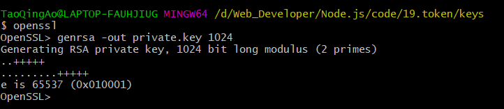

## 为什么需要登录凭证

**web开发中，我们使用最多的协议是http，但是http是一个无状态的协议。**

* 无状态的协议﹖什么叫做无状态协议呢?
  **举个例子:**
  我们登录了一个网站www.coderhub.com;
  登录的时候我们需要输入用户名和密码︰比如用户名coderwhy，密码:Coderwhy666.;
  登录成功之后，我们要以coderwhy的身份去访问其他的数据和资源，还是通过http请求去访问。
  * coderhub的服务器会问∶你谁呀?
  * coderwhy说:我是coderwhy呀，刚刚登录过呀;coderhub:怎么证明你刚刚登录过呀?
  * coderwhy说:这。。。，http没有告诉你吗?
  * coderhub : **http的每次请求对我来说都是一个单独的请求，和之前请求过什么没有关系。**

## 用户登录接口

* 用户登录接口编写流程:
  * 授权router的编写;
  * 处理函数的controller编写;
* 验证的中间件:
  * 账号和密码是否为空;
  * 用户名是否存在;
  * 校验密码是否一致;
* 登录成功返回凭证:
  * cookie+session ;
  * Token令牌;

## Cookie

### Cookie是什么？

* **Cookie** (复数形态Cookies )，又称为“小甜饼”。类型为“小型文本文件，某些网站**为了辨别用户身份而存储在用户本地终端(Client Side )上的数据。**
  * 浏览器会在特定的情况下携带上cookie来发送请求，我们可以通过cookie来获取一些信息;
* Cookie总是保存在客户端中，按在客户端中的存储位置，**Cookie可以分为内存Cookie和硬盘Cookie**。
  * 内存Cookie由浏览器维护，保存在内存中，浏览器关闭时Cookie就会消失，其存在时间是短暂的;
  * 硬盘Cookie保存在硬盘中，有一个过期时间，用户手动清理或者过期时间到时，才会被清理;
* **如果判断一个cookie是内存cookie还是硬盘cookie呢?**
  * 没有设置过期时间，默认情况下cookie是内存cookie，在关闭浏览器时会自动删除;
  * 有设置过期时间，并且过期时间不为0或者负数的cookie，是硬盘cookie，需要手动或者到期时，才会删除;

### cookie的生命周期：

默认情况下的cookie是内存cookie，也称之为会话cookie，也就是在浏览器关闭时会自动被删除;
我们可以通过设置**expires**或者**max-age**来设置过期的时间;
	➢**expires** :设置的是Date.toUTCString( ,设置格式是;expires =date-in-GMTString-format ;
	➢**max-age** :设置过期的秒钟，;max-age= max-age-in-seconds (例如一 年为60* 60*24*365) ;

### cookie的作用域: ( 允许cookie发送给哪些URL )

* **Domain** :指定哪些主机可以接受cookie
  	➢如果不指定 ,那么默认是origin ,不包括子域名。
  	➢如果指定Domain ,则包含子域名。例如,如果设置Domain=mozilla.org ,则Cookie也包含在子域名中(如developer.mozilla.org )
* **Path** :指定主机下哪些路径可以接受cookie
  	➢例如，设置Path=/docs ,则以下地址都会匹配:
  * /docs
  * /docs/Web/
  * /docs/Web/HTTP

### cookie的缺点

* cookie和session的方式有很多的缺点︰
  * Cookie会被附加在每个HTTP请求中，所以无形中增加了流量（事实上某些请求是不需要的);
  * Cookie是明文传递的，所以存在安全性的问题;
  * Cookie的大小限制是4KB，对于复杂的需求来说是不够的;
  * 对于浏览器外的其他客户端（比如iOS、Android )，必须手动的设置cookie和session
  * 对于分布式系统和服务器集群中如何可以保证其他系统也可以正确的解析session ?

## token

* token的使用应该分成两个重要的步骤:
  * **生成token** :登录的时候，颁发token ；
  * **验证token** :访问某些资源或者接口时，验证token ；

### JWT实现Token机制（JWT->jsonwebtoken）

* **header**
  * **alg** :采用的加密算法，默认是 HMAC SHA256 ( HS256)，采用同一个密钥进行加密和解密;当使用对称加密时使用默认算法，非对称加密时要自定义算法；
  * **typ** : JWT，固定值，通常都写成JWT即可；
  * 会通过base64Url算法进行编码;
* **payload**
  * 携带的数据，比如我们可以将用户的id和name放到payload中;
  * 默认也会携带iat ( issued at )，令牌的签发时间;默认携带不需要传递；
  * 我们也可以设置过期时间:exp ( expiration time ) ;需要手动设定
  * 会通过base64Url算法进行编码
* **signature**
  * 设置一个secretKey(私钥)，通过将前两个的结果合并后进行
  * HMACSHA256的算法;HMACSHA256(base64Url(header)+.+base64Url(payload), secretKey);
  * 但是如果secretKey暴露是一件非常危险的事情，因为之后就可以模拟颁发token,也可以解密token ;

**最后的token有这三部分拼接而成：header.payload.signature**

### 非对称加密

* HS256加密算法─单密钥暴露就是非常危险的事情:
  * 比如在分布式系统中，每一个子系统都需要获取到密钥;
  * 那么拿到这个密钥后这个子系统既可以发布另外，也可以验证令牌;
  * 但是对于一些资源服务器来说，它们只需要有验证令牌的能力就可以了;
* 这个时候我们可以使用非对称加密，RS256:
  * **私钥( private key )** :用于发布令牌;
  * **公钥( public key )** :用于验证令牌;

### 公钥与私钥的生成

在git bash中切换到生成key的文件夹中

`openssl  //使用OpenSSL`
`genrsa -out private.key 1024 //生成私钥，大小为1024个位`
`rsa -in private.key -pubout -out public.key //用私钥生成公钥`

生成私钥

生成公钥

