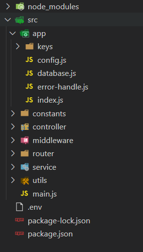
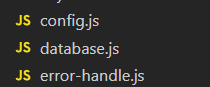
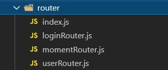

## 项目介绍

本项目是一个开发者发表动态的平台，可以登录参与讨论相互交流；

## 项目模块介绍

<br>

### 项目主入口

入口文件为文件为**main.js**，非常简单，只开启开启服务器，注意这里的端号是引用外部文件config的，其他的配置文件也放在对应的各个模块中

```js
const app = require("./app/index.js");
const config = require("./app/config.js"); //导入端号

app.listen(config.APP_PORT, () => {
  console.log(`服务器在${APP_PORT}端号启动成功`);
});
```

### koa对象实例app

app文件为app/index.js，里面含有Koa的实例app，所有的路由从外导入在这里配置。

<br>

### config文件

这个文件包含了一些非公开的数据，比如生成token的私钥，和解密的公钥，还包括连接数据库的配置

### database文件

这个是连接数据库的文件，导出的为promise类型`connextion.promise()`

### error-handle

这个是对应的错误处理的文件，当中间件抛出异常之后，就会来到这个文件寻找对应的错误类型，
错误类型是用一些常量定义好的，方便处理，这些错误类型常量放在**constants**文件夹中。

### 路由router

<br>

这个文件只包含路由，具体的中间件放在**middleware**和**cntroller**中，middleware是处理将数据存入数据库或者从数据库去出前的验证，比如用户是否存在，用户账号密码是否正确等等，cntroller是在验证之后存入数据库或从数据库取出结果的中间件。

#### index.js

在路由中有一个index.js文件，这个文件是将所有路由直接注册到app.use中的一个配置文件，就省去了自己手动导入路由并主测，而且是app/index.js文件简洁许多

```js
/**
 * 这个文件是将所有的路由注册在app里面的
 */
const fs = require("fs");

const routers = function (app) {
  //fs.readdirSync(__dirname) 读取当前目录所有文件名，返回值为一个数组；
  fs.readdirSync(__dirname).forEach((file) => {
    if (file !== "index.js") {
      const router = require(`./${file}`); //通过文件名获取路由
      app.use(router.routes()); //注册路由
      app.use(router.allowedMethods());
    }
  });
};

module.exports = routers;//app/index.js文件直接引入，然后将app传出即可
```

### **service**

这个文件存储这与数据库相关的操作，只要有中间件需要操作数据库，直接从这里引入。

### utils

这个文件存储这相关的格式化文件工具，其中有一个对密码进行加密的配置文件，将用户传递过来的密码进行md5格式的加密然后再讲其放入数据库中。

## 项目创新点

在用户登录之后也会进行一系列的操作，比如用户需要发表评论，而发表评论需要通过用户id与评论关联并存放到数据库中，而这时就可以通过token解码获取用户的id，并将token的信息存放到中间件context中。而验证用户token这个中间件是每一个只要是需要登录之后才会有的操作都需要用到这个中间件，所以可以在这个中间件里面将token信息存放到context中。然后只要是需要验证用户登录，就直接使用这个中间件。

```js
const verifyAuth = async (ctx, next) => {
  // console.log("验证授权的middleware");
  const authorization = ctx.headers.authorization;
  //当没有token为空时
  if (!authorization) {
    const error = new Error(errorType.UNAUTHORIZATION);
    return ctx.app.emit("error", error, ctx);
  }
  const token = authorization.replace("Bearer ", "");

  try {
    const result = jwt.verify(token, PUBLIC_KEY, {
      algorithms: ["RS256"], //通过RS256算法进行解密,以数组的形式传递，当有多个算法时，如果第一个算法解密不成功，会接着使用下一个算法进行解密。
    });
    /* 
      注意这里
      登录后的每个接口都需要进行token验证，所以需要保持用户id，方便下一个中间件查找
      但是如果这个用户信息保持在上一个路由中，在下一个路由是查找不到的，每个路由都是单独的；
      但可以这样做，因为每次都需要token验证，在解码的中间件中把token解码后的信息赋值给textToken，
      token是存在存在游览器的，会不消失，所以每次都可以获取到用户信息
    */
    ctx.textToken = result;
    await next(); //??????????
  } catch (err) {
    const error = new Error(errorType.UNAUTHORIZATION);
    ctx.app.emit("error", error, ctx);
  }
};
```

还有一个创新点是将所有路由自动合并到app.router中。