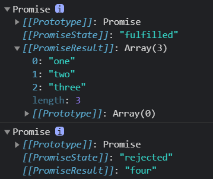
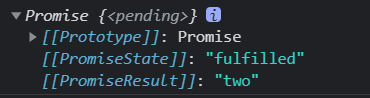

##  Promise构造函数: 

### **Promise (excutor){ }**

* **executor函数**:执行器(resolve,reject)=>{}
* **resolve函数**:内部定义成功时我们调用的函数value =>{}																													
* **reject 函数**:内部定义失败时我们调用的函数reason =>{}
* **说明: executor 会在 Promise 内部立即同步调用,异步操作在执行器中执行**

```js
const app = new Promise((resolve, reject) => {
   console.log("111");
})
console.log('222');//结果先打印111，后为222

const app = new Promise((resolve, reject) => {
    resolve(111);
}).then(data => {
    console.log(data);
})
console.log(222);//结果先打印22，后为111

//结论：executor执行器会在 Promise 内部立即同步调用,异步操作在执行器中执行；
```

### **Promise.prototype.then**

* (onResolved, onRejected)=>{ }
  * (1)onResolved.函数:成功的回调函数(value)=>{ }
  * (2)onRejected.函数:失败的回调函数(reason)=> { }
  * 说明1:指定用于得到成功value的成功回调和用于得到失败reason的失败回调**返回一个新的promise对象**
    * 当传递的为非Promise对象，则返回的结果为成功的Promise对象
    * 当传递的为Promise对象，则返回的为对应Promise对象的状态
    * 使用throw，则返回一个失败的promise对象
    * **当promise状态没有改变不会调用then方法*
  * 说明2:当有多个then回调时，只要Promise状态发送改变就都会回调

### **Promise.prototype.catch()**

* 方法:(onRejected)=>{ }
  * onRejected函数:失败的回调函数(reason)=>{ } **只能执行失败的回调函数**

### Promise.resolve

**该方法属于Promise函数对象的，不属于实例对象**；可以返回一个成功或者失败的Promise对象

```js
  const p1 = Promise.resolve('111');
  console.log(p1);
  /* 
    [[Prototype]]: Promise
    [[PromiseState]]: "fulfilled"
    [[PromiseResult]]: "111"
  */

  const p2 = Promise.resolve(new Promise((resolve, reject) => {
    reject('error')
  }))
  p2.catch((props) => {
    console.log(props);
  })
  console.log(p2);
  /* 
  [[Prototype]]: Promise
  [[PromiseState]]: "rejected"
  [[PromiseResult]]: "error"
  */

  const p3 = Promise.resolve(new Promise((resolve, reject) => {
    resolve('correct')
  }))
  console.log(p3);
  /*
  [[Prototype]]: Promise
  [[PromiseState]]: "fulfilled"
  [[PromiseResult]]: "correct"
  */
 
  /*
   结论：当resolve的参数为非Promise对象，则返回的结果为成功的Promise对象
        当传递的为Promise对象，则返回的为对应Promise对象的状态
  */
```

### Promise.reject

该方法也是Promise函数方法，不是对象实例的方法；返回的Promise永远为失败的，传入什么就返回什么PromiseResult；

### Promise.all

Promise.all方法:(promises) => {}<br>promises:包含n个promise的数组
**说明:返回一个新的promise，只有所有的promise都成功才成功，只要有一个失败了就直接失败**

```js
  const p1 = new Promise((resolve, reject) => {
    resolve('one');
  })
  const p2 = Promise.resolve('two');
  const p3 = Promise.resolve("three");
  const p4 = Promise.reject("four");

  const result1 = Promise.all([p1, p2, p3]);//PromiseResult为三个Promise成功PromiseResult的数组
  const result2 = Promise.all([p1, p2, p3, p4]);//只包含reject的PromiseResult结果

  console.log(result1);
  console.log(result2);
```

两个结果的截图<br>

### Promise.race

Promise.race方法: (promises)=>{ }<br>promises:包含n个promise的数组
**说明:返回一个新的promise，第一个完成的promise的结果状态就是最终的结果状态,第一个成功则race就成功，反之就失败**

```js
  const p1 = new Promise((resolve, reject) => {
    setTimeout(() => {
      resolve('one');
    }, 100)
  })
  const p2 = Promise.resolve('two');//最先完成
  const p3 = Promise.resolve("three");

  const result = Promise.race([p1, p2, p3]);//返回的结果为p2的结果
  console.log(result);
```

结果截图<br>

