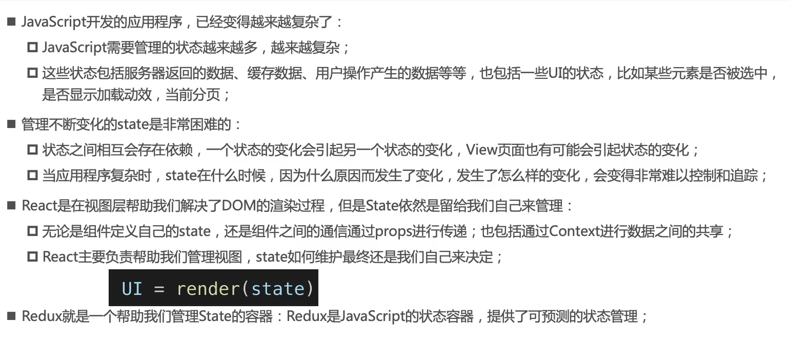
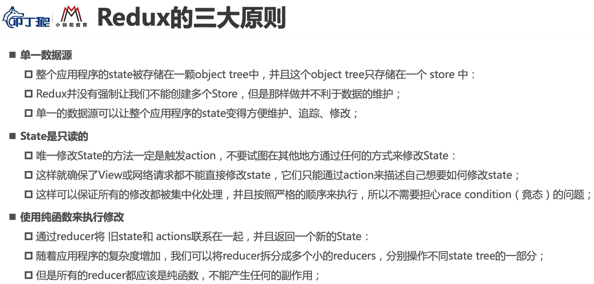

## 为什么需要reducer



## Redux的三大原则




## redux结合react逻辑图


## redux库的使用

### 1、安装

`yarn add react-redux`

### 2、引入react-redux

```js
import { Provider } from "react-redux";
import store from "./store";

ReactDOM.render(
  <Provider store={store}>
    <App />
  </Provider>,
  document.getElementById("root")
);
```

### 3、在组件里面使用react-redux

`import { connect } from "react-redux";`