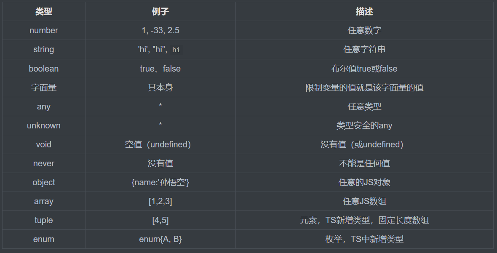

# TS类型

## 1.类型声明语法

```typescript
/* 1.先声明在赋值 */
let a : number;
a = 25;
//a = 'hello'; 报错

/* 2.直接声明赋值 */
let b = 25;//TS会根据数据自动匹配数据类型
b = 50;
//b = 'hello'; 也会报错

/* 3.函数声明 */
function sum(a:number,b:number):number{
    return a + b;
}
/*
    形参里面的数据类型number声明为传入的变量限制为number
    后面的是限制返回值为number
 */
```

## 2.数据类型



### 1、字面量

```typescript
/* 字面量申明 */
let c :'hello';//只可以为hello，相当于常量
c = 'hello';
//c = 'world'; 报错

let d :'male' | 'female';
//既可以赋值为male也可以赋值为female,当后面有多个‘|’时可以有多个赋值项
d = 'female';
d = 'male';
//d = 'hello' 报错

let e : number | string;
/* 既可以赋值为number型，也可以赋值为string型 */
e = 10;
e = 'hello';
```

### 2、any

```typescript
let d: any;
let f;
/*
1.相当于可以复制任何数据类型，
2.若声明变量没有指定类型也会为any类型
*/
d = 'hello';
d = true;
f = 'hello';
f = true;
//3.any类型可以赋值给任意类型，并使该类型转换为any类型
let a : number;
a = 25;
a = d;//d为布尔值，不会报错
```

### 3、unknown(类型断言)

```typescript
let notSure: unknown;
notSure = 'hello';
notSure = 886;
/*
	不同于any，unknown虽然也可以随意赋值，
	但不可以随意把本身赋值给其他类型
*/
let a : number;
a = 25;		 //a = notSure 报错,虽然notSure存储的也为number
/*
解决办法：1.先做条件判断再赋值
		2.类型断言
*/
if(typeof a === 'number') a = notSure;//先判断在赋值
a = notSure as string;//类型断言一,意味notSure确定为string类型
a = <string>notSure//类型断言二


```

### 4、void | any

```typescript
function fun():void{
    return;//没有返回值得类型，或者返回的为undefined
}
function fu():never{
   //没有值永远不返回结果,没有return
}
```

### 5、object

```typescript
let obj1 : Object;
/*
定义为对象类型，没用啥用处，因为JS中万物皆为对象，所以很少这样定义类型 
 */
let obj2 : {name:string, age:number};
obj2 = {name:'猴哥', age:1000};
obj2 = {name:'师傅'};
//报错，必须包含name和age两个类型，少一个多一个都不行

let obj3 : {name:string, age?:number};
//表示必须有name属性，但不一定要age属性，多其他则不行

let obj4 : {name:string, [name:string]:any};
//该方法表示必须有string型的name属性，其他的属性为任意类型，可加可不加
//[name:string]意为属性名为string型，any属性值为任意类型
obj4 = {
    name:'澳子哥',
    year:20,
    height:180,
}//不会报错
```

### 6、function

```typescript
let fu : Function;
//同Object声明一样没有意义
let fun : (a:number, b:number,c?:number)=>number;
/*
fun函数两个参数都为number，且返回值也为number
*/
fun = function(one, two){
    return one + two;
}
//第三个参数为可选参数
fun = function(one, two, three){
    return one + two + three;
}

//a: number = 10 参数a的默认值为10
function Fun(a: number = 10):number{
    return 10 * a;
}

let num1:number;
num1 = Fun(10);//没有报错
//num1 = Fun;  //报错

//若要使一个函数的引用赋值给一个变量，则需提前给该变量做类型声明
let num2 : (one: number) => number = Fun;// => number表示返回类型
```

### 7、array

**两种声明方式**

```typescript
let arry1 : number[];//声明方式一：声明number类型的数组
arry1 = [1,2,3];
arry1 = [1,'as',2];//报错 

let arry2 : Array<string>;//声明方式二：string类型数组
```

### 8.tuple(元组)

**固定长度的数组**

```typescript
let arry : [number,string];
//arry数组只有2个值，一个为number类型，一个为string类型
```

### 9.enum(枚举)

```typescript
/* 
有的变量只有几种可能取值。如人的性别只有两种可能取值，
星期只有七种可能取值。而这些变量取值为string类型，
string类型非常占用空间，所以可以代替为number类型，
而number不太直观，枚举就很好的解决了这个问
*/
enum Gender{
    male = 1,
    frmale = 0
}

let humman: {name: string, sex: Gender};//定义sex属性为Gender类型

humman = {
    name:'猴哥',
    sex:Gender.male//直接去值为枚举里面的male
}
```

## 类型别名type

```typescript
type myType = 1 | 2 | 3 | 4;
//声明把1 | 2 | 3 | 4赋值给一个变量类型，可以直接定义一个变量
let k: myType;
let l: myType;

```

## 泛型

泛型的功能：在定义函数或类时，如果遇到不确定类型就可以使用泛型

```typescript
/*
 定义泛型
 T是传递参数时的类型
 */
function fu<T>(one:T):T{
    return one;
    /* 
    参数类型为T，返回值类型也为T
     */
}

function fun<T,H>(one:T,two:H):H{
    return two;
}

console.log(fu<string>("hello"));//<string>通知函数传递的是string类型
console.log(fun("hello","bilibili"));

```

