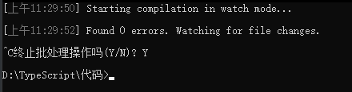
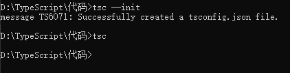
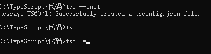
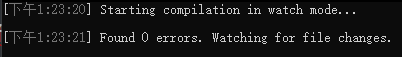
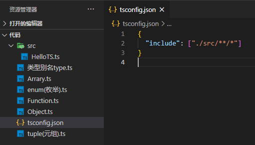
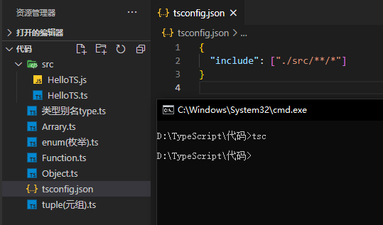
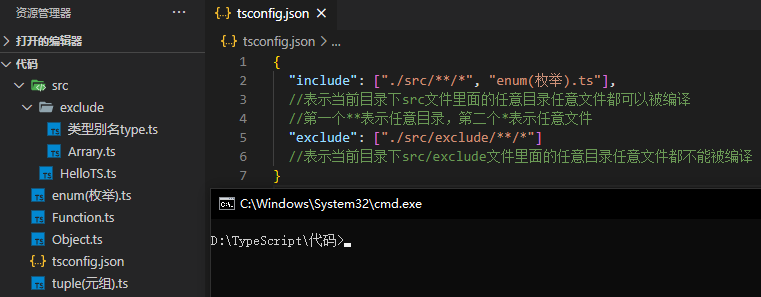
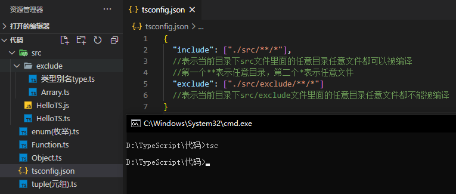

## 01、自动编译

一.编译文件时，使用 -w 指令后，TS编译器会自动监视文件的变化，并在文件发生变化时对文件进行重新编译

```powershell
tsc xxx.ts -w
```

二.关闭自动检测<br>开启命令行中执行Ctrl+C<br>

三、不足：只能对每一个单独的文件进行自动编译，不能对批量文件编译

## 02、tsconfig.json的使用及配置

### ①创建tsconfig.json文件

* 手动创建：在当前文件目录下创建tsconfig.json文件

* 自动创建：在命令行中输入`tsc --init`会自动创建并配置tsconfig.json文件

* 添加配置文件后，只需只需 tsc 命令即可完成对整个项目的编译

* 也可以开启自动编译：批量自动编译ts文件<br>、2、<br>3、

  

### ②、配置tsconfig.json文件

#### **include**

```json
{
  "include": ["./src/**/*"]
    //表示当前目录下src文件里面的任意目录任意文件都可以被编译
    //第一个**表示任意目录，第二个*表示任意文件
}
```

* 未编译前的文件<br>

* 编译执行后的文件，src文件目录下多了一个js文件，其他文件没有产生js文件<br>

#### **exclude**

```json
{
"exclude": ["./src/exclude/**/*"]
 //表示当前目录下src/exclude文件里面的任意目录任意文件都不能被编译
}
```

* 编译前<br>

* 编译后,之后src文件目录下多了js文件，src目录里面的exclude目录下没有生产文件<br>

**注意**：exclude默认值：["node_modules", "bower_components", "jspm_packages"]

#### **files**

* **指定**被编译文件的列表，**只有需要编译的文件少时才会用到**

```json
"files": [
    "core.ts",
    "sys.ts",
    "types.ts",
    "scanner.ts",
    "parser.ts",
    "utilities.ts",
    "binder.ts",
    "checker.ts",
    "tsc.ts"
  ]//列表里面的文件都会被编译
```

#### **extends**

-   定义被继承的配置文件

示例：

```json
"extends": "./configs/base" //当前配置文件中会自动包含config目录下base.json中的所有配置信息
```


