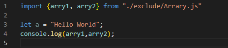
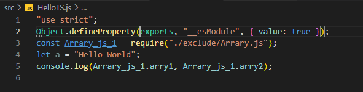

# tsconfig中compilerOptions的配置

## 01、target★★★

设置ts代码编译的目标js版本

```json
"compilerOptions": {
    "target": "ES6"
    //编写的ts代码将会被编译为ES6版本的js代码
}
//可选值：'es3', 'es5', 'es6', 'es2015', 'es2016', 'es2017', 'es2018', 'es2019', 'es2020', 'esnext'
```

## 02、module★★★

设置编译后代码使用的模块化系统

```json
"compilerOptions": {
    "module": "CommonJS"//默认编译为CommonJS的模块化
}//可选值：CommonJS、UMD、AMD、System、ES2020、ESNext、None
```

解析前<br><br>解析后.js的文件以CommonJS语法导入<br>

## 03、lib

指定代码运行时所包含的库,**在游览器运行一般不需要写**，当在node运行需要配置

```json
"compilerOptions": {
    "lib": ["ES6", "DOM"],
}
```

## 04、outDir★★★

指定编译后js文件所在的目录

```json
"compilerOptions": {
    "outDir": "./dist"//默认解析到当前文件目录下的dist文件夹下
}
```

## 05、outFile

将所有的文件编译为一个js文件

默认会将所有的编写在全局作用域中的代码合并为一个js文件，如果module制定了None、System或AMD则会将模块一起合并到文件之中

示例：

- ```json
  "compilerOptions": {
      "outFile": "dist/app.js"
  }
  ```


## 06、allowJS

是否对js文件编译

```json
"compilerOptions": {
    "allowJS": "true"//为true则编译js文件，false则不编译js文件
}
```

## 07、checkJS

检查js代码是否符合语法规范

```json
"compilerOptions": {
    "checkJS": "true"//为true则检查js文件是否规范，false则不检查js文件规范与否
}
```

## 08、removeComments

- 是否删除注释
- 默认值：false

```json
"compilerOptions": {
    "removeComments": "true"
    //为true编译是则删除注释，false则反之
}
```

## 09、noEmit

- 不对代码进行编译
- 默认值：false，**为true则不进行编译**

## 10、noEmitOnError★★★

- 有错误的情况下不进行编译
- 默认值：false，**为true时，当ts代码有错误是不进行编译**

## 11、alwaysStrict

* 默认值为false
* 当为true时编译的js文件会自带严格模式“use strict"

## 12 、noImplicitAny★★★

* 是否允许使用隐式的any类型
* 默认为false，为true时，不允许使用隐式的any

## 13、noImplicitThis

- 禁止类型不明确的this
- 默认为false，为true时则禁止类型不明确的this

## 14、strictBindCallApply

- 严格检查bind、call和apply的参数列表
- 默认为false，为true时则禁止类型可能为空值得null

## 15、strict

* 严格检查的总开关
* 当strict为true时上面11~14全部为true，反之全为false