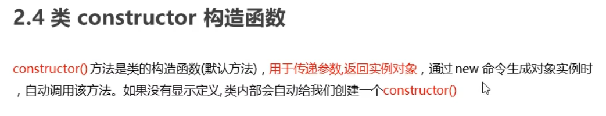

## 对象与类

### 1对象

对象是由属性和方法组成的：是一个无序键值对的集合,**指的是一个具体的事物**

- 属性：事物的特征，在对象中用属性来表示（常用名词）
- 方法：事物的行为，在对象中用方法来表示（常用动词）

#### 1.1创建对象

```js
//以下代码是对对象的复习
//字面量创建对象
var ldh = {
    name: '刘德华',
    age: 18
}
console.log(ldh);

//构造函数创建对象
  function Star(name, age) {
    this.name = name;
    this.age = age;
 }
var ldh = new Star('刘德华', 18)//实例化对象
console.log(ldh);	
```

如上两行代码运行结果为:

***

### 2类

- 在 ES6 中新增加了类的概念，可以使用 class 关键字声明一个类，之后以这个类来实例化对象。类抽象了对象的公共部分，**它泛指某一大类（class）对象特指某一个，通过类实例化一个具体的对象**
- **construct**
- 

#### 2.1创建类

1. 语法:

```js
//步骤1 使用class关键字
class name {
  // class body
}     
//步骤2使用定义的类创建实例  注意new关键字
var xx = new name();     
```

2. 示例

```js
 // 1. 创建类 class  创建一个 明星类
 class Star {
   // 类的共有属性放到 constructor 里面
   constructor(name, age) {
   this.name = name;
   this.age = age;
   }
 }
   // 2. 利用类创建对象 new
   var ldh = new Star('刘德华', 18);
   console.log(ldh);
```

以上代码运行结果: 


通过结果我们可以看出,运行结果和使用构造函数方式一样

***

#### 2.2类创建添加属性和方法

```js
 // 1. 创建类 class  创建一个类
class Star {
    // 类的共有属性放到 constructor 里面 constructor是 构造器或者构造函数
    constructor(uname, age) {
       //this指向的是当前的实例
      this.uname = uname;
      this.age = age;
    }//------------------------------------------->注意,方法与方法之间不需要添加逗号
    sing(song) {
      console.log(this.uname + '唱' + song);
    }
}
// 2. 利用类创建对象 new
var ldh = new Star('刘德华', 18);
console.log(ldh); // Star {uname: "刘德华", age: 18}
ldh.sing('冰雨'); // 刘德华唱冰雨
```

 以上代码运行结果:


**注意哟:**

1. 通过class 关键字创建类, 类名我们还是习惯性定义首字母大写
2. 类里面有个constructor 函数,可以接受传递过来的参数,同时返回实例对象
3. constructor 函数 只要 new 生成实例时,就会自动调用这个函数, 如果我们不写这个函数,类也会自动生成这个函数
4. 多个函数方法之间不需要添加逗号分隔
5. 生成实例 new 不能省略
6. 语法规范, 创建类 类名后面不要加小括号,生成实例 类名后面加小括号, 构造函数不需要加function


#### 2.3、实例属性与静态属性(类属性)

```typescript
class people{
    name:string = '猴哥';//需要实例化来访问
    static age:number = 5000;//静态属性(类属性)可以直接通过类去访问
    readonly height:number = 180;//readonly只读属性不可以更改
}

console.log(people.age);//没有实例化直接访问
const per =  new people;
console.log(per.name);

```

***


#### 2.4、类的继承

1. 语法

```js
// 父类
class Father{   
} 

// 子类继承父类
class  Son  extends Father {  
}       
```

2. 示例

```js
class Father {
      constructor(surname) {
        this.surname= surname;
      }
      say() {
        console.log('你的姓是' + this.surname);
       }
}

class Son extends Father{  // 这样子类就继承了父类的属性和方法
}
var damao= new Son('刘');
damao.say();      //结果为 你的姓是刘
```

以上代码运行结果:


- 子类使用super关键字访问父类的方法

  ```js
  //定义了父类
  class Father {
     constructor(x, y) {
     this.x = x;
     this.y = y;
     }
     sum() {
     console.log(this.x + this.y);
  	}
   }
  //子元素继承父类
      class Son extends Father {
     		 constructor(x, y) {
              /*
              this.x = x;
              this.y = y;
              */
      		super(x, y); 
               /*
               如果没有super,子类继承父类的sum()this指向是父类里面的construct
               不能指向子类的construct。
               使用super调用了父类中的contruct构造函数,把(x,y)直接传递给父类
               */
      	}
      }
      var son = new Son(1, 2);
      son.sum(); //结果为3
  ```

```js
  
**注意：** 
  
1. 继承中,如果实例化子类输出一个方法,先看子类有没有这个方法,如果有就先执行子类的
  
2. 继承中,如果子类里面没有,就去查找父类有没有这个方法,如果有,就执行父类的这个方法(就近原则)
  
3. 如果子类想要继承父类的方法,同时在自己内部扩展自己的方法,利用super 调用父类的构造函数,super 必须在子类this之前调用js
      // 父类有加法方法
      class Father {
        constructor(x, y) {
        this.x = x;
        this.y = y;
        }
        sum() {
        console.log(this.x + this.y);
        }
      }
      // 子类继承父类加法方法 同时 扩展减法方法
      class Son extends Father {
        constructor(x, y) {
        // 利用super 调用父类的构造函数 super 必须在子类this之前调用,放到this之后会报错
        super(x, y);
        this.x = x;
      this.y = y;
  
       }
       subtract() {
       console.log(this.x - this.y);
       }
     }
     var son = new Son(5, 3);
     son.subtract(); //2
     son.sum();//8
```

   以上代码运行结果为:

   

4. 时刻注意this的指向问题,类里面的共有的属性和方法一定要加this使用.

   1. constructor中的this指向的是new出来的实例对象 
   2. 自定义的方法,一般也指向的new出来的实例对象
   3. 绑定事件之后this指向的就是触发事件的事件源

5. 在 ES6 中类没有变量提升，所以必须先定义类，才能通过类实例化对象

   ## 

***

#### 2.5、抽象类(abstract)

```typescript
abstract class add {
    //abstract 抽象类只能继承不能实例化
    x:number;
    y:number;
    constructor(one:number,two:number){
        this.x = one;
        this.y = two;
    }
    abstract sum():void;/* {
        console.log(this.x+this.y);
    } */
    //定义一个抽象方法
    //抽象方法使用abstract，不能有功能即{}
    //抽象方法定义在抽象类中，子类中必须对抽象方法进行使用
}

//let per = new add(1,2) //报错无法创建抽象类的实例

class add1 extends add{
    constructor(x:number,y:number){
        super(x,y);//使继承的this指向子类
    }
    sum(){
        console.log(this.x+this.y);   
    }
}

let person = new add1(1,2) ;
person.sum();
```

#### 2.6、接口

接口的作用类似于抽象类，不同点在于：接口中的所有方法和属性都是没有实值的，换句话说接口中的所有方法都是抽象方法；

```typescript
/*
定义接口：interface 
接口所有的属性都不能有实际值
所有的方法都是抽象方法
 */
interface Person{
    name:string;
    characteristic():void;
}
/* 
使用implements调用一个接口
接口可以去限制一个对象的接口：
对象只有包含接口中定义的所有属性和方法时才能匹配接口；
*/
class peo implements Person{
    name:string;
    constructor(name:string){
        this.name = name;
    }
    characteristic(){
        console.log("hello world");
    }
}

let onePer = new peo("AoZiGe");
onePer.characteristic();
```

#### 2.7、属性的封装

1.属性修饰符：

* public ：可以在任意位置修改默认值
* private：私有属性只能在类的内部进行访问
  * 可以通过在类中添加方法使的私有属性可以被外部访问
* protected：只能在当前类和子类中访问

ts 类中内置方法:

* get():获取属性的值：必须要有放回值
* set():设置属性的值：必须要有参数

```typescript
class species{
    public kind:string;
    private year:number;//私有属性，只能够在类内部定义
    protected color:string;
    constructor(kind:string,year:number,color:string){
        this.kind = kind;
        this.color = color;
        this.year = year;
    }
    behavior(hobby:string){
        console.log("行为："+hobby);
    }
    //限制了属性的随意修改，现在只有满足条件才能被修改 
    /* 自定义方法访问私有属性 */
    setYear(value:number){
        if(value < 0) return;
        this.year = value;
    }
    getYear(){
        return this.year;
    }
    //ts 内置方法访问私有属性
    get Year(){
        //get 必须要有return
        return this.year;
    }
    set Year(value:number){
        //set必须要有参数
        if(value < 0) return;
        this.year = value;
    }
}

let bird = new species("bird",10,"green");
/* bird.year = '8'; //私有属性只能在类中访问
console.log(bird.year); */
bird.setYear(-1);
console.log("通过自定义方法访问",bird.getYear());//通过内置方法访问私有属性,结果还是10
bird.Year = 8;//与自定义方法不同，这是通过直接定义
console.log("通过内置方法访问",bird.Year);

class sons extends species{
    print(){
        console.log(this.kind);
        //console.log(this.year); //私有属性不能子类直接访问
        console.log(this.color);  //protected可以通过子类访问
    }
}

let a = new sons("person",20,'red');
a.print();


```

#### 2.8、construct语法糖

```typescript
class A{
    name:string;
    age:number;
    constructor(a:string,b:number){
        this.name = a;
        this.age = b;
    }
}
//class B等价于class A
class B{
    constructor(public name: string, public age: number){
    }
}

let c = new A('hhh',10);
let d = new B("aaa",20);
console.log(c,d);

```

