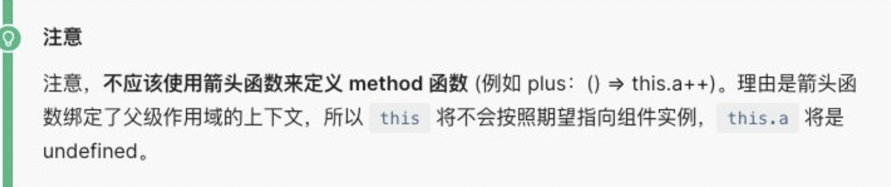
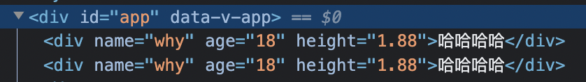

## 01、template属性

> **template属性:**表示的是Vue需要帮助我们渲染的模板信息:
> 目前我们看到它里面有很多的HTML标签，这些标签会替换掉我们挂载到的元素(比如id为app的div)的innerHTML;

> 但是这个模板的写法有点过于别扭了，并且IDE很有可能没有任何提示，阻碍我们编程的效率。

**Vue提供了两种方式:**

* 方式一：使用script标签，**并且标记它的类型为 x-template;**

  ```html
  <body>
    <div id="app">哈哈哈哈啊</div>
    
    <script type="x-template" id="why">
      <div>
        <h2>{{message}}</h2>
      </div>
    </script>
  
    <script src="../js/vue.js"></script>
    <script>
      document.querySelector("#why")
      Vue.createApp({
        template: '#why',	// 与script标签中的id相对应
        data: function() {
          return {
            message: "Hello World",
          }
        },
      }).mount('#app');
    </script>
  </body>
  ```

* 方式二：使用任意标签(通常使用template标签，因为不会被浏览器渲染)，设置id;
  **template元素是一种用于保存客户端内容的机制，该内容再加载页面时不会被呈现，但随后可以在运行时使 用JavaScript实例化;**

  ```html
  <body>
    <div id="app"></div>
    <template id="why">
      <div>
        <h2>{{counter}}</h2>
      </div>
    </template>
    <script src="../js/vue.js"></script>
    <script>
      document.querySelector("#why")
      Vue.createApp({
        template: '#why',
        data: function() {
          return {
            counter: 100
          }
        },
      }).mount('#app');
    </script>
  </body>
  ```

---

## 02、data属性

* **data属性**是传入一个函数，并且该函数需要返回一个对象:
  * 在Vue2.x的时候，**也可以传入一个对象**(虽然官方推荐是一个函数); 
  * 在Vue3.x的时候，**必须传入一个函数**，否则就会直接在浏览器中报错;
* data中返回的对象会被Vue的响应式系统劫持，之后对该对象的修改或者访问都会在劫持中被处理: 
  * 所以在template中通过 {{counter}} 访问counter，可以从对象中获取到数据; 
  * 所以修改counter的值时，template中的 {{counter}}也会发生改变;

---

## 03、**methods属性**

* **methods属性**是一个对象，通常我们会在这个对象中定义很多的方法: p
* 这些方法可以被**绑定到 template** 模板中;
* **在该方法中，我们可以使用this关键字来直接访问到data中返回的对象的属性;**
* 


### 3.1、methods中this的指向

```html
<body>
  <div id="app"></div>

  <template id="why">
    <div>
      <button @click="btn1Click">按钮1</button>
      <button @click="btn2Click">按钮2</button>
    </div>
  </template>

  <script src="../js/vue.js"></script>
  <script>
    document.querySelector('#why');
    Vue.createApp({
      template: '#why',
      data: function () {},
      // 定义各种各样的方法
      methods: {
        btn1Click: () => {
          // 在箭头函数中是不绑定this, this来自上层作用域，对象没有作用域，作用域就在script中了。
          console.log('箭头函数this=', this); // windows
        },
        btn2Click: function () {
          console.log('普通函数this=', this); // Proxy(Object)
        }
      }
    }).mount('#app');
  </script>
</body>
```

---

## 04、**Mustache双大括号语法**

如果我们希望把数据显示到模板(template)中，使用最多的语法是 **“Mustache”语法 (双大括号)** 的文本插值。 

并且data返回的对象是有添加到Vue的响应式系统中;当data中的数据发生改变时，对应的内容也会发生更新。

当然，Mustache中不仅仅可以是data中的属性，也可以是一个JavaScript的表达式。

```html
<body>
  
  <div id="app"></div>

  <template id="my-app">
    <!-- 1.mustache的基本使用 -->
    <h2>{{message}} - {{message}}</h2>
    <!-- 2.是一个表达式 -->
    <h2>{{counter * 10}}</h2>
    <h2>{{ message.split(" ").reverse().join(" ") }}</h2>
    <!-- 3.也可以调用函数 -->
    <!-- 也可以使用computed(计算属性) -->
    <h2>{{getReverseMessage()}}</h2>
    <!-- 4.三元运算符 -->
    <h2>{{ isShow ? "哈哈哈": "" }}</h2>
    <button @click="toggle">切换</button>

    <!-- 错误用法 -->
    <!-- var name = "abc" -> 赋值语句 -->
    <!-- <h2>{{var name = "abc"}}</h2>
    <h2>{{ if(isShow) {  return "哈哈哈" } }}</h2> -->
  </template>

  <script src="../js/vue.js"></script>
  <script>
    const App = {
      template: '#my-app',
      data() {
        return {
          message: "Hello World",
          counter: 100,
          isShow: true
        }
      },
      methods: {
        getReverseMessage() {
          return this.message.split(" ").reverse().join(" ");
        },
        toggle() {
          this.isShow = !this.isShow;
        }
      }
    }

    Vue.createApp(App).mount('#app');
  </script>
</body>
```

---

## 05、**v-once指令**

**v-once用于指定元素或者组件只渲染一次:**

>**当数据发生变化时，元素或者组件以及其所有的子元素将视为静态内容并且跳过;** 该指令可以用于性能优化;

```html
<body>
  <div id="app"></div>

  <template id="my-app">
    <!-- 会更新 -->
    <h2>{{counter}}</h2>
    <div v-once>
      <!-- 不会更新,只要被v-once包含都不会更新 -->
      <h2>{{counter}}</h2>
      <h2>{{message}}</h2>
    </div>
    <button @click="increment">+1</button>
  </template>

  <script src="../js/vue.js"></script>
  <script>
    const App = {
      template: '#my-app',
      data() {
        return {
          counter: 100,
          message: 'abc'
        };
      },
      methods: {
        increment() {
          this.counter++;
        }
      }
    };

    Vue.createApp(App).mount('#app');
  </script>
</body>
```

---

## 06、**v-text指令**

**用于更新元素的 textContent:**

```html
  <template id="my-app">
    <h2 v-text="message"></h2>
    <!-- 等价于 -->
    <h2>{{message}}</h2>
  </template>
```


---

## 07、**v-html**

* **默认情况下，如果我们展示的内容本身是 html 的，那么vue并不会对其进行特殊的解析。** 
* **如果我们希望这个内容被Vue可以解析出来，那么可以使用 v-html 来展示;**

```html
<body>
  
  <div id="app"></div>

  <template id="my-app">
    <div>{{msg}}</div>
    <div v-html="msg"></div>
  </template>

  <script src="../js/vue.js"></script>
  <script>
    const App = {
      template: '#my-app',
      data() {
        return {
          msg: '<span style="color:red; background: blue;">哈哈哈</span>'
        }
      }
    }

    Vue.createApp(App).mount('#app');
  </script>
</body>
```

---

## 08、**v-pre**

* v-pre用于跳过元素和它的子元素的编译过程，显示原始的Mustache标签: 
* 跳过不需要编译的节点，加快编译的速度;

```html
<template id="my-app">
	<h2 v-pre>{{message}}</h2>
  <!-- 展示 {{message}} -->
</template>
```

---

## 09、v-cloak

**当使用直接在 DOM 中书写的模板时，可能会出现一种叫做“未编译模板闪现”的情况：用户可能先看到的是还没编译完成的双大括号标签，直到挂载的组件将它们替换为实际渲染的内容。**

`v-cloak` 会保留在所绑定的元素上，直到相关组件实例被挂载后才移除。配合像 `[v-cloak] { display: none }` 这样的 CSS 规则，它可以在组件编译完毕前隐藏原始模板。

- **示例：**

  ```css
  [v-cloak] {
    display: none;
  }
  ```

  ```html
  <div v-cloak>
    {{ message }}
  </div>
  ```

  直到编译完成前，`<div>` 将不可见。

---

## 10、****v-bind**

前面的一系列指令，主要是将值插入到模板内容中。但是，除了内容需要动态来决定外，**某些属性我们也希望动态来绑定**。 比如动态绑定**a元素的href属性**;比如动态绑定**img元素的src属性**;

绑定属性我们使用v-bind: ，**缩写为:**。
v-bind用于**绑定一个或多个属性值**，**或者向另一个组件传递props值**

```html
  <!-- vue2 template模板中只能有一个根元素 -->
  <!-- vue3 是允许template中有多个根元素 -->
  <template id="my-app">
    <!-- 1.v-bind的基本使用 -->
    
    <a v-bind:href="link">百度一下</a>

    <!-- 2.v-bind提供一个语法糖 : -->
    
    
  </template>
```

### 10.1、绑定class元素

* 存在两种绑定方式：

  * **对象语法**
  * **数组语法**

* 用例：

* ```html
  <body>
    <div id="app"></div>
  
    <template id="my-app">
      <!-- 1.直接绑定 -->
      <div :class="className">哈哈哈哈</div>
      
      <!-- 2.对象语法: 当isActive为true类名为active -->
      <div :class="{'active': isActive}">呵呵呵呵</div>
      <button @click="toggle">切换</button>
  
      <!-- 3.也可以有多个键值对 -->
      <div :class="{active: isActive, title: true}">呵呵呵呵</div>
  
      <!-- 4.默认的class和动态的class结合 -->
      <div class="abc cba" :class="{active: isActive, title: true}">
        呵呵呵呵
      </div>
  
      <!-- 5.将对象放到一个单独的属性中 -->
      <div class="abc cba" :class="classObj">呵呵呵呵</div>
  
      <!-- 6.将返回的对象放到一个methods(computed)方法中 -->
      <div class="abc cba" :class="getClassObj()">呵呵呵呵</div>   
      
      <!-- 7.在数组中绑定 -->
      <div :class="['abc', title]">哈哈哈哈</div>
      <div :class="['abc', title, isActive ? 'active': '']">哈哈哈哈</div>
      <div :class="['abc', title, {active: isActive}]">哈哈哈哈</div>
    </template>
  
    <script src="../js/vue.js"></script>
    <script>
      const App = {
        template: "#my-app",
        data() {
          return {
            className: "why",
            isActive: true,
            title: "abc",
            classObj: { 
              active: true, 
              title: true 
            },
          };
        },
        methods: {
          toggle() {
            this.isActive = !this.isActive;
          },
          getClassObj() {
            return { 
              active: true, 
              title: true 
            }
          }
        },
      };
  
      Vue.createApp(App).mount("#app");
    </script>
  </body>
  ```

### 10.2、绑定style

```html
  <template id="my-app">
    <!-- :style="{cssPropertyName: cssPropertyValue}" -->
    <div :style="{color: finalColor, 'font-size': '30px'}">哈哈哈哈</div>
    <div :style="{color: finalColor, fontSize: '30px'}">哈哈哈哈</div>
    <div :style="{color: finalColor, fontSize: finalFontSize + 'px'}">哈哈哈哈</div>

    <!-- 绑定一个data中的属性值, 并且是一个对象 -->
    <div :style="finalStyleObj">呵呵呵呵</div>
    <!-- 调用一个方法 -->
    <div :style="getFinalStyleObj()">呵呵呵呵</div>
    
    <!-- 在数组中绑定 -->
    <div :style="[style1Obj, style2Obj]">哈哈哈</div>
  </template>

  <script>
    const App = {
      template: '#my-app',
      data() {
        return {
          message: "Hello World",
          finalColor: 'red',
          finalFontSize: 50,
          finalStyleObj: {
            'font-size': '50px',
            fontWeight: 700,
            backgroundColor: 'red'
          }
          
        }
      },
      methods: {
        getFinalStyleObj() {
          return {
            'font-size': '50px',
            fontWeight: 700,
            backgroundColor: 'red'
          }
        }
      }
    }
</script>
```

### 10.3、动态绑定属性名称

```html
 	<template id="my-app">
    <div :[name]="value">哈哈哈</div>
  </template>

  <script>
    const App = {
      template: '#my-app',
      data() {
        return {
          name: "cba",
          value: "kobe"
        }
      }
    }
  </script>
```

### 10.4、绑定对象，获取所有属性

**如果我们希望将一个对象的所有属性，绑定到元素上的所有属性，可以直接使用 v-bind 绑定一个对象;**

```html
  <template id="my-app">
    <div v-bind="info">哈哈哈哈</div>
    <div :="info">哈哈哈哈</div>
  </template>

  <script>
    const App = {
      template: '#my-app',
      data() {
        return {
          info: {
            name: "why",
            age: 18,
            height: 1.88
          }
        }
      }
    }
  </script>
```

结果：



---

## 11、v-on绑定事件

给元素绑定事件监听器。

- **缩写：**`@`
- **期望的绑定值类型：**`Function | Inline Statement | Object (不带参数)`
- **参数：**`event` (使用对象语法则为可选项)
- **修饰符：**
  - `.stop` - 调用 `event.stopPropagation()`。
  - `.prevent` - 调用 `event.preventDefault()`。
  - `.capture` - 在捕获模式添加事件监听器。
  - `.self` - 只有事件从元素本身发出才触发处理函数。
  - `.{keyAlias}` - 只在某些按键下触发处理函数。
  - `.once` - 最多触发一次处理函数。
  - `.left` - 只在鼠标左键事件触发处理函数。
  - `.right` - 只在鼠标右键事件触发处理函数。
  - `.middle` - 只在鼠标中键事件触发处理函数。
  - `.passive` - 通过 `{ passive: true }` 附加一个 DOM 事件。

### **11.1、基本使用：**

* 可以使用`v-on`来监听一下点击的事件:

  ```vue
    <template id="my-app">
      <!-- 1.完整写法: v-on:监听的事件="methods中方法" -->
      <button v-on:click="btn1Click">按钮1</button>
      <div class="area" v-on:mousemove="mouseMove">div</div>
      <!-- 2.语法糖 -->
      <button @click="btn1Click">按钮1</button>
      <!-- 绑定一个表达式: inline statement -->
      <button @click="counter++">{{counter}}</button><!-- 点击一次counter累加一次 -->
      <!-- 3.绑定一个对象，绑定多个事件 -->
      <div class="area" v-on="{click: btn1Click, mousemove: mouseMove}"></div>
      <div class="area" @="{click: btn1Click, mousemove: mouseMove}"></div>
    </template>
  
    <script>
      const App = {
        template: '#my-app',
        data() {
          return {
            message: "Hello World",
            counter: 100
          }
        },
        methods: {
          btn1Click() {
            console.log("按钮1发生了点击");
          },
          mouseMove() {
            console.log("鼠标移动");
          }
        }
      }
    </script>
  ```

### 11.2、传递参数

```html
	<template id="my-app">
    <!-- 默认传入event对象, 可以在方法中获取 -->
    <button @click="btn1Click">按钮1</button>
    <!-- $event可以获取到事件发生时的事件对象 -->
    <button @click="btn2Click($event, 'coderwhy', 18)">按钮2</button>
  </template>

  <script>
    const App = {
      template: '#my-app',
      data() {
        return {
          message: "Hello World"
        }
      },
      methods: {
        btn1Click(event) {
          console.log(event);
        },
        btn2Click(event, name, age) {
          console.log(name, age, event);
        }
      }
    }

  </script>
```

### 11.3、修饰符

 v-on支持修饰符，修饰符相当于对事件进行了一些特殊的处理: 

* .stop - 调用 event.stopPropagation()。
* .prevent - 调用 event.preventDefault()。
* .capture - 添加事件侦听器时使用 capture 模式。
* .self - 只当事件是从侦听器绑定的元素本身触发时才触发回调。 p.{keyAlias} - 仅当事件是从特定键触发时才触发回调。
* .once - 只触发一次回调。
* .left - 只当点击鼠标左键时触发。
* .right - 只当点击鼠标右键时触发。 
* .middle - 只当点击鼠标中键时触发。 
* .passive - { passive: true } 模式添加侦听器

```vue
	<template id="my-app">
    <div @click="divClick">
      <button @click.stop="btnClick">按钮</button>
    </div>
    <input type="text" @keyup.enter="enterKeyup">
  </template>

  <script>
    const App = {
      template: '#my-app',
      data() {
        return {
          message: "Hello World"
        }
      },
      methods: {
        divClick() {
          console.log("divClick");
        },
        btnClick() {
          console.log('btnClick');
        },
        enterKeyup(event) {
          console.log("keyup", event.target.value);
        }
      }
    }

    Vue.createApp(App).mount('#app');
  </script>
```

---

## 12、条件渲染

在某些情况下需要根据当前的条件决定某些元素或组件是否渲染，这个时候我们就需要进行条件判断了。

 Vue提供了下面的指令来进行条件判断: 

* **v-if**
* **v-else** 
* **v-else-if**
* **v-show**

> v-if、v-else、v-else-if用于根据条件来渲染某一块的内容: 
> 这些内容只有在条件为true时，才会被渲染出来; 
> 这三个指令与JavaScript的条件语句if、else、else if类似;

````vue
	<template id="my-app">
    <input type="text" v-model="score">
    <h2 v-if="score > 90">优秀</h2>
    <h2 v-else-if="score > 60">良好</h2>
    <h2 v-else>不及格</h2>
  </template>

  <script>
    const App = {
      template: '#my-app',
      data() {
        return {
          score: 95
        }
      }
    }

    Vue.createApp(App).mount('#app');
  </script>
````

**v-if的渲染原理:**

* v-if是惰性的;
* **当条件为false时，其判断的内容完全不会被渲染或者会被销毁掉;** 
* **当条件为true时，才会真正渲染条件块中的内容;**

**v-show**

```vue
<template id="my-app">
	<h2 v-show="isShow">哈哈哈哈</h2>
</template>
```

### **v-show和v-if的区别**

* 首先，在用法上的区别:

  * v-show是不支持template;而v-if是支持template
  * v-show不可以和v-else一起使用;

* 其次，本质的区别:

  * v-show元素无论是否需要显示到浏览器上，它的DOM实际都是有渲染的，只是通过CSS的display属性来进行切换;

  * v-if当条件为false时，其对应的原生压根不会被渲染到DOM中;

* 开发中如何进行选择呢?

  * 如果我们的原生需要在显示和隐藏之间频繁的切换，那么使用v-show; 
  * 如果不会频繁的发生切换，那么使用v-if;

---

## 13、**v-for**

```vue
<template id="my-app">
    <h2>电影列表</h2>
    <ul>
      <!-- 遍历数组 -->
      <li v-for="(movie, index) in movies">{{index+1}}.{{movie}}</li>
    </ul>
    <h2>个人信息</h2>
    <ul>
      <!-- 遍历对象 -->
      <li v-for="(value, key, index) in info">{{value}}-{{key}}-{{index}}</li>
      <!--
				why-name-0
				18-age-1
				1.88-height-2
			-->
    </ul>
    	<!-- 遍历数字 -->
    <ul>
      <li v-for="(num, index) in 10">{{num}}-{{index}}</li>
      <!--
				1-0
				2-1
				...
				10-9
			-->
    </ul>
  </template>

  <script>
    const App = {
      template: '#my-app',
      data() {
        return {
          movies: [
            "星际穿越",
            "盗梦空间",
            "大话西游",
            "教父",
            "少年派"
          ],
          info: {
            name: "why",
            age: 18,
            height: 1.88
          }
        }
      }
    }
  </script>
```

> 类似于v-if，你可以使用 template 元素来循环渲染一段包含多个元素的内容: 
>
> **我们使用template来对多个元素进行包裹，而不是使用div来完成;**

```vue
<template id="my-app">
    <ul>
      <template v-for="(value, key) in info">
        <li>{{key}}</li>
        <li>{{value}}</li>
        <li class="divider"></li>
      </template>
    </ul>
  </template>
```

### **v-for中的key是什么作用?**

* 这个key属性有什么作用呢?我们先来看一下官方的解释:
  * key属性主要用在Vue的虚拟DOM算法，**在新旧nodes对比时辨识VNodes;**
  * **如果不使用key，Vue会使用一种最大限度减少动态元素并且尽可能的尝试就地修改/复用相同类型元素的算法;** 
  * **而使用key时，它会基于key的变化重新排列元素顺序，并且会移除/销毁key不存在的元素;**

## vue中的V-Node

* 因为目前我们还没有比较完整的学习组件的概念，所以目前我们先理解HTML元素创建出来的VNode; 
* **VNode的全称是Virtual Node，也就是虚拟节点;**
* 事实上，无论是组件还是元素，它们最终在Vue中表示出来的都是一个个VNode;
* **VNode的本质是一个JavaScript的对象;**

```vue
 <template id="my-app">
    <ul>
      <li v-for="item in letters" :key="item">{{item}}</li>
    </ul>
    <button @click="insertF">插入F元素</button>
  </template>

  <script>
    const App = {
      template: '#my-app',
      data() {
        return {
          letters: ['a', 'b', 'c', 'd']
        }
      },
      methods: {
        insertF() {
          this.letters.splice(2, 0, 'f')
        }
      }
    }

    Vue.createApp(App).mount('#app');
  </script>
```

### 数组的修改

> **Vue 将被侦听的数组的变更方法进行了包裹，所以它们也将会触发视图更新。这些被包裹过的方法包括:**
>
> **push()、pop()、shift()、unshift()、splice()、sort()、reverse()**
>
> **上面的方法会直接修改原来的数组，但是某些方法不会替换原来的数组，而是会生成新的数组，比如 filter()、 concat() 和 slice()。**

```vue
	<template id="my-app">
    <h2>电影列表</h2>
    <ul>
      <li v-for="(movie, index) in movies">{{index+1}}.{{movie}}</li>
    </ul>
    <input type="text" v-model="newMovie">
    <button @click="addMovie">添加电影</button>
  </template>

  <script>
    const App = {
      template: '#my-app',
      data() {
        return {
          newMovie: "",
          movies: [
            "星际穿越",
            "盗梦空间",
            "大话西游",
            "教父",
            "少年派"
          ]
        }
      },
      methods: {
        addMovie() {
          this.movies.push(this.newMovie);
          this.newMovie = "";

          // this.movies = this.movies.filter(item => item.length > 2);
        }
      }
    }
  </script>
```

---

## **14、计算属性computed****

**前言：为什么会有计算属性**

>​	我们知道，在模板中可以直接通过**插值语法**显示一些**data中的数据**。但是在某些情况，我们可能需要对**数据进行一些转化后**再显示，或者需要**将多个数据结合起来**进行显示; 比如我们需要对多个data数据进行运算、三元运算符来决定结果、数据进行某种转化后显示;
>​	**在模板中使用表达式，可以非常方便的实现，但是设计它们的初衷是用于简单的运算;** 
>​	**在模板中放入太多的逻辑会让模板过重和难以维护;**
>​	**并且如果多个地方都使用到，那么会有大量重复的代码;** 
>​	我们有没有什么方法可以将逻辑抽离出去呢?
>​	可以，**其中一种方式就是将逻辑抽取到一个method中**，放到methods的options中;
>​	但是，**这种做法有一个直观的弊端，就是所有的data使用过程都会变成了一个方法的调用;** 
>​	另外一种方式就是使用计算属性computed;

**什么是计算属性呢?
官方并没有给出直接的概念解释;
而是说:对于任何包含响应式数据的复杂逻辑，你都应该使用计算属性**; 
计算属性将被混入到组件实例中。所有 getter 和 setter 的 this 上下文自动地绑定为组件实例;

**案例：**

>案例一:我们有两个变量:firstName和lastName，希望它们拼接之后在界面上显示;
>
>案例二:我们有一个分数:score
>当score大于60的时候，在界面上显示及格; p 当score小于60的时候，在界面上显示不及格;
>
>案例三:我们有一个变量message，记录一段文字:比如Hello World p 某些情况下我们是直接显示这段文字;
>某些情况下我们需要对这段文字进行反转;

**实现一：模版语法**

```vue
	<template id="my-app">
    <h2>{{firstName + " " + lastName}}</h2>
    <h2>{{score >= 60 ? '及格': '不及格'}}</h2>
    <h2>{{message.split(" ").reverse().join(" ")}}</h2>
  </template>
```

**实现二：method实现**

```vue
	<template id="my-app">
    <h2>{{getFullName()}}</h2>
    <h2>{{getResult()}}</h2>
    <h2>{{getReverseMessage()}}</h2>
  </template>

  <script>
    const App = {
      template: '#my-app',
      data() {
        return {
          firstName: "Kobe",
          lastName: "Bryant",
          score: 80,
          message: "Hello World"
        }
      },
      methods: {
        getFullName() {
          return this.firstName + " " + this.lastName;
        },
        getResult() {
          return this.score >= 60 ? "及格": "不及格";
        },
        getReverseMessage() {
          return this.message.split(" ").reverse().join(" ");
        }
      }
    }
  </script>
```

**实现三：computed实现**

```vue
	<template id="my-app">
    <h2>{{fullName}}</h2>
    <h2>{{result}}</h2>
    <h2>{{reverseMessage}}</h2>
  </template>

  <script>
    const App = {
      template: '#my-app',
      data() {
        return {
          firstName: "Kobe",
          lastName: "Bryant",
          score: 80,
          message: "Hello World"
        }
      },
      computed: {
        // 定义了一个计算属性叫fullname
        fullName() {
          return this.firstName + " " + this.lastName;
        },
        result() {
          return this.score >= 60 ? "及格": "不及格";
        },
        reverseMessage() {
          return this.message.split(" ").reverse().join(" ");
        }
      }
    }
  </script>
```

### 计算属性computed与methods的区别

* **当多次调用同一个计算属性或者方法时，计算属性只会执行一次，而方法会执行多次。**	
* **这是因为计算属性会基于它们的依赖关系进行缓存;在数据不发生变化时，计算属性是不需要重新计算的;**
* **但是如果依赖的数据发生变化，在使用时，计算属性依然会重新进行计算;**

### 计算属性的setter与getter

```vue
	<template id="my-app">
    <button @click="changeFullName">修改fullName</button>
    <h2>{{fullName}}</h2>
  </template>
  <script>
    const App = {
      template: '#my-app',
      data() {
        return {
          firstName: "Kobe",
          lastName: "Bryant"
        }
      },
      computed: {
        // fullName 的 getter方法
        fullName() {
          return this.firstName + " " + this.lastName;
        },
        // fullName的getter和setter方法
        fullName: {
          get: function() {
            return this.firstName + " " + this.lastName;
          },
          set: function(newValue) {
            console.log(newValue);
            const names = newValue.split(" ");
            this.firstName = names[0];
            this.lastName = names[1];
          }
        }
      },
      methods: {
        changeFullName() {
          this.fullName = "Coder Why";
        }
      }
    }
  </script>
```

**源码如何对setter和getter处理呢?**

Todo

---

## **15、侦听器watch****

* **什么是侦听器呢?** 
  * 开发中我们在data返回的对象中定义了数据，这个数据通过插值语法等方式绑定到template中;
  * 当数据变化时，template会自动进行更新来显示最新的数据;
  * 但是在某些情况下，我们希望在代码逻辑中监听某个数据的变化，这个时候就需要用侦听器watch来完成了;

```vue
	<template id="my-app">
    您的问题: <input type="text" v-model="question">
    <!-- <button @click="queryAnswer">查找答案</button> -->
  </template>

  <script>
    const App = {
      template: '#my-app',
      data() {
        return {
          // 侦听question的变化时, 去进行一些逻辑的处理(JavaScript, 网络请求)
          question: "Hello World",
          anwser: ""
        }
      },
      watch: {
        // question侦听的data中的属性的名称
        // newValue变化后的新值
        // oldValue变化前的旧值
        question: function(newValue, oldValue) {
          console.log("新值: ", newValue, "旧值", oldValue);
          this.queryAnswer();
        }
      },
      methods: {
        queryAnswer() {
          console.log(`你的问题${this.question}的答案是哈哈哈哈哈`);
          this.anwser = "";
        }
      }
    }
  </script>
```

