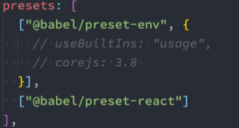

# Babel的作用是什么？

* 事实上，在开发中我们很少直接去接触babel，但是babel对于前端开发来说，目前是不可缺少的一部分： 
  * 开发中，我们想要使用ES6+的语法，想要使用TypeScript，开发React项目，它们都是离不开Babel的；
* 那么，Babel到底是什么呢？ 
  * Babel是一个工具链，主要用于旧浏览器或者缓解中将ECMAScript 2015+代码转换为向后兼容版本的 JavaScript，也可以将ts，jsx等等转化为js，； 
  * 包括：语法转换、源代码转换、Polyfill实现目标缓解缺少的功能等；


# Babel命令行使用

* **babel本身可以作为一个独立的工具（和postcss一样），不和webpack等构建工具配置来单独使用。**
* 如果我们希望在命令行尝试使用babel，需要安装如下库： 
  * **@babel/core：babel的核心代码，必须安装；**
  * **@babel/cli：可以让我们在命令行使用babel；**
  * **`npm install @babel/cli @babel/core`**
* 使用babel来处理我们的源代码： 
  * src：是源文件的目录； 
  * --out-dir：指定要输出的文件夹dist；
  * **`npx babel src --out-dir dist`**
* 比如我们需要转换箭头函数，那么我们就可以使用箭头函数转换相关的插件：
  * **`npm install @babel/plugin-transform-arrow-functions -D`**，arrow-functions代表箭头函数
  * **`npx babel src --out-dir dist --plugins=@babel/plugin-transform-arrow-functions`**打包时添加相关的插件；
* 查看转换后的结果：**我们会发现 const 并没有转成 var**，这是因为 **plugin-transform-arrow-functions**，并没有提供这样的功能；
  * 我们需要使用 `plugin-transform-block-scoping` 来完成这样的功能；
  * `npm install @babel/plugin-transform-block-scoping -D`，block-scoping表示块级作用域
  * `npx babel src --out-dir dist --plugins=@babel/plugin-transform-block-scoping ,@babel/plugin-transform-arrow-functions`

## Babel的预设preset

* **但是如果要转换的内容过多，一个个设置是比较麻烦的，我们可以使用预设（preset）：**
  * 预设是多个插件的组合
  * 安装@babel/preset-env预设：`npm install @babel/preset-env -D`
  * 执行如下命令：`npx babel src --out-dir dist --presets=@babel/preset-env`


# Babel原理

* babel是如何做到将我们的一段代码（ES6、TypeScript、React）转成另外一段代码（ES5）的呢？
  * 从一种源代码（原生语言）转换成另一种源代码（目标语言），这是什么的工作呢？ 
  * **就是编译器，事实上我们可以将babel看成就是一个编译器。**
  * Babel编译器的作用就是将我们的源代码，转换成浏览器可以直接识别的另外一段源代码；
* Babel也拥有编译器的工作流程： 
  * 解析阶段（Parsing） 
  * 转换阶段（Transformation） 
  * 生成阶段（Code Generation）
  * 
  * 


# Babel-loader

* 在实际开发中，我们通常会在构建工具中通过配置babel来对其进行使用的，比如在webpack中。 

  * 那么我们就需要去安装相关的依赖：@babel/core:`npm install babel-loader @babel/core`；

  * 我们可以设置一个规则，在加载js文件时，使用babel**，我们必须指定使用的插件才会生效**：

  * ```js
    module: {
        rules: [
          {
            test: /\.js$/,
            use: {
              loader: "babel-loader",
              options: {
                  //通过插件绝对转化成哪一种代码
                  plugins: [
                  "@babel/plugin-transform-arrow-functions",//箭头函数转化
                  "@babel/plugin-transform-block-scoping",//块级作用域转化
                ], 
              },
            },
          },
        ],
      },
    ```

## babel-preset

如果我们一个个去安装使用插件，那么需要手动来管理大量的babel插件，我们可以直接给webpack提供一个 preset，webpack会根据我们的预设来加载对应的插件列表，并且将其传递给babel。

* 安装预设

  * `npm install @babel/preset-env`

* 如何告知babel去适应哪个版本的游览器

  * **browserslist工具** 在webpack前面笔记里面提到的**browserslist**

  * **target属性**(优先级最高)

  * 如果两个同时配置了，哪一个会生效呢？

    * **配置的targets属性会覆盖browserslist；**
    * **但是在开发中，更推荐通过browserslist来配置，因为类似于postcss工具，也会使用browserslist，进行统一浏览器 的适配；**

  * ```js
    rules: [
          {
            test: /\.js$/,
            use: {
              loader: "babel-loader",
              options: {
                presets: ["@babel/preset-env"],
              },
            },
          },
        ],
    ```

# Babel的配置文件

* 像之前postCSS.config.js一样，我们可以将babel的配置信息放到一个独立的文件中，babel给我们提供了两种配置文件的编写

  * babel.config.json（或者.js，.cjs，.mjs）文件； 
  * .babelrc.json（或者.babelrc，.js，.cjs，.mjs）文件；

* 它们两个有什么区别呢？目前很多的项目都采用了多包管理的方式（babel本身、element-plus、umi等）； 

  * .babelrc.json：早期使用较多的配置方式，但是对于配置Monorepos项目是比较麻烦的； 
  * babel.config.json（babel7）：可以直接作用于Monorepos项目的子包，更加推荐；

  ```js
  //babel.config.js
  module.exports = {
    presets: [["@babel/preset-env"]],
  };
  ```

# polyfill

## polyfill是什么？

* 翻译：一种用于衣物、床具等的聚酯填充材料, 使这些物品更加温暖舒适；
* 理解：更像是应该填充物（垫片），一个补丁，可以帮助我们更好的使用JavaScript；
* **比如我们使用了一些语法特性（例如：Promise, Generator, Symbol等以及实例方法例如 Array.prototype.includes等）**
* **但是某些浏览器压根不认识这些特性，必然会报错；** 
* **我们可以使用polyfill来填充或者说打一个补丁，那么就会包含该特性了；**

## 使用polyfill

* 独引入**core-js**和**regenerator-runtime**来完成**polyfill**的使用：

  `npm install core-js regenerator-runtime --save`//开发与生产时的依赖

* 我们需要在babel.config.js文件中进行配置，给preset-env配置一些属性：

  * **useBuiltIns**：设置以什么样的方式来使用**polyfill**；
  * **corejs**：设置corejs的版本，目前使用较多的是3.x的版本，比如我使用的是3.8.x的版本； 
    * 另外**corejs**可以设置是否对提议阶段的特性进行支持； 
    * 设置**proposals**属性为true即可；

* **useBuiltIns属性有三个常见的值**

  * 第一个值：**false** 

    *  打包后的文件不使用polyfill来进行适配； 
    * 并且这个时候是不需要设置corejs属性的；

  * 第二个值：**usage** 

    * **会根据源代码中出现的语言特性，自动检测所需要的polyfill；** 
    * **这样可以确保最终包里的polyfill数量的最小化，打包的包相对会小一些；** 
    * 可以设置corejs属性来确定使用的corejs的版本；

  * 第三个值：**entry** 

    * 如果我们依赖的某一个库本身使用了某些polyfill的特性，但是因为我们使用的是usage，两者相互作用可能会出现错误；
    * 所以，如果你担心出现这种情况，可以使用 entry； 
      * 并且需要在入口文件中添加 **`import 'core-js/stable';   import 'regenerator-runtime/runtime';**
    * 这样做会根据 browserslist 目标导入`.browserslistrc`所适配游览器的所需要的所有的polyfill，但是对应的包也会变大；

    ```js
    module.exports = {
      presets: [
        [
          "@babel/preset-env",
          {
            /**
             * 有三个可设置的值：
             * false:不会使用任何的polyfill相关的代码;
             * usage:需要哪些polyfill的补丁就用相关的api，比如引入了promise,就会在打包的文件中添加解析promise的代码;
             * enter:默认不会生效的，需要在入口文件中导入`import 'core-js/stable'; import 'regenerator-						    runtime/runtime';
             */
            useBuiltIns: "entry",
            corejs: 3, //指定当前的corejs版本为第三个版本，默认为2.0的版本
          },
        ],
      ],
    };
    ```


## React的jsx支持

* 安装
  * `npm install @babel/preset-react -D`
  * 在babel.config.js文件中配置<br>


## TypeScript的编译

**1.	使用ts-loader对ts进行处理**	

* 如果我们希望在webpack中使用TypeScript，那么我们可以使用ts-loader来处理ts文件：

* 安装`npm i ts-loader -D`
* 配置tes-loader：<br>


**2.	使用babel对ts进行处理**

* 除了可以使用TypeScript Compiler来编译TypeScript之外，我们也可以使用Babel： 

  * Babel是有对TypeScript进行支持； 
  * 我们可以使用插件： @babel/tranform-typescript； 
  * 但是更推荐直接使用preset：**@babel/preset-typescript；**

* 安装：`npm i @babel/preset-typescript -D`

* ```js
  //webpack.config.js
  {
    test: /\.ts$/,
    exclude: /node_modules/,//不使用loader打包该文件夹下面的文件
    use: "babel-loader",
  },
      
  //babel.config.js
  module.exports = {
    presets: [
      [
        "@babel/preset-env",
        {
          useBuiltIns: "usage",
          corejs: 3, 
        },
      ],
      ["@babel/preset-typescript"],
    ],
  };
  ```


## ts-loader和babel-loader选择

* 那么我们在开发中应该选择ts-loader还是babel-loader呢？ 
* 使用ts-loader（TypeScript Compiler） 
  * 来直接编译TypeScript，那么只能将ts转换成js； 
  * **如果我们还希望在这个过程中添加对应的polyfill，那么ts-loader是无能为力的；** 
* 使用babel-loader（Babel） 
  * 来直接编译TypeScript，也可以将ts转换成js，并且可以实现polyfill的功能； 
  * **但是babel-loader在编译的过程中，不会对类型错误进行检测；**

# ESLint

## **什么是ESLint呢？** 

* ESLint是一个静态代码分析工具（Static program analysis，在没有任何程序执行的情况下，对代码进行分析）；
* ESLint可以帮助我们在项目中建立统一的团队代码规范，**保持正确、统一的代码风格，提高代码的可读性、可维护性；** 
* 并且ESLint的规则是可配置的，我们可以自定义属于自己的规则；
* 早期还有一些其他的工具，比如JSLint、JSHint、JSCS等，目前使用最多的是ESLint。

## 使用ESLint

1. 安装

   **`npm install eslint -D`**

2. 创建ESLint配置文件

   **`npx eslint --init`**

3. 选择想要使用的ESLint：

   

4. 执行检测命令：

   **`npx eslint ./src/main.js`**

## ESLint的文件解析

* 默认创建的环境如下： 
*  env：运行的环境，比如是浏览器，并且我们会使用es2021（对应的ecmaVersion是12）的语法； 
* extends：可以扩展当前的配置，让其继承自其他的配置信息，可以跟字符串或者数组（多个）； 
* parserOptions：这里可以指定ESMAScript的版本、sourceType的类型 
  * parser：默认情况下是espree（也是一个JS Parser，用于ESLint），但是因为我们需要编译TypeScript，所 以需要指定对应的解释器； 
* plugins：指定我们用到的插件； 
* rules：自定义的一些规则；

## ESLint-Loader的使用

* 但是如果每次校验时，都需要执行一次npm run eslint就有点麻烦了。事实上，我们在编译代码的时候，也能进行代码的eslint检测，这个时候我们就可以使用eslint-loader来完成了： 

安装：`npm install eslint-loader -D`<br>注意这里eslint-loader执行顺序应该在babel-loader前面

* 还在意在不用编译时就能进行检测，可以使用一个VSCode的插件： ESLint<br>


 

