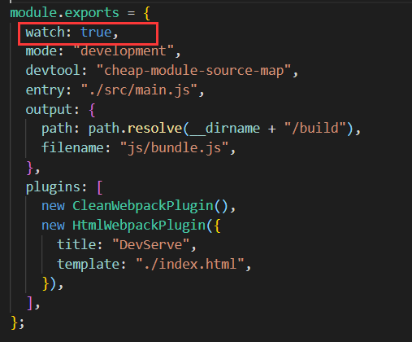
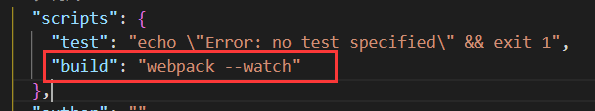

# 搭建本地服务器

* **目前我们开发的代码，为了运行需要有两个操作：** 
  * 操作一：**npm run build**（script脚本中执行webpack），编译相关的代码； 
  * 操作二：通过**live server**打开index.html生成本地服务器，会自动检测打包后的代码更新；
* **所以每次修改完代码都需要自己手动去终端输入npm run build，这样效率很低**
* 为了完成自动编译，webpack提供了几种可选的方式：
  * **webpack watch mode；** 
  * **webpack-dev-server；** 
  * **webpack-dev-middleware**

## Webpack watch

* webpack给我们提供了watch模式： 
  * 在该模式下，webpack依赖图中的所有文件，**只要有一个发生了更新，那么代码将被重新编译**； 
  * 我们不需要手动去运行 npm run build指令了；
* 开启watch
  * 方式一：**在导出的webpack.config.js配置中，添加 watch: true；**<br>
  * 方式二：**在启动webpack的命令中，添加 --watch的标识；**<br>


## webpack-dev-server

* 上面采用**liver server** + **watch**的方案并效率并不是最优的；
  1. 每次文件发生改变后会对所有的源代码进行打包；
  2. 编译完成后都会重新生成新的文件，webpack每次都会进行写入操作；
  3. liver-server每次都会刷新整个页面

**使用webpack-dev-server:**

* **安装：**
  * `npm install --save-dev webpack-dev-server`
* **在package中添加一个新的scripts脚本**
  * ` "sever":"webpack server"` //当webpack后面跟着server时，webpack会自动去寻找webpack-dev-server开启本地服务
* **webpack-dev-server 在编译之后没有任何的输出文件。**
  * **所以没有写入文件的操作，而是将打包后的文件保留在内存中，提高了webpack运行效率** 
  * 事实上webpack-dev-server使用了一个库叫memfs；

## HMR

* **什么是HMR呢？** 	

  * HMR的全称是Hot Module Replacement，翻译为模块热替换； 
  * 模块热替换是指在 应用程序运行过程中，替换、添加、删除模块，而无需重新刷新整个页面；

  

* HMR通过如下几种方式，来提高开发的速度： 

  * 不重新加载整个页面，这样可以保留某些应用程序的状态不丢失； 
  * 只更新需要变化的内容，节省开发的时间； 
  * 修改了css、js源代码，会立即在浏览器更新，相当于直接在浏览器的devtools中直接修改样式；

**使用HMR**

默认情况下，webpack-dev-server已经支持HMR，我们只需要开启即可； 
在不开启HMR的情况下，当我们修改了源代码之后，整个页面会自动刷新，使用的是live reloading；

* **开启HMR**

  * 在webpack配置中添加：

    ```js
    devServer: {
        hot: true,
    }
    ```

  * 但是会发现，当修改了某一个模块的代码时，是刷新的整个页面，而不是刷某个模块： 

    * 这是因为我们需要去指定哪些模块发生更新时，进行HMR；

    * ```js
      if (module.hot) {
        //开启模块更新时需要指定哪些模块发生更新时进行HMR；否则还是会直接刷新整个页面
        module.hot.accept("./moudle.js", () => {
          console.log("module.js更新了"); //该回调函数可以写也可以不写
        });
      }
      ```

      

## React的HMR

* 在之前，React是借助于React Hot Loader来实现的HMR，目前已经改成使用react-refresh来实现了。 

* 安装实现HMR相关的依赖： 

  * 注意：这里安装@pmmmwh/react-refresh-webpack-plugin，最新的npm安装有bug（建议使用lts版本对 应的npm版本）；

    **`npm install @pmmmwh/react-refresh-webpack-plugin react-refresh -D`**

  * 修改webpack.config.js和babel.config.js文件：

* ```js
  //webpack.config.js
  const ReactRefreshWebpackPlugin = require("@pmmmwh/react-refresh-webpack-plugin");
  
  moudle.exports = {
      module: {
      	rules: [
        		{
          		test: /\.jsx?$/,
          		use: "babel-loader",
        		},
      	],
    	},
      plugins: [
      		new ReactRefreshWebpackPlugin(),
    		],
  	}
  
  //babel.config.js
  module.exports = {
    presets: [["@babel/preset-env"], ["@babel/preset-react"]],
    plugins: [["react-refresh/babel"]],
  };
  ```


# devServer中的属性配置


## publicPath(很少用)

* devServer中也有一个publicPath的属性，该属性是指定本地服务所在的文件夹： 
  * 它的默认值是 /，也就是我们直接访问端口即可访问其中的资源 http://localhost:8080； 
  * 如果我们将其设置为了 /abc，那么我们需要通过 http://localhost:8080/abc才能访问到对应的打包后的资源； 
  * 并且这个时候，我们其中的bundle.js通过 http://localhost:8080/bundle.js也是无法访问的： 
    * 所以必须将output.publicPath也设置为 /abc； 
    * 官方其实有提到，建议 devServer.publicPath 与 output.publicPath相同；

## contentBase(很少用)

* devServer中contentBase对于我们直接访问打包后的资源其实并没有太大的作用，它的主要作用是如果我们打包后的资源，又依赖于其他的一些资源，那么就需要指定从哪里来查找这个内容： 
  * 比如在index.html中，我们需要依赖一个 abc.js 文件，这个文件我们存放在 public文件 中；
  * 在index.html中，我们应该如何去引入这个文件呢？ 
    * 比如代码是这样的：<script src="./public/abc.js"></script>； 
    * 但是这样打包后浏览器是无法通过相对路径去找到这个文件夹的； 
    * 所以代码是这样的：<script src="/abc.js"></script>; 
    * 但是我们如何让它去查找到这个文件的存在呢？ 设置contentBase即可； 
  * 当然在devServer中还有一个可以监听contentBase发生变化后重新编译的一个属性：watchContentBase。

## hotOnly

* hotOnly是当代码编译失败时，是否刷新整个页面： 

  * 默认情况下当代码编译失败修复后，我们会重新刷新整个页面； 

  * 如果不希望重新刷新整个页面，可以设置hotOnly为true；

    ```js
    devServer: {
        hot: true,
        hotOnly: true,
      },
    ```

## host配置

* **host设置主机地址**： 

  * 默认值是localhost； 

  * 如果希望其他地方也可以访问，可以设置为 0.0.0.0； 

  * **localhost 和 0.0.0.0 的区别：** 

    * localhost：本质上是一个域名，通常情况下会被解析成127.0.0.1; 
    * 127.0.0.1：回环地址(Loop Back Address)，表达的意思其实是我们主机自己发出去的包，直接被自己接收;
      * 正常的数据库包经常 应用层 - 传输层 - 网络层 - 数据链路层 - 物理层 ; 
      * 而回环地址，是在网络层直接就被获取到了，是不会经常数据链路层和物理层的; 
      * 比如我们监听 127.0.0.1时，在同一个网段下的主机中，通过ip地址是不能访问的; 
    * 0.0.0.0：监听IPV4上所有的地址，再根据端口找到不同的应用程序; 比如我们监听 0.0.0.0时，在同一个网段下的主机中，通过ip地址是可以访问的;

  * ```js
    decServer: {
    	hot: true,
    	host: "0.0.0.0",
    }
    ```

## port、open

* port设置监听的端口，默认情况下是8080 
* open是否打开浏览器：
  * 默认值是false，设置为true会打开浏览器； 
  * **当设置为true时，打包完成后会自动打开游览器**
  * 也可以设置为类似于 Google Chrome等值； 

## compress(性能优化)

* **compress是否为静态文件开启gzip compression：** 
  * 默认值是false，可以设置为true；
  * 可以对打包的文件进行压缩，在传输时效率大大增加。
  * 1.7Mb的文件大概可以压缩到400kb

```js
devServer: {
    hot: true,
    port: 8000,//修改监听的端口为8000
    open: true,//服务完成之后默认打开游览器
    compress: true,//对打包后的文件进行压缩
  },
```


## Proxy代理(不太理解)

* proxy是我们开发中非常常用的一个配置选项，它的目的设置代理来解决跨域访问的问题： 

  * 比如我们的一个api请求是 http://localhost:8888，但是本地启动服务器的域名是 http://localhost:8000，这个时候发送网络请求就会出现跨域的问题； 
  * 那么我们可以将请求先发送到一个代理服务器，代理服务器和API服务器没有跨域的问题，就可以解决我们的跨域问题了； 

* 我们可以进行如下的设置：

  * **target**：表示的是代理到的目标地址，比如 /api-hy/moment会被代理到 http://localhost:8888/apihy/moment； 

  * **pathRewrite**：默认情况下，我们的 /api-hy 也会被写入到URL中，如果希望删除，可以使用pathRewrite； 

  * **secure**：默认情况下不接收转发到https的服务器上，如果希望支持，可以设置为false； 

  * **changeOrigin**：它表示是否更新代理后请求的headers中host地址；

  * ```js
    deServer: {
        hot: true,
        proxy: {
        	'/port': {
            	target: "http://localhost:8888",
            	pathRewrite: {
               		"^/port":''
            		},
            	secure: false,
            	changeOrigin: true    
        		}
    		}
    	}
    ```

### changeOrigin的解析

* 这个 changeOrigin官方说的非常模糊，通过查看源码我发现其实是要修改代理请求中的headers中的host属性： 
  * 因为我们真实的请求，其实是需要通过 http://localhost:8888来请求的； 
  * 但是因为使用了代码，默认情况下它的值时 http://localhost:8000； 
  * 如果我们需要修改，那么可以将changeOrigin设置为true即可；


## historyApiFallback

* historyApiFallback是开发中一个非常常见的属性，它主要的作用是解决SPA页面在路由跳转之后，进行页面刷新时，返回404的错误。当跳转路由后url会发送变化， 若直接以路由变化后的url请求服务，会直接报404错误。

* **boolean值：默认是false** 

  * **如果设置为true，那么在刷新时，返回404错误时，会自动返回 index.html 的内容；**

    ```js
    deServer: {
        historyApiFallback: true,
    }
    ```

    

* **object类型的值，可以配置rewrites属性：** 

  * **可以配置from来匹配路径，决定要跳转到哪一个页面；** 

    ```js
    deServer: {
    	historyApiFallback: {
      		rewrites: [
                /*from代表匹配到哪个路径报错后，路径以正则为格式，会自动跳转到to后面对应的路径*/
        		{ from: /^\/$/, to: '/views/landing.html' },
        		{ from: /^\/subpage/, to: '/views/subpage.html' },
        		{ from: /./, to: '/views/404.html' }
      		]
    	}    
    }
    ```

    

* 事实上devServer中实现historyApiFallback功能是通过connect-history-api-fallback库的： 

* 可以查看connect-history-api-fallback 文档

