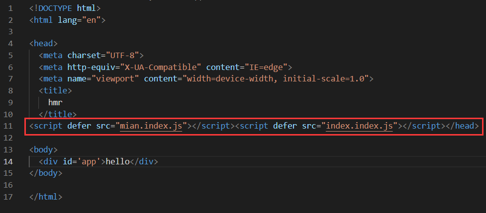

#  如何区分开发环境

* 目前我们所有的webpack配置信息都是放到一个配置文件中的：webpack.config.js 

  * 当配置越来越多时，这个文件会变得越来越不容易维护； 
  * 并且某些配置是在开发环境需要使用的，某些配置是在生成环境需要使用的，当然某些配置是在开发和生成环境都会使用的；
  * 所以，我们最好对配置进行划分，方便我们维护和管理； 

  

* 那么，在启动时如何可以区分不同的配置呢？ 

  * **方案一：编写两个不同的配置文件，开发和生成时，分别加载不同的配置文件即可；**

    ```json
    //packge.json文件
    "scripts": {
        //--config 指定执行哪个webpack配置文件，
        "build": "webpack --config webpack.produce.js",
        "server": "webpack server --config webpack.development.js"
      },
    ```

    

  * **方式二：使用相同的一个入口配置文件，通过设置参数来区分它们；**

    ```json
    //packge.json文件
    "scripts": {
        //无论开发模式还是生产模式都使用一个webpack配置文件，但是后面会传递参数指明为哪一个开发模式
        "build": "webpack --config webpack.common.js --env production",
        "server": "webpack server --config webpack.common.js --env developmet"
        /*在配置文件中以函数的方式导出配置，接收一个参数，这个参数可以把package中的中传递的参数接收到
       
        module.exports = (env) => {
      		console.log(env);// { WEBPACK_BUNDLE: true, WEBPACK_BUILD: true, production: true }
      		if(env.production){
      		//生产时配置
      			return {
                	 mode: "development",
        	   		entry: "./src/main.js",
        	  		output: {
          	   			filename: "index.js",
         				path: path.resolve(__dirname, "./build"),
        			},
    			};
      		}else{
      			//开发模式的配置
      			return { }
      		}
      		
        */
      },
    ```


# 打包后代码分离

* 代码分离（Code Splitting）是webpack一个非常重要的特性： 
  * **它主要的目的是将代码分离到不同的bundle中，之后我们可以按需加载，或者并行加载这些文件；** 
  * **比如默认情况下，所有的JavaScript代码（业务代码、第三方依赖、暂时没有用到的模块）在首页全部都加载， 就会影响首页的加载速度；** 
  * **代码分离可以分出出更小的bundle，以及控制资源加载优先级，提供代码的加载性能；**  
* Webpack中常用的代码分离有三种： 
  * **入口起点**：使用entry配置手动分离代码； 
  * **防止重复**：使用Entry Dependencies或者SplitChunksPlugin去重和分离代码（官方不推荐少用）； 
  * **动态导入**：通过模块的内联函数调用来分离代码；


## 多入口起点

* 入口起点的含义非常简单，就是配置多入口： 

  * 比如配置一个index.js和main.js的入口； 
  * 他们分别有自己的代码逻辑;

* ```js
  //配置两个入口文件
  entry: {
    mian: "./src/main.js",
    index: "./src/index.js",
  },
  //打包的文件名前面添加[name]，[name]会自动配对入口文件，分别打包成对应的文件
  output: {
    filename: "[name].index.js",
    path: path.resolve(__dirname, "./build"),
  },
  ```

* 打包后的文件<br>

## Entry Dependencies

* 假如我们的index.js和main.js都依赖两个库：lodash、dayjs 
  * **如果我们单纯的进行入口分离，那么打包后的两个bunlde都有会有一份lodash和dayjs；** 
  * **事实上我们可以对他们进行共享；**

```js
/*
在entry中配置：
与前面不一样的是：以对象的形式指定入口文件与依赖
import是入口文件，dependOn是公共的依赖。
这些依赖以数组的方式存在一起。
*/
entry: {
    main: { import: "./src/main.js", dependOn: "shared"},
    index: { import: "./src/index.js", dependOn: "shared"},
    shared: ['lodash', "axios"]
},
output: {
  filename: "[name].index.js",
  path: path.resolve(__dirname, "./build"),
},
```


## SplitChunks

* 另外一种分包的模式是splitChunk，它是使用SplitChunksPlugin来实现的：

  * **因为该插件webpack已经默认安装和集成，所以我们并不需要单独安装和直接使用该插件；** 
  * **只需要提供SplitChunksPlugin相关的配置信息即可；** 

* Webpack提供了SplitChunksPlugin默认的配置，我们也可以手动来修改它的配置： 

  * **比如默认配置中，chunks仅仅针对于异步（async）请求，我们可以设置为initial或者all；**

* ```js
  optimization: {
    splitChunks: {
      //async处理异步的导入
      //inital对同步的导入进行处理
      chunks: "all", //不管异步导入还是同步导入都会抽取公共的依赖为单独的配置文件。
    },
  },
  ```

**注意：如果要使用optimization.splitChunks，入口文件必须是`entry:{mian: './src/main.js'}`格式，出口文件的`filename: "[name.main.js]"`格式**

### SplitChunks属性解析

* **Chunks**:

  * 默认值是async 
  * 另一个值是initial，表示对通过的代码进行处理 
  * all表示对同步和异步代码都进行处理 

* **minSize**： 

  * 拆分包的大小, 至少为minSize； 
  * 如果一个包拆分出来达不到minSize,那么这个包就不会拆分； 

* **maxSize**： 

  * 将大于maxSize的包，拆分为不小于minSize的包； 

* **minChunks**： 

  * 至少被引入的次数，默认是1； 
  * 如果我们写一个2，但只引入了一次，那么不会被单独拆分；

* **name**：设置拆包的名称

  * 可以设置一个名称，也可以设置为false； 
  * 设置为false后，需要在cacheGroups中设置名称； 

* **cacheGroups**： 

  * **cacheGroups这个属性可以自定义匹配加载到的包，并打包到自定义的一个文件中。**
  * **用于对拆分的包就行分组，比如一个lodash在拆分之后，并不会立即打包，而是会等到有没有其他符合规则的包一起来打包；**
  * test属性：匹配符合规则的包，以正则的形式； 
  * name属性：拆分包的为名字为name值； 
* filename属性：拆分包的名称；
  * name与filename的区别：name一般是固定值，也可以使用函数，但一般不用函数，所以一般都是固定值，而filename是可以嵌套`[ ]`来动态加载加载名称
  
  ```js
  optimization: {
    splitChunks: {
      chunks: "all", 
      cacheGroups: {
          //vendor是自定义的属性
         vendor: {
             test: /[\\/]node_moudles[\\/]/,//当匹配到node_modules文件夹中的包时都会打包到[id]_vendors.js文件中
             filename: "[id]_vendors.js"
         }
      }
    },
},
  ```

  
  
  

## 动态导入

* 另外一个代码拆分的方式是动态导入时，webpack提供了两种实现动态导入的方式： 

  * 第一种，**使用ECMAScript中的 import() 语法来完成，也是目前推荐的方式**； 

    `import('./***').then(res => {**})`//异步导入为一个promise；

  * 第二种，使用webpack遗留的 require.ensure，目前已经不推荐使用； 

* 比如我们有一个模块 bar.js： 

  * 该模块我们希望在代码运行过程中来加载它（比如判断一个条件成立时加载）； 
  * 因为我们并不确定这个模块中的代码一定会用到，所以最好拆分成一个独立的js文件； 
  * 这样可以保证不用到该内容时，浏览器不需要加载和处理该文件的js代码； 
  * 这个时候我们就可以使用动态导入；

* 注意：使用动态导入bar.js： 

  * 在webpack中，通过动态导入获取到一个对象； 
  * **真正导出的内容，在该对象的default属性中，所以我们需要做一个简单的解构；**
  * **使用import导入的是异步导入，webpack一定会对导入的把分离打包**

### 动态导入的文件命名

* **因为动态导入通常是一定会打包成独立的文件的，所以并不会再cacheGroups中进行配置；** 

* **那么它的命名我们通常会在output中，通过 chunkFilename 属性来命名；**

* ```js
  output: {
    filename: "[name].index.js",
    path: path.resolve(__dirname, "./build"),
    chunkFilename: '[name]_chunk.js' //默认情况下name为id值
  },
  ```

* **自定义name值**

  ```js
  import(/* webpackChunkName: "bar" */"./bar").then(res) => {
      console.log(res)
  }//在异步导入时使用魔法注释导入，在打包的文件里面就可以生成魔法注释里面的name了
  ```


### Hash、ContentHash、ChunkHash

* 在我们给打包的文件进行命名的时候，会使用placeholder，placeholder中有几个属性比较相似：

  * hash、chunkhash、contenthash 
  * hash本身是通过MD4的散列函数处理后，生成一个128位的hash值（32个十六进制）； 

* **hash**值的生成和整个项目有关系： 

  * 比如我们现在有两个入口index.js和main.js； 

  * 它们分别会输出到不同的bundle文件中，并且在文件名称中我们有使用hash； 

  * **这个时候，如果修改了index.js文件中的内容，那么hash会发生变化； 那就意味着两个文件的名称都会发生变化；** 

    ```js
  output: {
      filename: "[name].[hash:6].index.js",
      path: path.resolve(__dirname, "./build"),
    },
    ```
  
    

* **chunkhash**可以有效的解决上面的问题，它会根据不同的入口进行借来解析来生成hash值： 

  * 比如我们修改了index.js，那么main.js的chunkhash是不会发生改变的； 

    ```js
    output: {
      filename: "[name].[chunkhash:6].index.js",
      path: path.resolve(__dirname, "./build"),
    },
    ```

    

* **contenthash**表示生成的文件hash名称，只和内容有关系： 

  * 比如我们的index.js，引入了一个style.css，style.css有被抽取到一个独立的css文件中； 
  * 这个css文件在命名时，如果我们使用的是chunkhash； 
  * 那么当index.js文件的内容发生变化时，css文件的命名也会发生变化； 
  * 这个时候我们可以使用contenthash；

  ```js
  output: {
    filename: "[name].[contenthash:6].index.js",
    path: path.resolve(__dirname, "./build"),
  },
  ```

  


### 代码的懒加载(!!很重要)

* 动态import使用最多的一个场景是懒加载（比如路由懒加载）： 
* 封装一个component.js，返回一个component对象； 我们可以在一个按钮点击时，加载这个对象；<br>
* 

#### Prefetch和Preload

在正常的懒加载时，会等到特定的时刻才会向服务器请求模块，下载并解析。但是下载模块这个步骤会比较消耗时间。Prefetch和Preload就可以提前将模块下载好，等到需要时再加载。

* **prefetch**(推荐)：
  * prefetch chunk 会在父 chunk 加载结束后开始加载，也就是浏览器空闲时加载。<br>
* **preload**(不推荐)：
  * preload chunk 会在父 chunk 加载时，以并行方式开始加载。preload chunk 具有中等优先级，并立即下载。
  * 换句话说preload等于是没有用到懒加载，和同步导入一样，直接一起请求了，没有提高性能。


## optimization.chunkIds配置

* optimization.chunkIds配置用于告知webpack模块的id采用什么算法生成。 
* 有三个比较常见的值： 
  * **natural**：按照数字的顺序使用id； 
  * **named**：development下的默认值，一个可读的名称的id； 
  * **deterministic**：确定性的，在不同的编译中不变的短数字id 
    * 在webpack4中是没有这个值的； 
    * 那个时候如果使用natural，那么在一些编译发生变化时，就会有问题； 
  * **最佳实践：** 
    * **开发过程中，我们推荐使用named；`chunkIds: named`** 
    * **打包过程中，我们推荐使用deterministic；`chunkIds: deterministic`**<br>