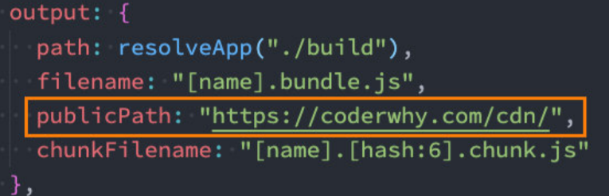
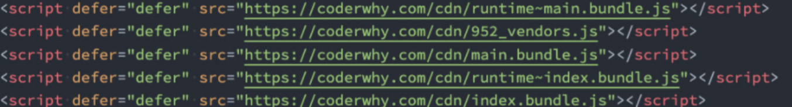

# 什么是CDN

* CDN称之为内容分发网络（Content Delivery Network或Content Distribution Network，缩写：CDN） 
  * 它是指通过相互连接的网络系统，利用最靠近每个用户的服务器；
  * 更快、更可靠地将音乐、图片、视频、应用程序及其他文件发送给用户； 
  * 来提供高性能、可扩展性及低成本的网络内容传递给用户；

## 两种使用CDN的方式

* **方式一：打包的所有静态资源，放到CDN服务器，用户所有资源都是通过CDN服务器加 载的；** 
* **方式二：自己的代码放到自己的服务器上，但一些第三方资源放到CDN服务器上，可以直接从CDN服务器引入，免费的；(推荐！！)**

### 方式一：

* 如果所有的静态资源都想要放到CDN服务器上，我们需要购买自己的CDN服务器； 
  * 目前阿里、腾讯、亚马逊、Google等都可以购买CDN服务器； 
  * 我们可以直接修改publicPath，在打包时添加上自己的CDN地址；<br>

### 方式二：

* **通常一些比较出名的开源框架都会将打包后的源码放到一些比较出名的、免费的CDN服务器上：** 

  * 国际上使用比较多的是unpkg、JSDelivr、cdnjs； 
  * 国内也有一个比较好用的CDN是bootcdn； 

* 在项目中，我们如何去引入这些CDN呢？ 

  * **第一，在打包的时候我们不再需要对类似于lodash或者dayjs这些库进行打包；** 
  * **第二，在html模块中，我们需要自己加入对应的CDN服务器地址；** 

* 第一步，我们可以通过webpack配置，来排除一些库的打包： 

  ```js
  externals: {
      lodash: "-",//lodash是不需要打包库的名称，'-'是lodash是该库暴露出的全局对象
      dayjs: "days"
  }
  ```

  

* 第二步，在html模块中，加入CDN服务器地址：

  ```html
  <script src="https://cdn.jsdelivr.net/npm/lodash@4.17.21/lodash.min.js"></script>
  <script src="https://unpkg.com/dayjs@1.8.21/dayjs.min.js"></script>
  ```


#### 

**注意：**
在开发模式下，是不使用CDN的，当生产模式下才使用，因为开发模式，包都是在自己本地服务器，速率肯定是最快的。

* **如何在生成模式使用CDN，开发模式不使用CDN**

  * 首先将externals这个属性写入生产的webpck.config.js文件中

  * 对于模板index.html文件引入的CDN包需要特殊处理

    ```html
    <% if (process.env.NOE_ENV === "production"){ %>//node中会记录当前是否为生产模式，通过这个判断加入
    <script src="https://cdn.jsdelivr.net/npm/lodash@4.17.21/lodash.min.js"></script>
    <script src="https://unpkg.com/dayjs@1.8.21/dayjs.min.js"></script>
    <% } /%>
    ```

    


