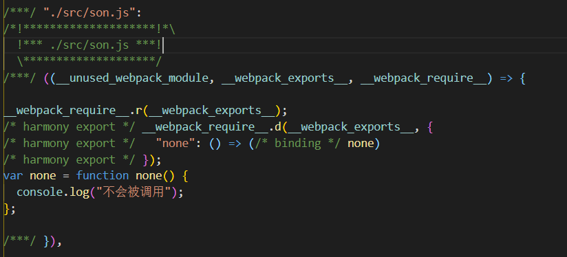
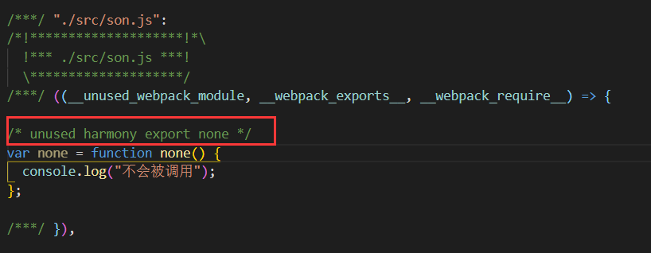
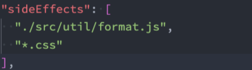
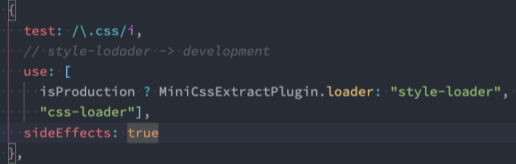
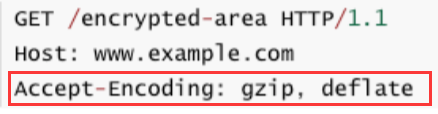
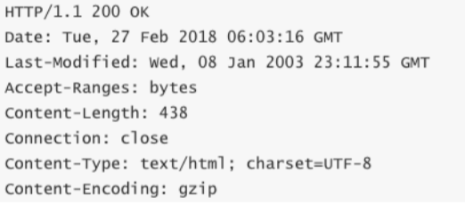

# Terser

## Terser介绍和安装

* 什么是Terser呢？ 

  * Terser是一个JavaScript的解释（Parser）、Mangler（绞肉机）/Compressor（压缩机）的工具集； 
  * 早期我们会使用 uglify-js来压缩、丑化我们的JavaScript代码，但是目前已经不再维护，并且不支持ES6+的 语法； 
  * Terser是从 uglify-es fork 过来的，并且保留它原来的大部分API以及适配 uglify-es和uglify-js@3等； 

* 也就是说，**Terser可以帮助我们压缩、丑化我们的代码，让我们的bundle变得更小。**

  **安装**：

  * 全局安装` npm install terser -g`		
  * 局部安装 `npm install terser`
  * 安装terser会默认安装命令行工具


## 使用Terser

### 命令行使用：

`npx terser [input files] -o [options]`// [input files]为需要压缩的文件，[options]为压缩后的文件

例如：
`terser js/file.js -o foo.min.js ` //将file.js压缩为foo.min.js文件

* 这里来讲解几个Compress option和Mangle option： 
* 因为他们的配置非常多，我们不可能一个个解析，更多的查看文档即可； 
* https://github.com/terser/terser#compress-options 
* https://github.com/terser/terser#mangle-options

#### 传递参数：

* [**-c**] Compress option： 

  * **defaults**:默认的方式压缩：`npx terser ./src/main.js -o main.min.js -c defaults`
  * **arrows**：class或者object中的函数，转换成箭头函数； `npx terser ./src/main.js -o main.min.js -c arrow=true`//给arrow参数赋值为true
  * **arguments**：将函数中使用 arguments[index]转成对应的形参名称； 
  * **dead_code**：移除不可达的代码（tree shaking）； `npx terser ./src/main.js -o main.min.js -c arguments=true,dead_code=true`，两个参数有`,`隔开
  * 其他属性可以查看文档；

* [**-m**]  Mangle option:

  * **toplevel**：默认值是false，顶层作用域中的变量名称，进行丑化（转换）； 

  * **keep_classnames**：默认值是false，是否保持依赖的类名称； 

  * **keep_fnames**：默认值是false，是否保持原来的函数名称； 

    `npx terser ./src/main.js -o main.min.js -c defaults -m toplevel=true,keep_classnames=true`

  * 其他属性可以查看文档；


### 在webpack中使用terser 

```js
const TerserPlugin = require("terser-webpack-plugin"); //webpack5已经自带了terser，只需要引入即可

module exports = {
  optimization: {
    minimize: true,//当为true时minimizer会执行，为false则不会执行
    minimizer: [
       new TerserPlugin({
		parallel: true,//使用多进程并发运行以提高构建速度,为true时并发运行的默认数量:os.cpus().length-1，cpu多核数量减一
         extractComments: false,//是否将注释剥离到单独的文件中,开启为true。
         terserOptions: { //terser的配置项
		  mangle: true,
           toplevel: true,
           keep_classnames: true,
           keep_fnames: true
         }
       })
    ],
    splitChunks: {
      //async处理异步的导入
      //inital对同步的导入进行处理
      chunks: "all", //不管异步导入还是同步导入都会抽取公共的依赖为单独的配置文件。
    },
} 
```


## CSS打包后的代码压缩

CSS压缩通常是去除无用的空格等，因为很难去修改选择器、属性的名称、值等； 
CSS的压缩我们可以使用另外一个插件：css-minimizer-webpack-plugin； 
css-minimizer-webpack-plugin是使用cssnano工具来优化、压缩CSS（也可以单独使用）；

**前提**：

得使用**min-css-extract-plugin**单独把css文件打包，然后进行压缩。

**安装：**`npm install css-minimizer-webpack-plugin -D`

**配置**：

```js
const CssMinimizerPlugin = require("css-minimizer-webpack-plugin");

plugins:[
    new CssMinimizerPlugin(),
]
```


## Scope Hoisting

* 什么是Scope Hoisting呢？ 

  * Scope Hoisting从webpack3开始增加的一个新功能；**功能是对作用域进行提升，并且让webpack打包后的代码更小、运行更快；**
  * 默认情况下webpack打包会有很多的函数作用域，包括一些（比如最外层的）IIFE：
  * **无论是从最开始的代码运行，还是加载一个模块，都需要执行一系列的函数；** 
  * **Scope Hoisting可以将函数合并到一个模块中来运行；**

* **使用scope Hoisting**

  * **在production模式下，默认这个模块就会启用；**

  * **在development模式下，我们需要自己来打开该模块；**

    ```js
    //development
    const webpack = require('webpack');
    
    plugins:[
        new webpack.optimize.ModuleConcatenationPlugin()
    ]
    ```

    

# Tree Shaking

## 什么是Tree Shaking:

* 什么是Tree Shaking呢？ 
  * Tree Shaking是一个术语，在计算机中表示消除死代码（dead_code）；
  * 最早的想法起源于LISP，用于消除未调用的代码（纯函数无副作用，可以放心的消除，这也是为什么要求我们在进 行函数式编程时，尽量使用纯函数的原因之一）；
  * 后来Tree Shaking也被应用于其他的语言，比如JavaScript、Dart； 
* JavaScript的Tree Shaking： 
  * 对JavaScript进行Tree Shaking是源自打包工具rollup（后面我们也会讲的构建工具）；
  * 这是因为Tree Shaking依赖于ES Module的静态语法分析（不执行任何的代码，可以明确知道模块的依赖关系）； 
  * webpack2正式内置支持了ES2015模块，和检测未使用模块的能力； 
  * **在webpack4正式扩展了这个能力，并且通过 package.json的 sideEffects属性作为标记，告知webpack在编译时， 哪里文件可以安全的删除掉；** 
  * webpack5中，也提供了对部分CommonJS的tree shaking的支持；


## webpack实现Tree Shaking

1. **usedExports**：通过标记某些函数是否被使用，之后通过Terser来进行优化的；
2. **psideEffects**：跳过整个模块/文件，直接查看该文件是否有副作用；


## usedExports

**使用条件:**	

* **将mode设置为development模式：** 
  * 为了可以看到 usedExports带来的效果，我们需要设置为 development 模式 ，因为在 production 模式下，webpack默认的一些优化会带来很大额影响。

**配置usedExport**:

```js
// webpack.config.js中的optimization的usedExport属性配置为true
optimization: {
    usedExports: true, // 会用魔法注释标记导出的模块中哪些未被使用
    }
```

**设置usedExports为false和true对比打包后的代码：**<br>

* 在usedExports设置为true时，会有一段注释：`unused harmony export none`
* 这段注释的意义是什么呢？**告知Terser在优化时，可以删除掉这段代码**；

* 这个时候，我们将optimization.minimize设置true： 
  * usedExports设置为false时，mul函数没有被移除掉； 
  * usedExports设置为true时，mul函数有被移除掉； 
* 所以，**usedExports实现Tree Shaking是结合Terser来完成的。**


## sideEffects

当usedExports结合Terser删掉未使用的代码时，虽然删除了未使用的代码，**但是还是有引用该模块，只是模块里面的内容为空**。
sideEffects的作用就是把该引用也删掉，即只要是未使用的模块都不会显示。

* sideEffects用于告知webpack compiler哪些模块时有副作用的：
  * 副作用的意思是这里面的代码有执行一些特殊的任务，不能仅仅通过export来判断这段代码的意义；

* 在**package.json中设置sideEffects的值**： 
  * **如果我们将sideEffects设置为false，就是告知webpack可以安全的删除未用到的exports**； 
  * 如果有一些我们希望保留，可以设置为数组；
* 比如当**sideEffects设置为false**我们有一个**format.js、style.css**文件： <br>
  * `"sideEffects": false`
  * **该文件在导入时没有使用任何的变量来接受；** 
  * **那么打包后的文件，不会保留format.js、style.css相关的任何代码；**
* 如果需要保留**format.js、style.css**，可以设置为数组的形式<br>
* 但是在开发中我们基本都会写没有副作用的模块，所以sideEffects就只有一个css文件了。就显得很多余，**可以在配置css-loader地方单独配置,`sideEffects: true`,让css保留**<br>


## CSS实现Tree Shaking

在css中可能会存在一些代码没有对应的标签，所以打包时希望删除这些没有作用的代码，这就是css的treeshaking

**安装插件**
`npm install purgecss-webpack-plugin -D`

**配置插件**

* **paths**：表示要检测哪些目录下的内容需要被分析，这里我们可以使用glob； 
* **safelist**：默认情况下，Purgecss会将我们的**html**，**body**标签的样式移除掉，如果我们希望保留，可以添加一个**safelist**的属性；

```js
const PurgecssPlugin = require("purgecss-webpack-plugin");
const glob = require("glob");

module.exports = {
  plugins: [
    new PurgecssPlugin({
      // 通过glob.sync匹配src下的所有文件夹的所有文件
      paths: glob.sync(`${path.resolve(__dirname, "./src")}/**/*`, {
        nodir: true, // nodir表面匹配的是文件
      }), // 哪些目录下的文件需要被treeShaking
      safelist: function () {
        // 表示一下标签名或者类名或者id是安全的不需要treeShaking
        return {
          standard: ["body", "html"],
        };
      },
    }),
  ],
};
```

**purgecss也可以对less文件进行处理（所以它是对打包后的css进行tree shaking操作）；**

# HTTP压缩

## 什么是HTTP压缩

* HTTP压缩是一种内置在 服务器 和 客户端 之间的，以改进传输速度和带宽利用率的方式； 
* HTTP压缩的流程什么呢？ 
  * 第一步：HTTP数据在服务器发送前就已经被压缩了；（可以在webpack中完成） 
  * 第二步：兼容的浏览器在向服务器发送请求时，会告知服务器自己支持哪些压缩格式；<br>
  * 第三步：服务器在浏览器支持的压缩格式下，直接返回对应的压缩后的文件，并且在响应头中告知浏览器；
    * 游览器在请求时只会请求对应的代码，并告诉服务器需要的压缩格式，服务器会直接返回对应的压缩后的代码<br>

## 压缩的格式

* 目前的压缩格式非常的多： 
  * compress – UNIX的“compress”程序的方法（历史性原因，不推荐大多数应用使用，应该使用gzip或 deflate）； 
  * deflate – 基于deflate算法（定义于RFC 1951）的压缩，使用zlib数据格式封装； 
  * gzip – GNU zip格式（定义于RFC 1952），是目前使用比较广泛的压缩算法； 
  * br – 一种新的开源压缩算法，专为HTTP内容的编码而设计；

## Webpack对文件压缩

* webpack中相当于是实现了HTTP压缩的第一步操作，我们可以使用CompressionPlugin。 

* 第一步，安装**CompressionPlugin**：

  * `npm install compression-webpack-plugin -D`

* 第二步，使用CompressionPlugin即可：

  ```js
  const CompressionPlugin = require("compression-webpack-plugin");
  
  module.exports = {
    plugins: [
      new CompressionPlugin({
        test: /\.(css|js)$/,//匹配哪些文件需要压缩
        //threshould: 500, // 设置文件从多大开始压缩
        minRatio: 0.7,//至少要达到的压缩比例才给压缩，压缩比例=(压缩后的文件)/(压缩前的文件)
        algorithm:"gzip",//采用的压缩算法
      }),
    ],
  };
  ```

  