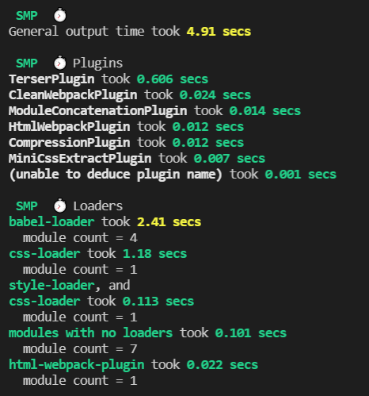
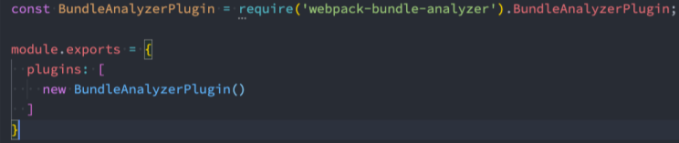

## 分析一：打包的时间分析

* 如果我们希望看到每一个loader、每一个Plugin消耗的打包时间，可以借助于一个插件：speed-measure-webpack-plugin

  * **注意：该插件在最新的webpack版本中存在一些兼容性的问题（和部分Plugin不兼容）** 
  * 截止2021-3-10日，但是目前该插件还在维护，所以可以等待后续是否更新； 
  * **我这里暂时的做法是把不兼容的插件先删除掉，也就是不兼容的插件不显示它的打包时间就可以了；**

* 第一步，**安装**speed-measure-webpack-plugin插件

  **`npm install speed-measure-webpack-plugin -D`**

* 第二步，**使用**speed-measure-webpack-plugin插件

  * **创建插件导出的对象 SpeedMeasurePlugin；** 

  * **使用 smp.wrap 包裹我们导出的webpack配置；**

    ```js
    const SpeedMeasurePlugin = require("speed-measure-webpack-plugin");
    
    const plugin = {
    	//webpack相关的配置
    }
    
    const smp = new SpeedMeasurePlugin();
    module.exports = smp.wrap(plugin);//用创建的SpeedMeasurePlugin实例将webpack配置包裹起来导出即可
    
    ```

    各个loader及插件的时间显示<br>


## 分析二：打包后文件分析

### 方案一：生成一个stats.json的文件

* 在package.json中添加一个script
  **`"stats": "webpack --profile --json=stats.json"`**
* 打包之后就会生成一个stats.json，里面包含了打包后文件的信息
* 这个文件我们自己分析不容易看到其中的信息，可以放到 http://webpack.github.com/analyse，进行分析。

### 方案二：使用webpack-bundle-analyzer

* 第一步，我们可以直接安装这个工具： 

  **`npm install webpack-bundle-analyzer -D`**

* 第二步，我们可以在webpack配置中使用该插件：<br>

* 在打包webpack的时候，这个工具是帮助我们打开一个8888端口上的服务，我们可以直接的看到每个包的大小。 

  * 比如有一个包时通过一个Vue组件打包的，但是非常的大，那么我们可以考虑是否可以拆分出多个组件，并且对其进 行懒加载
  * 比如一个图片或者字体文件特别大，是否可以对其进行压缩或者其他的优化