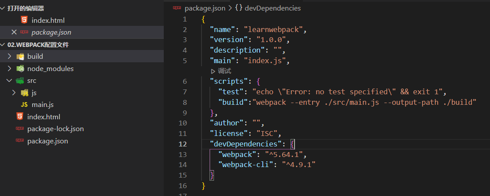
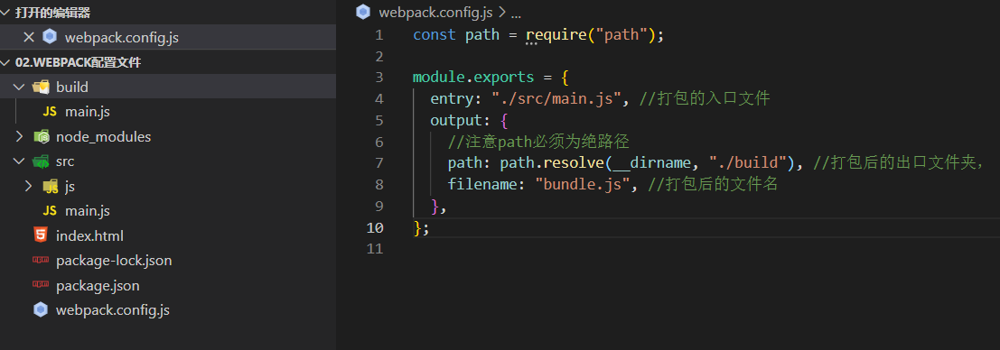
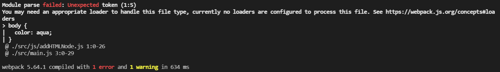
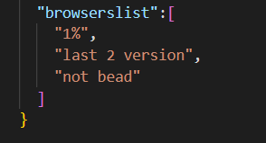
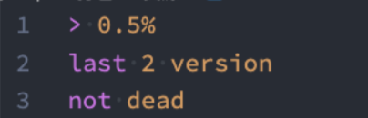
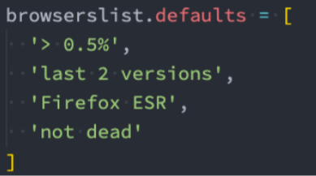
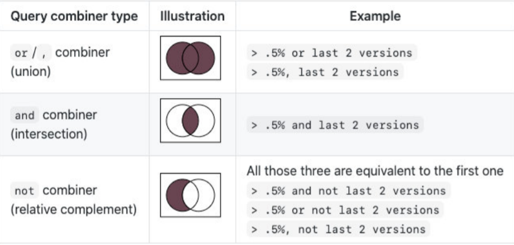
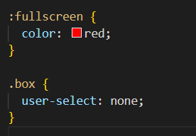
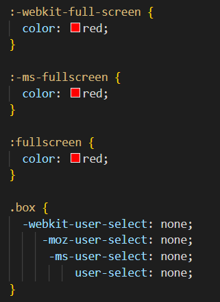

## webpack打包入口与出口

### webpack默认入口与出口

* webpack默认的打包入口为`src/index.js`文件，如果修改了`index.js`文件的文件名，那么webpack就找不到文件的入口了。
* 默认打包的文件都会放入到`build`文件夹里面

### 修改webpack入口

1. **命令行直接修改默认配置**

   ​	`npx webpack --entry ./src/main.js --output-path ./build`这里将默认的入口文件改为main.js,并且出口文件夹改为了`build`

2. **将命令放入package.json文件的script里面，然后运行`npm run build`**

   1. 

3. **生成webpack配置文件**

   1. 建立一个`webpack.config.js`的文件，将配置以commonJS模块化导出，然后直接执行webpack即可
   2. 

   ## context

   基础目录，**绝对路径**，用于从配置中解析入口点(entry point)和 加载器(loader)。

   
   
   ### entry属性的相对路径
   
   entry属性的相对路径是相对context属性的，context配置了什么位置，entry就相对这个位置；
   
   如果没有配置context，那么就相对项目的根目录。
   
   
   
   
   
   
   
### **output中的publicPath**

* output中的path的作用是告知webpack之后的输出目录： 
     * 比如静态资源的js、css等输出到哪里，常见的会设置为dist、build文件夹等； 
   * output中还有一个publicPath属性，该属性是指定index.html文件打包引用的一个基本路径： 
     * 它的默认值是一个空字符串，所以我们打包后引入js文件时，路径是 bundle.js； 
     * **在开发中，我们也将其设置为 / ，路径是 /bundle.js，那么浏览器会根据所在的域名+路径去请求对应的资源；** 
     * **如果我们希望在本地直接打开html文件来运行，会将其设置为 ./，路径时 ./bundle.js，可以根据相对路径去 查找资源；**
   
   
   
   

## 修改默认配置文件

* 默认的配置文件就是`webpack.config.js`，那么如何修改默认的配置文件么
  * `--config`参数修改配置文件路径
  * 即执行webpack时`npx webpack --config ./test.config.js`  把test.config.js配置文件
  * 同理也可以将该命令放入package.json文件的script中。

## css-loader



* 当需要引入一个css文件是，会报上错误信息告诉我们需要一个loader来加载这个css文件，但是loader是什么呢?
  * loader可以用于对模块的源代码进行转换;
  * 我们可以将css文件也看成是一个模块，我们是通过import来加载这个模块的;
  * **在加载这个模块时，webpack其实并不知道如何对其进行加载，我们必须制定对应的loader来完成这个功能;**
* 那么我们需要一个什么样的loader呢?
  * 对于加载css文件来说，我们需要一个可以读取css文件的loader ;
  * 这个loader最常用的是css-loader ;
* **css-loader的安装:**
  * **`npm install css-loader -D`**


### 配置css-loader

安装完成css-loader之后，并不能直接对css文件进行引用，使用某个css文件之前需配置好css-loader

* 如何使用这个loader来加载css文件呢？有三种方式： 
  * **内联方式；** 
  * **CLI方式（webpack5中不再使用）；** 
  * **配置方式；**(基本就用这个方式)

* **内联方式**：内联方式使用较少，因为不方便管理； 

  * 在引入的样式前加上使用的loader，并且使用`!`分割；
  * `import "css-loader!../css/index.css";`

* **配置文件方式**

  * 配置方式表示的意思是在我们的**webpack.config.js**文件中写明配置信息∶

    * **module.rules**中允许我们配置多个loader(因为我们也会继续使用其他的loader，来完成其他文件的加载）;
    * 这种方式可以更好的表示loader的配置，也方便后期的维护，同时也让你对各个Loader有一个全局的概览;

    

  * **module.rules**的配置如下:

    * **rules**属性对应的值是一个数组:[Rule]

    * 数组中存放的是一个个的Rule ，Rule是一个对象，对象中可以设置多个属性︰

      * **test属性**︰用于对resource(资源）进行匹配的，**通常会设置成正则表达式**;
      * **use属性**:对应的值时一个数组:[UseEntry]，UseEntry是一个对象，可以通过对象的属性来设置一些其他属性
        * **loader**:必须有一个 loader属性，对应的值是一个字符串;
        * **options**:可选的属性，值是一个字符串或者对象，值会被传入到loader中;
        * query:目前已经使用options来替代;
      * **传递字符串（如:`use: [ 'style-loader' ]` )是loader 属性的简写方式(如: `use: [ { loader: 'style-loader'} ]`)**
      * **loader属性: Rule.use: [ { loader }]的简写。**

    * ```js
      module: {
          rules: [
            {
              //配置文件，当对应的文件匹配上，就可以使用对应的loader，使用正则表达式进行匹配
              test: /\.css$/,
              use: [
                {
                  loader: "css-loader",
                },
                // "css-loader" // loader:"css-loader"的简写，不需要以对象的格式
              ],
              // loader: "css-loader",//当一个只有一个loader时，可以省去use数组,直接写loader对应的loader
            },
          ],
        },
      ```


## style-loader

* 上面已经可以通过css-loader来加载css文件了 

  * 但是会发现这个css在我们的代码中并没有生效（页面没有效果）。

* 这是为什么呢？ 

  * **因为css-loader只是负责将.css文件进行解析，并不会将解析之后的css插入到页面中；** 
  * 如果我们希望再完成插入style的操作，那么我们还需要另外一个loader，就是**style-loader**； 

* **安装style-loader：** 

  * **`npm install style-loader -D`**

* **使用style-loader：** 

  * 在配置文件中，添加style-loader； 

  * **注意：因为loader的执行顺序是从右向左（或者说从下到上，或者说从后到前的），所以我们需要将style-loader写到css-loader的前面；**

  * ```js
    use: [ 
        //注意：webpack在加载loader时，是从use的数组中，从后往前加载的，应该先解析css在加载css，所以css-loader在后，style-loader在前
                loader: "style-loader",
                loader: "css-loader",
         ],
    ```

## less-loader

* **安装**

  * `npm i less-loader -D`

* **配置less-loader**

  * ```js
    {
        test: /\.less$/,
        //先使用less-loader将less转化为css，再用css-loader解析css-loader，最后用style-loader进行加载
        use: ["style-loader", "css-loader", "less-loader"],
    },
    ```


## browserslist

* Browserslist是什么？

  * Browserslist是一个在不同的前端工具之间，共享目标浏览器和Node.js版本的配置：
  * 所有配置基于**https://caniuse.com/usage-table**

* 我们可以编写类似于这样的配置：

  * ```js
    > 1%
    last 2 versions
    not dead
    ```

### Browserslist编写规则

* **defaults**：**Browserslist的默认浏览器（> 0.5%, last 2 versions, Firefox ESR, not dead）。** 
* **5%**：通过全局使用情况统计信息选择的浏览器版本。 >=，<和<=工作过。 p
  * 5% in US：使用美国使用情况统计信息。它接受两个字母的国家/地区代码。 
  * 5% in alt-AS：使用亚洲地区使用情况统计信息。有关所有区域代码的列表，请参见caniuse-lite/data/regions
  * 5% in my stats：使用自定义用法数据。
  * 5% in browserslist-config-mycompany stats：使用 来自的自定义使用情况数据browserslist-config-mycompany/browserslist-stats.json。 p cover 99.5%：提供覆盖率的最受欢迎的浏览器。
  * cover 99.5% in US：与上述相同，但国家/地区代码由两个字母组成。
  * cover 99.5% in my stats：使用自定义用法数据。 
* **dead：24个月内没有官方支持或更新的浏览器。**现在是IE 10，IE_Mob 11，BlackBerry 10，BlackBerry 7， Samsung 4和OperaMobile 12.1。 
* **last 2 versions：每个浏览器的最后2个版本。** 
  *  last 2 Chrome versions：最近2个版本的Chrome浏览器。 
  * last 2 major versions或last 2 iOS major versions：最近2个主要版本的所有次要/补丁版本。
* node 10和node 10.4：选择最新的Node.js10.x.x 或10.4.x版本。  
  * current node：Browserslist现在使用的Node.js版本。 
  * maintained node versions：所有Node.js版本，仍由 Node.js Foundation维护。 
* iOS 7：直接使用iOS浏览器版本7。 
  * Firefox > 20：Firefox的版本高于20 >=，<并且<=也可以使用。它也可以与Node.js一起使用。
  *  ie 6-8：选择一个包含范围的版本。 
  * Firefox ESR：最新的[Firefox ESR]版本。
  * PhantomJS 2.1和PhantomJS 1.9：选择类似于PhantomJS运行时的Safari版本。
* extends browserslist-config-mycompany：
* browserslist-config-mycompanynpm包中查询 。 
* supports es6-module：支持特定功能的浏览器。 es6-module这是“我可以使用” 页面feat的URL上的参数。有关所有可用功能的列表，caniuselite/data/features 
* browserslist config：在Browserslist配置中定义的浏览器。在差异服务中很有用，可用于修改用户的配置，例如 browserslist config and supports es6-module。
* since 2015或last 2 years：自2015年以来发布的所有版本（since 2015-03以及since 2015-03-10）。
* unreleased versions或unreleased Chrome versions：Alpha和Beta版本。
* not ie <= 8：排除先前查询选择的浏览器。

### 使用命令直接来查询所匹配到的游览器

`npx browserslist ">1%, last 2 version, not dead"`

### 配置browserslist

* **方案一：在package.json中配置**； <br>
* **方案二：单独的一个配置文件.browserslistrc文件；**<br>

### browserslist的默认配置

如果没有配置，那么也会有一个默认配置<br>

### 配置条件之间的联系




## PostCSS

### PostCSS是什么

* PostCSS是一个通过JavaScript来转换样式的工具；
* 这个工具可以帮助我们进行一些**CSS的转换和适配，比如自动添加浏览器前缀、css样式的重置**； 
* 但是实现这些工具，我们需要借助于PostCSS对应的插件；

### PostCSS的使用步骤

* 第一步：查找PostCSS在构建工具中的扩展，比如webpack中的postcss-loader； 
* 第二步：选择可以添加你需要的PostCSS相关的插件；

* 在使用之前先安装**postcss、postcss-cli**
  `npm install postcss postcss-cli -D`，postcss-cli的作用是在命令行中可以使用postcss

* 添加前缀需要安装**autoprefixer**插件，postCss不会自己添加前缀： 

  ` npm install autoprefixer -D`

* 直接使用使用postcss工具，并且制定使用autoprefixer  

  `npx postcss --use autoprefixer -o end.css ./src/css/style.css`

  --use 代表使用后面的插件,-o代表输出，输出的文件名为end.css

* 添加前<br>

* 添加后<br>


## postcss-loader

1. **安装postcss-loader**

   1. `npm install postcss-loader -D`

2. **们修改加载css的loader：**

   1. 注意，因为是在css中添加游览器配置，这个loader应该在编译css之前的loader添加，即需写在css-loader后面

   ```js
   {
   	loader: "postcss-loader",
   	options: {
   		postcssOptions: {//postcssOptions代表postcss所需要安装的options
   			plugins: [require("autoprefixer")],//plugins代表插件，即需要autoprefixer
   		},
   	},
   },
   ```

3. **插件postcss-preset-env**

   * 该插件的作用

     * **它可以帮助我们将一些现代的CSS特性，转成大多数浏览器认识的CSS，并且会根据目标浏览器或者运行时环 境添加所需的polyfill；**
     * **也包括会自动帮助我们添加autoprefixer（所以相当于已经内置了autoprefixer），比如color中的颜色8位16进制的字符串可以转化为grb格式，但是autoprefixer不可以；**

   * 安装插件

     `npm install postcss-preset-env -D `

   * 添加插件

     ```js
     {
     	loader: "postcss-loader",
     	options: {
     		postcssOptions: {
     			plugins: [require("postcss-preset-env")],
     		},
     	},
     },
     ```

   * 注意：使用**某些**postcss插件时，也可以直接传入字符串

     ```js
     plugins: ["postcss-preset-env"] //plugins: [require("postcss-preset-env")]的简写，但不是所有插件都可以这样写
     ```


## postcss.config.js

当配置postcss-loader，不难想象，在解析less里面是不是也需要使用浏览器前缀来适应不同的游览器，所以在配置解析less的loader时，也需要在来配置postcss-loader以及options。那么有没有一种方法将共有的loader提取出来公共处理了？

### 配置postcss.config.js

在css以及less的loader中只需配置postcss-loader，不需要配置其options，在主目录下生成一个postcss.config.js文件

```js
{
	test: /\.css$/,
	use: ["style-loader","css-loader","postcss-loader",],
},
{
	test: /\.less$/,
	use: ["style-loader", "css-loader", "postcss-loader", "less-loader"],
},
```

postcss.config.js文件

```js
module.exports = {
  plugins: [require("postcss-preset-env")],
};
```

## importLoaders

**当css文件映入另一个css文件时，`@import './test.css'`这句代码只能被css-loader解析，当css-loader解析完之后，不会再送往上一个loader解析，也就意味着`postcss-loader`不能解析到，那么test.css里面的代码就会没有添加游览器前缀。**而importLoades就可以解决这个问题。

### 配置importLoaders

```js
{
	test: /\.less$/,
	use: [
		"style-loader",
		{
            loader: "css-loader",
            options: {
              importLoaders: 2, //因为css-loader前有2个loader，所以importLoaders值为2。less-loader不负责只负责转化为css不负责解析。
        		},
          },
          "postcss-loader",
          "less-loader",
        ],
}
```

