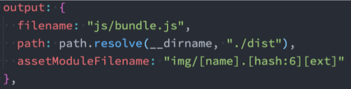

## file-loader

### file-loader的作用

* **要处理jpg、png等格式的图片，我们也需要有对应的loader：file-loader** 
  * **file-loader的作用就是帮助我们处理import/require()方式引入的一个文件资源，并且会将它放到我们输出的文件夹中；** 

### 安装file-loader

`npm install file-loader -D`

### 配置file-loader

```js
{
	test: /\.(png|jpe?g|gif|svg)$/i,
	use: "file-loader",
},
```

### 文件命名规则

* 有时候我们处理后的**文件名**称按照一定的规则进行显示： 

  * 比如保留原来的**文件名、扩展名**，同时为了防止重复，包含一个hash值等； 

* 这个时候我们可以使用**PlaceHolders**来完成，webpack给我们提供了大量的PlaceHolders来显示不同的内容：

  *  https://webpack.js.org/loaders/file-loader/#placeholders
  * 我们可以在文档中查阅自己需要的placeholder； 

* 我们这里介绍几个最常用的placeholder：

  * [**ext**]： 处理文件的扩展名； 
  * [**name**]：处理文件的名称； 
  * [**hash**]：文件的内容，使用MD4的散列函数处理，生成的一个128位的hash值（32个十六进制）；
  * [**contentHash**]：在file-loader中和[hash]结果是一致的（在webpack的一些其他地方不一样，后面会讲到）； 
  * [**hash:***]：截图hash的长度，默认32个字符太长了； 
  * [**path**]：文件相对于webpack配置文件的路径；

* 配置格式

  * ```js
    {
      test: /\.(png|jpe?g|gif|svg)$/i,
      use: [
        {
          loader: "file-loader",
          options: {
            name: "./img/[name].[hash:6].[ext]", //表示webpack打包后的以上文件都会放入img文件夹中，命名为'原文件名.加哈希值得前6位.加元文件扩展名
          },
        },
      ],
    },
    ```

## url-loader

### url-loader与file-loader的区别

url-loader和file-loader的工作方式是相似的，但是可以将较小的文件，转成base64的URI.

### 安装url-loader

`npm i url-loader -D`

### url-loader中的limit

* **但是开发中我们往往是小的图片需要转换，但是大的图片直接使用图片即可** 
  * **这是因为小的图片转换base64之后可以和页面一起被请求，减少不必要的请求过程；** 
  * **而大的图片也进行转换，反而会影响页面的请求速度；**
* 那么，我们如何可以限制哪些大小的图片转换和不转换呢？ 
  * url-loader有一个options属性limit，可以用于设置转换的限制； 
  * 下面的代码小于100kb的图片会进行base64的编码，大于的不会，而是放入img文件夹中；

### 配置url-loader

```js
{
  loader: "url-loader",
  options: {
    name: "./img/[name].[hash:6].[ext]",
   	limit: 100 * 1024,//表示大小超过100kb的图片将不放在js文件中，单独抽取出来放入img文件夹中
  },
},
```


## asset module type

### 从webpack5之后

在webpack5之前，加载这些资源我们需要使用一些loader，比如raw-loader 、url-loader、file-loader ;
**在webpack5之后，我们可以直接使用资源模块类型( asset module type )，来替代上面的这些loader ;**

### 资源模块类型(asset module type)

* **asset/resource**发送一个单独的文件并导出URL。之前通过使用**file-loader**实现
* **asset/inline** 导出一个资源的data URI。之前通过使用**url-loader** 实现﹔
* **asset/source** 导出资源的源代码。之前通过使用**raw-loader**实现;
* **asset**在导出一个data URI和发送一个单独的文件之间自动选择。之前通过使用**url-loader**，并且配置资源体积限制实现;

### asset/resource的使用

* 配置格式

<br>

* **自定义文件的输出路劲和文件名**
  * **方式一：修改output，添加assetModuleFilename属性；**<br>
  * **方式二：在Rule中，添加一个generator属性，并且设置filename；**<br>
* **实现url-loader的limit效果**
  * **步骤一**：将type修改为asset；
  * **步骤二**：添加一个parser属性，并且制定dataUrl的条件，添加maxSize属性<br>


## 加载字体文件

如果需要使用某些特殊的字体或者字体图标，那么会引入很多字体相关的文件，这些文件的处理也是一样的。

* n 首先，我从阿里图标库中下载了几个字体图标：<br>
* 在component中引入，并且添加一个i元素用于显示字体图标：<br>

* 这个时候打包会报错，**因为无法正确的处理eot、ttf、woff等文件**：
  * 我们可以选择使用**file-loader**来处理，也可以选择直接使**用webpack5的资源模块类型**来处理；<br>


