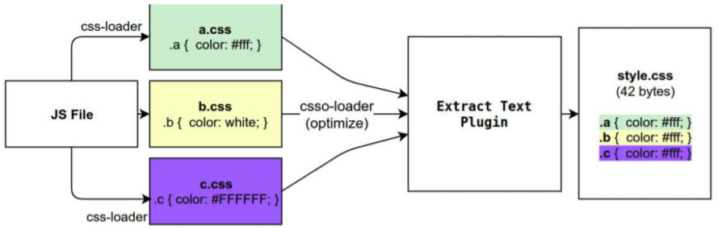

## 认识plugin

* **Webpack的另一个核心是Plugin，官方有这样一段对Plugin的描述：**
  * While loaders are used to transform certain types of modules, plugins can be leveraged to perform a wider range of tasks like bundle optimization, asset management and injection of environment variables.
* 上面表达的含义翻译过来就是：
  * Loader是用于特定的模块类型进行转换；
  * Plugin可以用于执行更加广泛的任务，比如打包优化、资源管理、环境变量注入等；
* 


## CleanWebpackPlugin

* 前面每次修改了一些配置，重新打包时，都需要手动删除dist文件夹： 

  * 我们可以借助于一个插件来帮助我们完成，这个插件就是**CleanWebpackPlugin；**

* **安装插件**

  * `npm install clean-webpack-plugin -D`

* 配置插件

  * ```js
    const { CleanWebpackPlugin } = require("clean-webpack-plugin"); //cleanWebpackPlugin源码中是向export添加属性的方式添加cleanWebpackPlugin并导出的,所以需要解构
    
    module.exports = {
    	plugins: [
      		new CleanWebpackPlugin(), //cleanWebpackPlugin是一个类，该plugins的作用是每次打包文件时，会先自动清理build文件夹里面的文
    	],
    };
    ```


## HtmlWebpackPlugin

### 没有HtmlWebpackPlugin打包时的缺陷

* 我们的HTML文件是编写在根目录下的，而最终打包的dist文件夹中是没有index.html文件的。 
* 在进行项目部署的时，必然也是需要有对应的入口文件index.html； 
* 所以我们也需要对index.html进行打包处理

### HtmlWebpackPlugin的使用

* ### 安装

  `npm install html-webpack-plugin -D`

* **配置**

  ```js
  const HtmlWebpackPlugin = require("html-webpack-plugin"); 
  
  module.exports = {
  	plugins: [
    		new HtmlWebpackPlugin({
        		title: "webpack案列", //在HtmlWebpackPlugin模板中<title></title>中为一个待输入的变量，传入title即可将生产所需的title
      	}),
  	],
  };
  ```

### 自定义Html模板

* 我们会发现，现在自动在dist文件夹中，生成了一个index.html的文件：该文件中也自动添加了我们打包的bundle.js文件；
* 这个文件是如何生成的呢？ 
  * 默认情况下是根据ejs的一个模板来生成的； 
  * **在html-webpack-plugin的源码中，有一个default_index.ejs模块；**
* 如果我们想在自己的模块中加入一些比较特别的内容：
  * **比如添加一个noscript标签，在用户的JavaScript被关闭时，给予响应的提示；**
  * **比如在开发vue或者react项目时，我们需要一个可以挂载后续组件的根标签 ；**
*  这个我们需要一个属于自己的index.html模块：<br>
* 上面的代码中，会有一些类似这样的语法**<% 变量 %>**，这个是**EJS模块填充数据**的方式

* **配置HtmlWebpackPlugin**

  ```js
  const HtmlWebpackPlugin = require("html-webpack-plugin"); 
  
  module.exports = {
  	plugins: [
    		new HtmlWebpackPlugin({
        		title: "webpack案列", //在HtmlWebpackPlugin模板中<title></title>中为一个待输入的变量，传入title即可将生产所需的title
        		template:'./public/index.html',  //自定义模板html文件
      	}),
  	],
  };
  ```


## DefinePlugin

在自定义的link模块中链接为`href = "<%= BASE_URL %>favicon.ico"`，其中`BASE_URL`为需要等定义的常量，而这个常量就需要在DefinePlugin中定义。

### DefinePlugin的配置及使用

DefinePlugin允许在编译时创建配置的全局常量，**是一个webpack内置的插件（不需要单独安装）：**

```js
const { DefinePlugin } = require("webpack");//是一个webpack内置的插件（不需要单独安装）

module.exports = {
	plugins: [
		new DefinePlugin({
            BASE_URL: '"./"', //读取到的BASE_URL为字符串内的，得再在外面套一层''，否则BASE_URL就会为./;
		}),
        ]
}
```


## MiniCssExtractPlugin

* MiniCssExtractPlugin可以帮助我们将css提取到一个独立的css文件中，该插件需要在webpack4+才可以使用。 

* 首先，我们需要安装 **mini-css-extract-plugin**：

  `npm install mini-css-extract-plugin -D`

* 配置rules和plugins：

  ```js
  const MiniCssExtractPlugin = require('mini-css-extract-plugin');
  
  module.exports = {
      rules; [
      	{
      		test: /\.css$/i,
      		use: [MiniCssExtractPlugin.loader, 'css-loader'],
                  //原来这里的styled-loader换成了MiniCssExtractPlugin.loader
  		}
      ],
      pulgins: [
          new MiniCssExtractPlugin({
              filename:'css/[name].[hash:8].css',//前面css代表文件夹，后面的为构建css的文件名
          })
      ]
  }
  ```

  

## CopyWebpackPlugin

* 在vue的打包过程中，如果我们将一些文件放到public的目录下，那么这个目录会被复制到dist文件夹中。这个复制的功能，我们可以使用**CopyWebpackPlugin**来完成；

* **安装CopyWebpackPlugin**

  `npm install copy-webpack-plugin -D`

* **配置copy-webpack-plugin**

  * 复制的规则在patterns中设置；

    * **from：设置从哪一个源中开始复制；** 

    * **to**：**复制到的位置**，可以省略，会默认复制到打包的目录下； 

    * **globOptions**：设置一些额外的选项，其中可以编写需要**忽略的文件：** 
  
* **.DS_Store：mac系统目录下回自动生成的一个文件，记录当前文件夹下的一个文件；** 

*  **index.html：也不需要复制**，因为我们已经通过HtmlWebpackPlugin完成了index.html的生成；

```js
const CopyWebpackPlugin = require("copy-webpack-plugin");

new CopyWebpackPlugin({
  patterns: [
    {
      from: "src/public",//从哪一个源中开始复制
      globOptions: {//**忽略的文件
        ignore: ["**/.DS_Store", "**/index.html"], //当需要忽略某个文件时前面应该需要添加**/
      },
    },
  ],
}),
```

