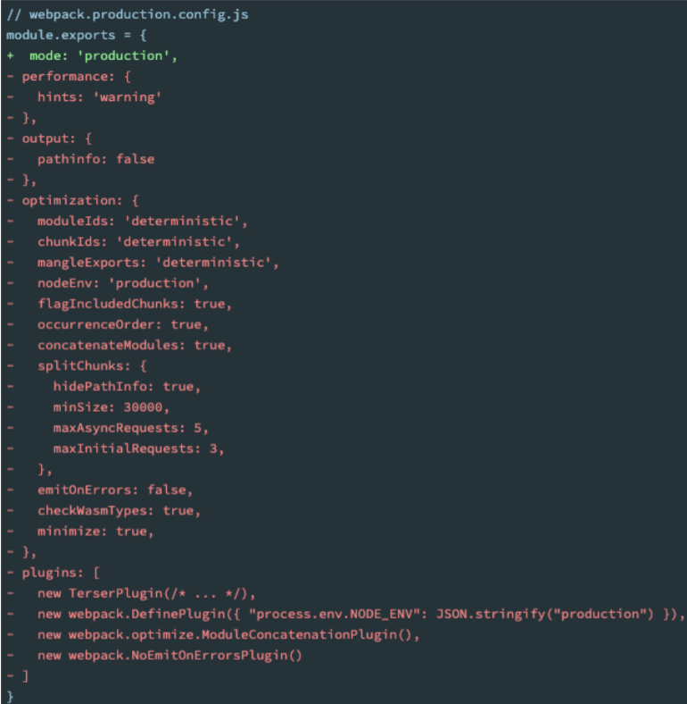
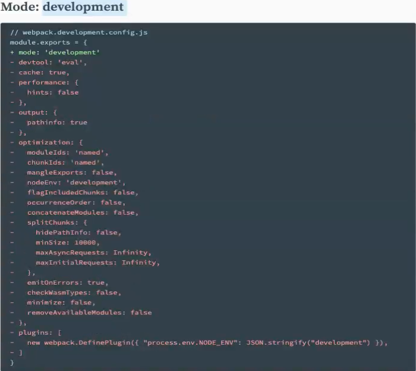
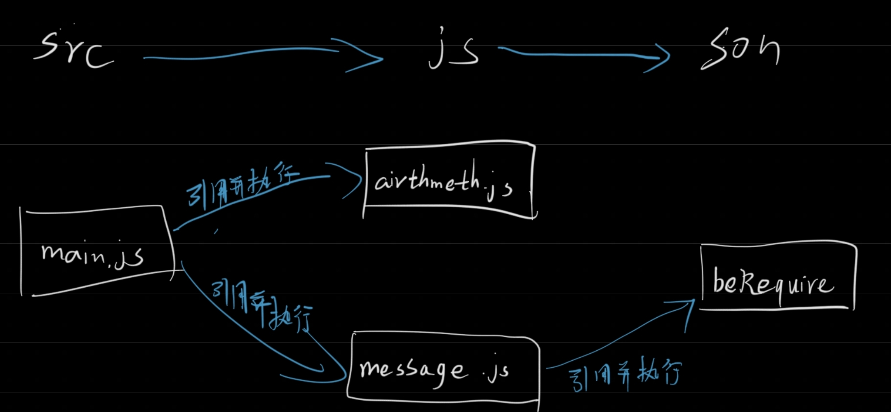

## mode属性

在webpack.config.js中，有一个属性为mode

* 属性值

  * ### production该属性为默认属性，等价于设置了一下配置<br>

  * **development**

    * **设置develop等价于设置了下面这些配置**，develop属性可以看到打包后的源码，**但development模式默认的devtool为`eval`需要将eval，需要将devtool设置为source-map**<br>

  * **none**


## 模块化原理

文件依赖图<br>

### CommonJS中的模块化原理

```js
//文件位置 js/son/beRequire.js
const print = (message) => {
  console.log(message);
};

module.exports = print;
```

```js
//文件位置 js/arithmeth.js
const add = (a, b) => {
  return a + b;
};

const sub = (a, b) => {
  return a - b;
};

export { add, sub };
```

```js
//文件位置 js/message.js
const print = require("./son/beRequie.js");

const CURRENT_TIME = new Date();
print("Hello Webpack");

exports.modules = { CURRENT_TIME }; 
```

```js
//文件位置 main.js,与js文件夹同级
import { add, sub } from "./js/arithmeth.js";
const getTime = require("./js/messgae.js");

const a = add(1, 1);
const b = sub(1, 1);
console.log("a:", a, "b:", b, "现在时间", getTime);
```

```js
//存放各个需被导入的模块，以模块的位置为key值。
var __webpack_modules__ = {
  "./src/js/arithmeth.js": function (module) {
    const add = (a, b) => {
      return a + b;
    };

    const sub = (a, b) => {
      return a - b;
    };

    module.exports = { add, sub };
  },

  "./src/js/messgae.js": function (
    module,
    __unused_webpack_exports,
    __webpack_require__
  ) {
    //在该模块中又引入了其他模块的，同理一样的处理机制，使用__webpack_require__函数
    const print = __webpack_require__("./src/js/son/beRequie.js");

    const CURRENT_TIME = new Date();
    print("Hello Webpack");

    module.exports = { CURRENT_TIME };
  },

  "./src/js/son/beRequie.js": function (module) {
    const print = (message) => {
      console.log(message);
    };

    module.exports = print;
  },
};

var __webpack_module_cache__ = {}; //存放已经被引用过的模块，cache代表缓存

//当使用require时调用这个函数
function __webpack_require__(moduleId) {
  var cachedModule = __webpack_module_cache__[moduleId];
  //如果在缓存中找到了，就直接返回已经找到的模块
  if (cachedModule !== undefined) {
    return cachedModule.exports;
  }
  //将所需查找的模块存放在module.exports中，并且缓存与module指向的是同一个对象
  var module = (__webpack_module_cache__[moduleId] = {
    exports: {},
  });
  //在被导入到模块中去寻找模块，模块中导出的代码将放入module.exports中
  __webpack_modules__[moduleId](module, module.exports, __webpack_require__);
  //return module.exports，即return 所需查找的模块
  return module.exports;
}

var __webpack_exports__ = {};

//立即执行函数，前面需要添加！，否则会报错，添加了!函数相当于表达式
!(function () {
  const { add, sub } = __webpack_require__("./src/js/arithmeth.js");
  const getTime = __webpack_require__("./src/js/messgae.js");

  const a = add(1, 1);
  const b = sub(1, 1);
  console.log("a:", a, "b:", b, "现在时间", getTime);
})();

```

### ESmodule中的原理

```js
//main.js
import { add, sub } from "./js/arithmeth";
import { CURRENT_TIME } from "./js/messgae.js";

const a = add(1, 1);
const b = sub(1, 1);
console.log("a:", a, "b:", b, "现在时间", CURRENT_TIME);
```

```js
//arithmeth.js
const add = (a, b) => {
  return a + b;
};

const sub = (a, b) => {
  return a - b;
};

export { add, sub };
```

```js
//message.js
import { print } from "./son/beRequie.js";

const CURRENT_TIME = new Date();
print("Hello Webpack");

export { CURRENT_TIME };
```

```js
//beRequire
const print = (message) => {
  console.log(message);
};

export { print };
```


```js
var __webpack_modules__ = {
  "./src/js/arithmeth.js": function (
    __unused_webpack_module,
    __webpack_exports__,
    __webpack_require__
  ) {
    //调用__webpack_require__.r标记该模块为ES_module
    __webpack_require__.r(__webpack_exports__);
    __webpack_require__.d(__webpack_exports__, {
      add: function () {
        return add;
      },
      sub: function () {
        return sub;
      },
    });
    const add = (a, b) => {
      return a + b;
    };

    const sub = (a, b) => {
      return a - b;
    };
  },

  "./src/js/messgae.js": function (
    __unused_webpack_module,
    __webpack_exports__,
    __webpack_require__
  ) {
    __webpack_require__.r(__webpack_exports__);
    __webpack_require__.d(__webpack_exports__, {
      CURRENT_TIME: function () {
        return CURRENT_TIME;
      },
    });
    var _son_beRequie_js__WEBPACK_IMPORTED_MODULE_0__ = __webpack_require__(
      "./src/js/son/beRequie.js"
    );

    const CURRENT_TIME = new Date();
    (0, _son_beRequie_js__WEBPACK_IMPORTED_MODULE_0__.print)("Hello Webpack");
  },

  "./src/js/son/beRequie.js": function (
    __unused_webpack_module,
    __webpack_exports__,
    __webpack_require__
  ) {
    __webpack_require__.r(__webpack_exports__);
    __webpack_require__.d(__webpack_exports__, {
      print: function () {
        return print;
      },
    });
    const print = (message) => {
      console.log(message);
    };
  },
};

//缓存
var __webpack_module_cache__ = {};

//与CommonJS的__webpack_require__相同
function __webpack_require__(moduleId) {
  var cachedModule = __webpack_module_cache__[moduleId];
  if (cachedModule !== undefined) {
    return cachedModule.exports;
  }
  var module = (__webpack_module_cache__[moduleId] = {
    exports: {},
  });

  __webpack_modules__[moduleId](module, module.exports, __webpack_require__);

  return module.exports;
}

//
__webpack_require__.d = function (exports, definition) {
  // definition中保存着该模块导出的模块，以对象的形式存储，key只是导出模块的键值并不是导出的模块
  for (var key in definition) {
    if (
      __webpack_require__.o(definition, key) &&
      !__webpack_require__.o(exports, key)
      //如果definition中有该模块，exports中没有该模块，则向exports中以对象的形式存入该模块
    ) {
      /*
      这里并不是直接给exports设置的key设置value，而是设置了代理，
      当调用exports[key]调用的是definition[key]
      */
      Object.defineProperty(exports, key, {
        enumerable: true,
        get: definition[key],
      });
    }
  }
};

__webpack_require__.o = function (obj, prop) {
  /* 
  hasOwnProperty() 方法会返回一个布尔值，
  指示对象自身属性中是否具有指定的属性（也就是，是否有指定的键）。 
  */
  return Object.prototype.hasOwnProperty.call(obj, prop);
};

//ES_module模块会调用该函数，并给该模块标记为ES_module
__webpack_require__.r = function (exports) {
  if (typeof Symbol !== "undefined" && Symbol.toStringTag) {
    Object.defineProperty(exports, Symbol.toStringTag, { value: "Module" });
  }
  /* 
  Object.defineProperty() 方法会直接在一个对象上定义一个新属性，
  或者修改一个对象的现有属性，并返回此对象。
  */
  Object.defineProperty(exports, "__esModule", { value: true });
};

var __webpack_exports__ = {};

!(function () {
  //标记为ES_module
  __webpack_require__.r(__webpack_exports__);

  var _js_arithmeth__WEBPACK_IMPORTED_MODULE_0__ = __webpack_require__(
    "./src/js/arithmeth.js"
  );
  var _js_messgae_js__WEBPACK_IMPORTED_MODULE_1__ = __webpack_require__(
    "./src/js/messgae.js"
  );

  const a = (0, _js_arithmeth__WEBPACK_IMPORTED_MODULE_0__.add)(1, 1);
  const b = (0, _js_arithmeth__WEBPACK_IMPORTED_MODULE_0__.sub)(1, 1);
  console.log(
    "a:",
    a,
    "b:",
    b,
    "现在时间",
    _js_messgae_js__WEBPACK_IMPORTED_MODULE_1__.CURRENT_TIME
  );
})();

```

