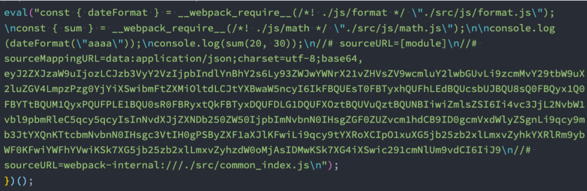
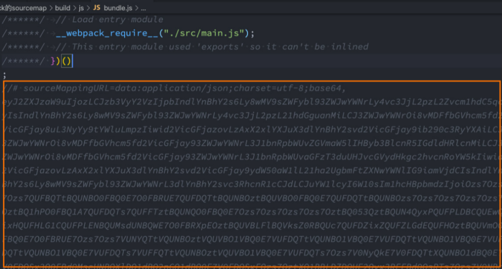
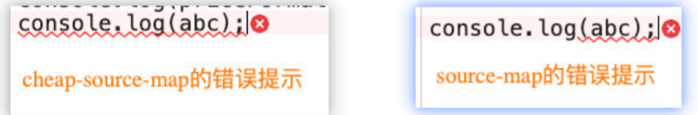
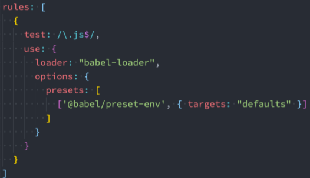
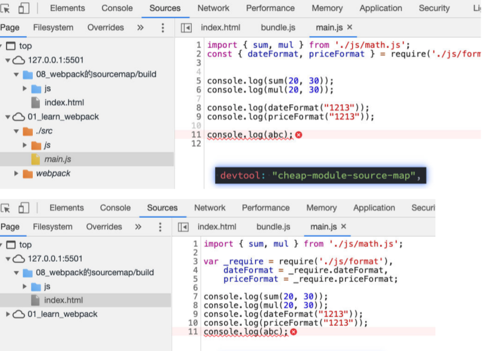

# source-map是什么

* 我们的代码通常运行在浏览器上时，是通过打包压缩的： 
  * 也就是真实跑在浏览器上的代码，和我们编写的代码其实是有差异的； 
  * 比如ES6的代码可能被转换成ES5； 
  * 比如对应的代码行号、列号在经过编译后肯定会不一致； 
  * 比如代码进行丑化压缩时，会将编码名称等修改；
  * 比如我们使用了TypeScript等方式编写的代码，最终转换成JavaScript；
* 但是，当代码报错需要调试时（debug），调试转换后的代码是很困难的 
* 那么如何可以调试这种转换后不一致的代码呢？答案就是source-map 
  * **source-map是从已转换的代码，映射到原始的源文件；** 
  * **使浏览器可以重构原始源并在调试器中显示重建的原始源；**

# 如何使用source-map

 **如何可以使用source-map呢？两个步骤：**

* 第一步：根据源文件，生成source-map文件，webpack在打包时，可以通过配置生成source-map； 
* 第二步：在转换后的代码，最后添加一个注释，它指向sourcemap；`//# sourceMappingURL=common.bundle.js.map`

**浏览器会根据我们的注释，查找响应的source-map，并且根据source-map还原我们的代码，方便进行调试。**

## source-map各个参数的意义

* **version**：当前使用的版本，也就是最新的第三版； 
* **sources**：从哪些文件转换过来的source-map和打包的代码（最初始的文件）； 
* **names**：转换前的变量和属性名称（因为我目前使用的是development模式，所以不需要保留转换前的名 称）； 
* **mappings**：source-map用来和源文件映射的信息（比如位置信息等），一串base64 VLQ（veriablelength quantity可变长度值）编码； 
* **file**：打包后的文件（浏览器加载的文件）； 
* **sourceContent**：转换前的具体代码信息（和sources是对应的关系）； 
* **sourceRoot**：所有的sources相对的根目录；

webpack为我们提供了非常多的选项（**目前是26个**），来处理source-map； 

https://webpack.docschina.org/configuration/devtool/ 
**选择不同的值，生成的source-map会稍微有差异，打包的过程也会有性能的差异**，可以根据不同的情况进行选择；

# 不会生成source-map的devtool的属性

* **false**：**不使用source-map**，也就是没有任何和source-map相关的内容，**也不使用eval**。 
* **none**：**production模式下的默认值，不生成source-map，注意none的意思是不设置devtool，而不是设置devtool的值为none**。 
* **eval**：**development模式下的默认值，不生成source-map** 
  * **但是它会在eval执行的代码中，添加 //# sourceURL=；** sourceUR对应的是原文件的位置
  * **它会被浏览器在执行时解析，并且在调试面板中生成对应的一些文件目录，方便我们调试代码；**

# 生成source-map的devtool属性

## source-map

**生成一个独立的source-map文件，并且在bundle文件中有一个注释，`//# sourceMappingURL=bundle.js.map`指向source-map文件；**开发工具会根据这个注释找到source-map文件，并且解析；

## **eval-source-map**

**会生成sourcemap，但不是文件，source-map是以DataUrl添加到eval函数的后面**

## inline-source-map

**会生成sourcemap，但是source-map是以DataUrl添加到bundle文件的后面** 

## cheap-source-map

* **会生成sourcemap，但是会更加高效一些（cheap低开销），因为它没有生成列映射（Column Mapping）**
* 因为在开发中，我们只需要行信息通常就可以定位到错误了 

## cheap-module-source-map：

* **解释：**
  * **会生成sourcemap，类似于cheap-source-map，但是对源自loader的sourcemap处理会更好**
* **cheap-source-map和cheap-module-source-map的区别：**
  * 这里使用了babel-loader 
  * **使用了babel之后，cheap-module-source-map对于报错时的源文件定位是一摸一样的，而且对应的源文件也一样，而cheap-source-map报错时对应的文件与源文件是有出入的。**

## hidden-source-map

* **会生成sourcemap，但是不会对source-map文件进行引用；** 
* **相当于删除了打包文件bund.js中对sourcemap的引用注释；**
  * 被删除掉的 //# sourceMappingURL=bundle.js.map
* 如果我们手动添加进来，那么sourcemap就会生效了

## nosources-source-map

​	**会生成sourcemap，但是生成的sourcemap只有错误信息的提示，不会生成源代码文件；**

## 多个值的组合

事实上，webpack提供给我们的26个值，是可以进行多组合的。

### 组合的规则

* inline-|hidden-|eval：三个值时三选一； 
* nosources：可选值； 
* cheap可选值，并且可以跟随module的值；
* `[inline-| hidden-| eval-] [nosources-] [cheap- [module-]] source-map`

### 那么在开发中，最佳的实践是什么呢？

* **开发阶段：**
  * 推荐**使用 source-map或者cheap-module-source-map** 
  * 这分别是vue和react使用的值，可以获取调试信息，方便快速开发； 
* **测试阶段：**
  * 推荐**使用 source-map或者cheap-module-source-map** 
  * 测试阶段我们也希望在浏览器下看到正确的错误提示； 
* **发布阶段：**
  * **false、缺省值（不写）**