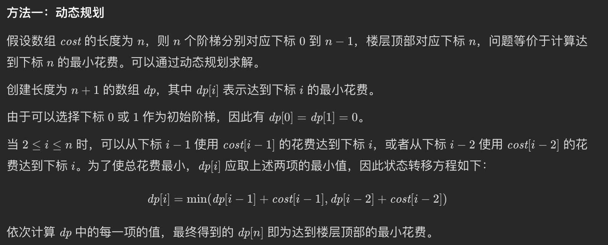

## 02、[746. 使用最小花费爬楼梯](https://leetcode.cn/problems/min-cost-climbing-stairs/)

	* 题目

> 给你一个整数数组 **cost** ，其中 **cost[i] 是从楼梯第 i 个台阶向上爬需要支付的费用。**一旦你支付此费用，即可选择向上**爬一个或者两个台阶**。你**可以选择从下标为 0 或下标为 1 的台阶开始爬楼梯**。请你计算并返回达到楼梯顶部的**最低花费**。
>
> 输入：cost = [10,15,20]
> 输出：15
> 解释：你将从下标为 1 的台阶开始。支付 15 ，向上爬两个台阶，到达楼梯顶部。总花费为 15 。
>
> 输入：cost = [1,100,1,1,1,100,1,1,100,1]
> 输出：6
> 解释：你将从下标为 0 的台阶开始。
> - 支付 1 ，向上爬两个台阶，到达下标为 2 的台阶。
> - 支付 1 ，向上爬两个台阶，到达下标为 4 的台阶。
> - 支付 1 ，向上爬两个台阶，到达下标为 6 的台阶。
> - 支付 1 ，向上爬一个台阶，到达下标为 7 的台阶。
> - 支付 1 ，向上爬两个台阶，到达下标为 9 的台阶。
> - 支付 1 ，向上爬一个台阶，到达楼梯顶部。总花费为 6 。
>
> 2 <= cost.length <= 1000
> 0 <= cost[i] <= 999

* 解析

  >
  >

```js
/**
 * @param {number[]} cost
 * @return {number}
 */
var minCostClimbingStairs = function(cost) {
    let first = cost[0], second = cost[1];
    for (let i = 2; i < cost.length; i++) {
        current = Math.min(first + cost[i], second + cost[i]);
        first = second;
        second = current;
    }
    return Math.min(first, second);
};
```

