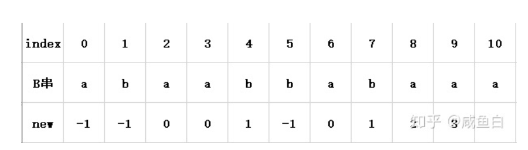

## [实现 strStr()/indexOf](https://leetcode.cn/problems/implement-strstr/)

* **题目：**

  >实现 strStr() 函数。
  >
  >给你两个字符串 haystack 和 needle ，请你在 haystack 字符串中找出 needle 字符串出现的第一个位置（下标从 0 开始）。如果不存在，则返回  -1 。
  >
  >说明：
  >
  >当 needle 是空字符串时，我们应当返回什么值呢？这是一个在面试中很好的问题。
  >
  >对于本题而言，当 needle 是空字符串时我们应当返回 0 。这与 C 语言的 strstr() 以及 Java 的 indexOf() 定义相符。
  >

* **示例：**

  * **示例1：**

    ```
    输入：haystack = "hello", needle = "ll"
    输出：2
    ```

  * **示例2：**

    ```
    输入：haystack = "aaaaa", needle = "bba"
    输出：-1
    ```

  * **提示：**

    * `1 <= haystack.length, needle.length <= 104`
    * `haystack` 和 `needle` 仅由小写英文字符组成

* **解析：**

  >**[kmp理论](https://www.bilibili.com/video/BV1PD4y1o7nd/?spm_id_from=333.788&vd_source=b6001cd2cca6a6d248ae56c4519c732f)**
  >
  >[next数组实现](https://www.zhihu.com/question/21923021/answer/642165149)
  >
  >next数组，while循环
  >
  >
  >
  >现在a与b不相对，不能使原来的最长公共前后缀加一，但可能会出现**a与前面最长的后缀的子后缀拼接起来与前缀相同的情况**。现在已知前缀abaa与后缀abaa相等了（由next数组知），**那么前缀的的new数组对应的值与后缀单独拧出来看对应的new数组是一样的（不是表上的，是单独看的new数组）。**
  >
  >**那么当前a与前缀拼接得到的最长公共子序列的值 和 a与后缀拼接的最长公共子序列也是一样的。就可以把拼接得到的 前缀的最长公共前缀 与 后缀的最长公共后缀单独抽出来，这两个前后缀肯定也是相同的，并且也是整个串的最长公共前后缀。**
  >
  >当前j = 3，由于a与b匹配不上，j = new[3] = 0，即得到前缀串0-3中公共最长前后缀为0 + 1 = 1，即abaa中的前面的a和后面的a相等的。
  >因此后缀的6-9（index = 9, 9-3=6）中公共最长前后缀为1，即abaa中的前面的a和后面的a相等的。
  >如果a与B[1]是相等的，那么与前缀串0-3拼接串的最长公共前后缀就为 (j + 1) + 1 = 2，同理后缀的最大公共前后缀也为2，那么当前位置整个串的最长公共前后缀的就为2了。
  >但是B[1] =  b，所以需要继续j = new[0]，来重复上述步骤。由于每一个串的公共前后缀串都是相同的，都可以重复上述步骤，只要拼接上了，也就意味着与之对应后缀串拼接上了，依次类推，所以可以使用while循环
  >
  >

* **代码：**

  ```js
  var strStr = function(haystack, needle) {
    if (needle.length === 0) return 0;
    const next = [0];
    getNext(next, needle);
    let j = 0;
    for (let i = 0; i < haystack.length; i++) {
      while (j > 0 && haystack[i] != needle[j]) {
        j = next[j - 1];
      }
      if (haystack[i] == needle[j]) {
        j++;
      }
      if (j === needle.length) {
        return (i - needle.length + 1)
      }
    }
    return -1;
  	
    // 生成next数组 
    function getNext(next, s) {
      let j = 0; // j 表示前缀末尾位置，i 表示后缀末尾位置
      for (let i = 1; i < s.length; i++) {
        while (j > 0 && s[i] !== s[j]) {
          j = next[j - 1];
        }
        if (s[i] === s[j]) {
          j++;
        }
        next[i] = j;
      }
    }
  }
  ```