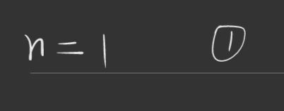
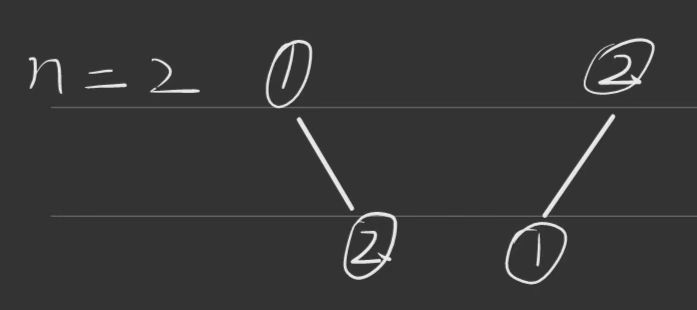
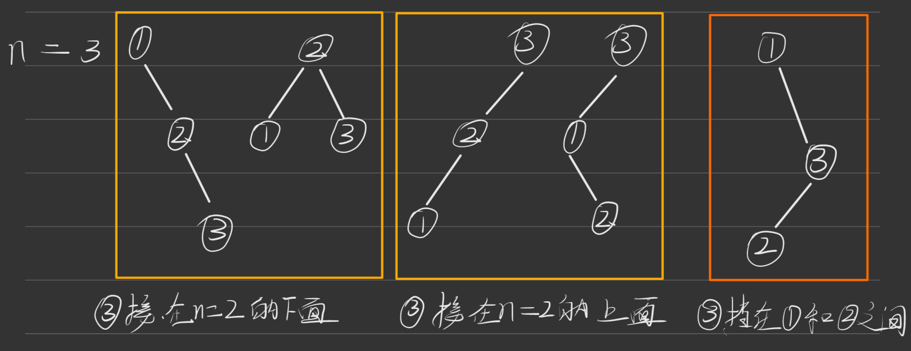
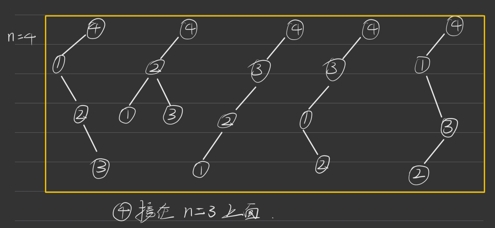
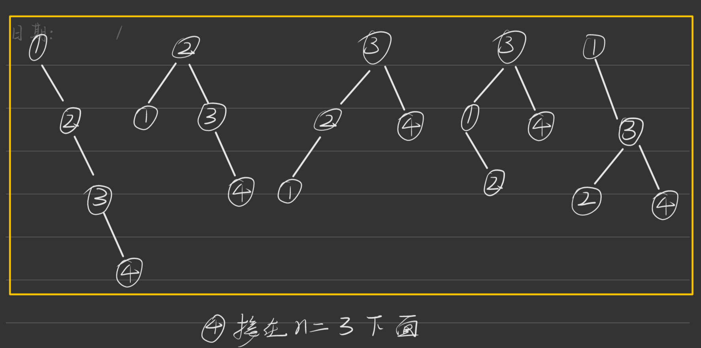
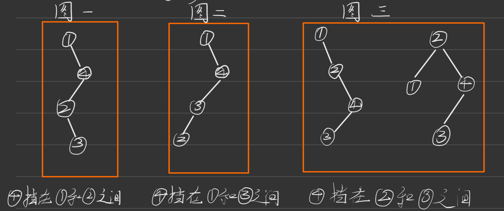
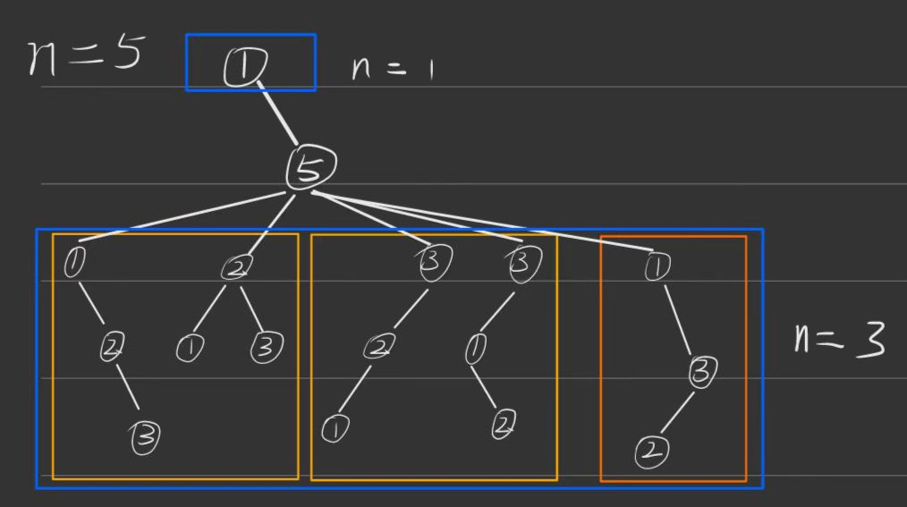
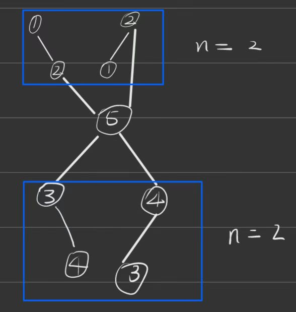
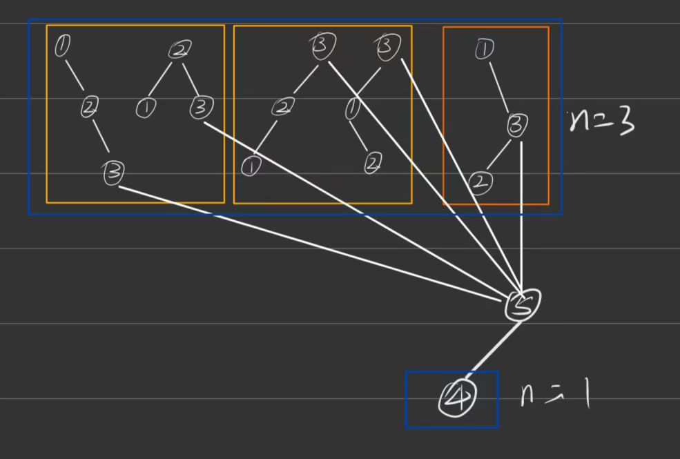

* 思路

  这道题是在动态规划中刷到到，遇到动态规划问题我大部分的解题思路都是从头开始找起，看看后面的结果能不能依据前面的结论，依此来发现动态规划方程，这题也不列外

  ## 画图过程

  ### n = 1
  无需多言
  

  ### n = 2
  这个也很容易得出
  

  ### n = 3
  n = 3 时可以发现能利用 n = 2 时的结果，③分别接在上面和下面，也就是4种了，但是还存在③挡在①和②之间的情况。于是就可以画出下面的二叉树。
  
  **注意**：③挡在①和②之间的情况只有这一种，若②放在上面就构成不了二插搜索树了。
  **当前结论**：画到这里，可以发现每次可以利用上一次得到的二叉搜索树结果，分别接在上面和下面，但是③挡在①和②的规律还未知。目前结果为2 * f(2) + 1继续画

  ### n = 4
  ④分别接在n = 3结果的上面与下面：
  
  

  还存在④挡在他们之间的情况
  
  画到这里仔细看下，会发现图一与图二上面的结点是①下面的两个结点是②和③，而②和③之间的组合结果正好对应 n = 2 时候的结果，对于①就是 n = 1 时候的结果；
  再看图三，上面的结点是对应的是 n = 2 时候的结果，下面的③正好和 n = 1 时候的结果一样。也就是每一次都利用了前面所有的二叉树结果。
  画到这里其实结果已经快浮出水面了，仔细分析可以得出图一和图二是 f(1) * f(2) 的结果，而图三是f(2) * f(1)的结果；

  **当前结论**；f(4) = 2 * f(3) + f(1) * f(2) + f(2) * f(1);对于后面f(1) * f(2) + f(2) * f(1)的结论可能还不够严谨，而且规律还不是特别明显，画出f(5)来验证并找出规律。

  ### n = 5
  这里就不在重复画接在 n = 4 上下的情况了，着重来画⑤挡在他们之间的情况
  #### 首先①在最上面，⑤接着①，然后其他三个在最下面。
  
  下面的二叉树肯定是在⑤的左边了，这里简单画下，应该都能看懂，下面的①②③按数按顺序换成②③④就好了。
  也确实是 f(1) * f(3); 即使没有上面的结论，估计在画下面三个时你能很明显感觉到这就是 n = 3 时候的情况；

  ### ①和②在上面③和④在下面
  
  f(2) * f(2)

  ### ①②③在上面④在下面
  
  f(3) * f(1)

  **当前结论**：f(5) = 2 * f(4) + f(1) * f(3) + f(2) * f(2) * f(3) * f(1);

  ## 总结
  我们得出上面的式子，后面的 f(1) * f(3) + f(2) * f(2) * f(3) * f(1) 是很整齐的顺子，唯独这个2 * f(4)非常不规律，要不然写递归还得单独给它写一个条件判断的代码块了，确实有点傻，所以要解决掉这个问题。
  2 * f(4) = f(4) + f(4) = 1 * f(4) + f(4) * 1;
  带到式子中 1 * f(4) + f(1) * f(3) + f(2) * f(2) * f(3) * f(1) + f(4) * 1;
  如果式子中的 1 换成 f(0) 岂不就完美？虽然 f(0) 并没有什么实质性意义，但设f(0) = 1却很有利计算；

  **验证：**
  f(4) = 2 * f(3) + f(1) * f(2) + f(2) * f(1) = f(0) * f(3) + f(1) * f(2) + f(2) * f(1) + f(3) * f(0);
  f(3) = 2 * f(2) + 1 = f(0) * f(2) + f(1) * f(1) + f(2) * f(0);
  f(2) = f(0) * f(1) + f(1) * f(0);
  f(1) 不可分解了，我们把f(1)固定为 1;

  ## 结论
  f(n) = f(0) * f(n - 1) + f(1) * f(n - 2) + ... + f(n - 1) * f(0);
  我们只需要依据f(0) = 1, f(1) = 1; 一步步往后推就好了；

  ## 代码
  ```js
  function numTrees(n) {
      const trees = new Array(n + 1).fill(0);
      trees[1] = trees[0] = 1;
      for (let i = 2; i <= n; i++) {
          for (let j = 1; j <= i; j++) {
          trees[i] += trees[i - j] * trees[j - 1];  
          }
      }
      return trees[n];
  }
  ```

