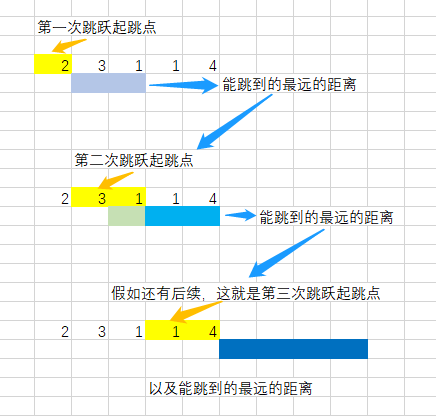

## [跳跃游戏](https://leetcode.cn/problems/jump-game/)

* **题目：**

  >给定一个非负整数数组 `nums` ，你最初位于数组的 **第一个下标** 。数组中的每个元素代表你在该位置可以跳跃的最大长度。
  >
  >判断你是否能够到达最后一个下标。

* **示例：**

  * 示例 1：

    ```
    输入：nums = [2,3,1,1,4]
    输出：true
    解释：可以先跳 1 步，从下标 0 到达下标 1, 然后再从下标 1 跳 3 步到达最后一个下标。
    ```

  * 示例 2：

    ```
    输入：nums = [3,2,1,0,4]
    输出：false
    解释：无论怎样，总会到达下标为 3 的位置。但该下标的最大跳跃长度是 0 ， 所以永远不可能到达最后一个下标。
    ```

  * 提示：

    * `1 <= nums.length <= 3 * 104`
    * `0 <= nums[i] <= 105`

* **解析：**

  * **方法一：**

    >每次遍历用当前位置加上当前位置可跳跃的最大值就是就是当前位置可以调到的最大位置，那么保存这个maxJump，每次遍历更新这个最大值，当最大值大于等于数组长度就可以跳到最后一个下标。

  * **方法二：**

    >从后往前，倒数第二个应该至少要>=1才能跳到最后一个，如果倒数第二个可以跳到最后一个，那么倒数第三个只要能跳到倒数第二个就可以了，也是至少>=1,同理只要后面的都能跳到，只需要满足当前>=1。
    >
    >如果倒数第二个不能跳到最后一个，那么倒数第三个需要跳到倒数第一个，即需要>=2，如果倒数第三个也不可以，那就需要倒数第四个>=3。同理依次加一。只要当前的可以跳到最后一个了，那么前面一个只要能跳到当前位置就可以了，就是前面的满足>=1即可。

* **代码：**

  ```js
  function canJump(nums) {
  	// 跳跃的最大位置
    let kips = nums[0]; 
    for (let i = 1; i < nums.length; i++) {
      if (kips >= i) kips = Math.max(kips, i + nums[i]);
      // 最大位置已经不能跳到下一个了，那后面的肯定都跳不到了；
      else return false
    }
    return true;
  }
  
  // 自创解法，从后往前
  var canJump = function(nums) {
      let len = nums.length;
      if (len === 1) return true;
      let jump = 1;
      for (let i = len - 2; i >= 0; i--) {
          if (nums[i] < jump) jump++;
          else jump = 1;
      }
      return jump === 1 ? true : false;
  };
  ```


## [跳跃游戏II](https://leetcode.cn/problems/jump-game-ii/)

* **题目：**

  >给你一个非负整数数组 nums ，你最初位于数组的第一个位置。
  >
  >数组中的每个元素代表你在该位置可以跳跃的最大长度。
  >
  >你的目标是使用最少的跳跃次数到达数组的最后一个位置。
  >
  >假设你总是可以到达数组的最后一个位置。
  >

* **示例：**

  * **示例1：**

    ```
    输入: nums = [2,3,1,1,4]
    输出: 2
    解释: 跳到最后一个位置的最小跳跃数是 2。
         从下标为 0 跳到下标为 1 的位置，跳 1 步，然后跳 3 步到达数组的最后一个位置。
    ```

  * **示例2：**

    ```
    输入: nums = [2,3,0,1,4]
    输出: 2
    ```

  * **提示：**

    * `1 <= nums.length <= 104`
    * `0 <= nums[i] <= 1000`

* **解析：**

  ><br>

* **代码：**

  ```js
  /**
   * @param {number[]} nums
   * @return {number}
   */
  function jump(nums) {
      const len = nums.length;
      let min = 0, max = 0, times = 0;
      while (max < len - 1) {
          let currentMax = max;
          for (let i = min; i <= max; i++) {
              currentMax = Math.max(nums[i] + i, currentMax);
          }
          min = max + 1;
          max = currentMax;
          times++;
      }
      return times;
  }
  ```

  