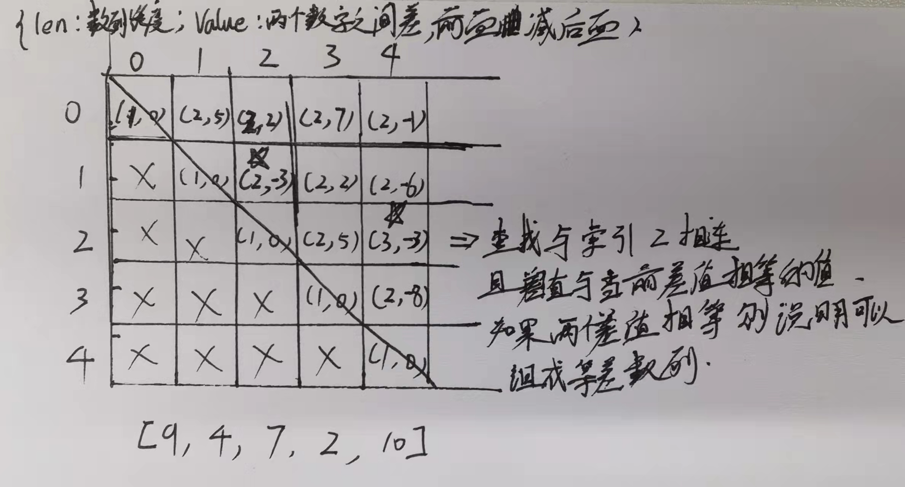

## [等差数列划分](https://leetcode.cn/problems/arithmetic-slices/)

* **题目：**

  >如果一个数列 至少有三个元素 ，并且任意两个相邻元素之差相同，则称该数列为等差数列。
  >
  >例如，[1,3,5,7,9]、[7,7,7,7] 和 [3,-1,-5,-9] 都是等差数列。
  >给你一个整数数组 nums ，返回数组 nums 中所有为等差数组的 子数组 个数。
  >
  >子数组 是数组中的一个连续序列。
  >

* **示例：**

  * **示例1：**

    ```
    输入：nums = [1,2,3,4]
    输出：3
    解释：nums 中有三个子等差数组：[1, 2, 3]、[2, 3, 4] 和 [1,2,3,4] 自身。
    ```

  * **示例2：**

    ```
    输入：nums = [1]
    输出：0
    ```

  * **提示：**

    * `1 <= nums.length <= 5000`
    * `-1000 <= nums[i] <= 1000`

* **解析：**

  >如果当前的连续3个为等差数列且上一个连续的3个为等差数列，那么这四个比为等差数列，同理如果上上个也是等差数列，则这5个也为等差数列。

* **代码：**

  ```js
  function numberOfArithmeticSlices(nums) {
    // 标记前面等差数列的个数
    let flag = 0;
    // 结果
    let res = 0;
    for (let i = 2; i < nums.length; i++) {
      // 判断等差数列公式 2b = a + c
      if (2 * nums[i - 1] === nums[i - 2] + nums[i]) {
        flag++;
        res += flag;
      }else {
        flag = 0;
      }
    }
    return res;
  }
  ```

  

## [最长等差数列](https://leetcode.cn/problems/longest-arithmetic-subsequence/)

* **题目：**

  >给你一个整数数组 nums，返回 nums 中最长等差子序列的长度。
  >
  >回想一下，nums 的子序列是一个列表 nums[i1], nums[i2], ..., nums[ik] ，且 0 <= i1 < i2 < ... < ik <= nums.length - 1。并且如果 seq[i+1] - seq[i]( 0 <= i < seq.length - 1) 的值都相同，那么序列 seq 是等差的。
  >

* **示例：**

  * **示例1：**

    ```
    输入：nums = [3,6,9,12]
    输出：4
    解释： 
    整个数组是公差为 3 的等差数列。
    ```

  * **示例2：**

    ```
    输入：nums = [9,4,7,2,10]
    输出：3
    解释：
    最长的等差子序列是 [4,7,10]。
    ```

  * **示例3：**

    ```
    输入：nums = [20,1,15,3,10,5,8]
    输出：4
    解释：
    最长的等差子序列是 [20,15,10,5]。
    ```

  * **提示：**

    * `2 <= nums.length <= 1000`
    * `0 <= nums[i] <= 500`

* **解析：**

  >这题和上面一题关系其实不大，是属于子序列问题。
  >
  >子序列问题一般用二维数组解决。`dp[i][j]`代表以i，j结尾等差数列长度<br>

* **代码：**

  ```js
  function longestArithSeqLength(nums) {
    const len = nums.length;
    const dp = Array.from({length: len}, () => Array.from({length: len}, () => ({len: 0, value: 0})));
    let res = 0;
    // 初始化第一行，其他行都是依据第一行来的
    for (let i = 1; i < dp[0].length; i++) {
      dp[0][i].len = 2;
      dp[0][i].value = nums[0] - nums[i];
    }
    for (let i = 1; i < nums.length; i++) {
      for (let j = i + 1; j < nums.length; j++) {
        const d = nums[i] - nums[j];
        // 公差
        dp[i][j].value = d;
        // 有两个数所以初始值设为 2 ，
        dp[i][j].len = 2;
        // 遍历索引与 i 相同的那列，公差相同说明可以组成等差数列，合并两者的len值
        for (let k = 0; k < i; k++) {
          if (dp[k][i].value === d) {
            // 可能存在多个相同的值，所以需要取最大值
            dp[i][j].len = Math.max(dp[k][i].len + 1, dp[i][j].len);
          }
        }
        // 获取最大值
        res = Math.max(res, dp[i][j].len);
      }
    }
    return res;
  };
  ```

* **优化：**

  * 见12.子序列问题第一题