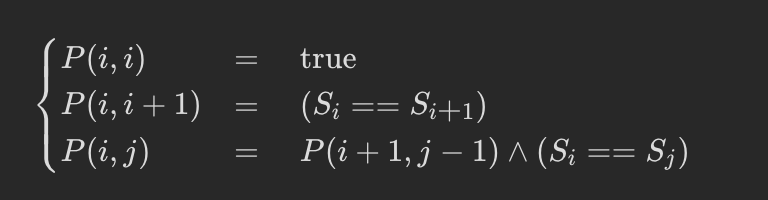

## [验证回文串](https://leetcode.cn/problems/valid-palindrome/)

* **题目：**

  >给定一个字符串，验证它是否是回文串，只考虑字母和数字字符，可以忽略字母的大小写。
  >
  >**说明：**本题中，我们将空字符串定义为有效的回文串。

* **示例：**

  * **示例1：**

    ```
    输入: "A man, a plan, a canal: Panama"
    输出: true
    解释："amanaplanacanalpanama" 是回文串
    ```

  * **示例2：**

    ```
    输入: "race a car"
    输出: false
    解释："raceacar" 不是回文串
    ```

  * **提示：**

    * `1 <= s.length <= 2 * 105`
    * 字符串 `s` 由 ASCII 字符组成

* **解析：**

  >1：将字符串转换为数组，该数字只包含数字与小写字母
  >
  >2：双指针，一个指向头一个指向尾，开始向中间遍历，遇到不相等的就不是回文串了

* **代码：**

  ```js
  function isPalindrome(s) {
    // 使用正则来匹配是否为数字或字母
    const reg = /^[0-9a-zA-Z]$/
    const string = [];
    for (let i = 0; i < s.length; i++) {
      if (reg.test(s[i])) {
        // toLowerCase 将大写字母转小写，非大写转换不变
        string.push(s[i].toLowerCase());
      }
    }
    // 双指针判断
    for (let i = 0, j = string.length - 1; i <= j; i++, j--) {
      if (string[i] !== string[j]) return false;
    }
    return true;
  };
  ```


---

## [**最长回文子串](https://leetcode.cn/problems/longest-palindromic-substring/)

* **题目：**

  >给你一个字符串 `s`，找到 `s` 中最长的回文子串。

* **示例：**

  * **示例1：**

    ```
    输入：s = "babad"
    输出："bab"
    解释："aba" 同样是符合题意的答案。
    ```

  * **示例2：**

    ```
    输入：s = "cbbd"
    输出："bb"
    ```

  * **提示：**

    * `1 <= s.length <= 1000`
    * `s` 仅由数字和英文字母组成

* **解析：**

  >[题解](https://leetcode.cn/problems/longest-palindromic-substring/solution/zui-chang-hui-wen-zi-chuan-by-leetcode-solution/)<br>

* **代码：**

  ```js
  // 动态规划+中心扩展
  function longestPalindrome(s) {
    // start与end记录开始与结束的位置
    let start = 0, end = 0, length = 0;
    for (let i = 0; i < s.length; i++) {
      	// 分别从偶数和奇数来求解
        let temp1 = foo(i, i + 1, s); // 不需要判断s[i] === s[i + 1]，如果不成立返回的还是0；
        let temp2 = foo(i, i, s);
        length = length < temp1.length ? (start = temp1.start, end = temp1.end, temp1.length) : length; 
        length = length < temp2.length ? (start = temp2.start, end = temp2.end, temp2.length) : length; 
    }
    return s.slice(start, end + 1);
    
    // 中心扩展
    function foo(start, end, s){
        while (start >= 0 && end < s.length && s[start] === s[end]) {
            start--;
            end++;
        }
        return {length: end - start - 1, start: start + 1, end: end - 1};
    }
  };
  ```

---

## [ 回文子串](https://leetcode.cn/problems/palindromic-substrings/)

* **题目：**

  >给你一个字符串 s ，请你统计并返回这个字符串中 回文子串 的数目。
  >
  >回文字符串 是正着读和倒过来读一样的字符串。
  >
  >子字符串 是字符串中的由连续字符组成的一个序列。
  >
  >具有不同开始位置或结束位置的子串，即使是由相同的字符组成，也会被视作不同的子串。

* **示例：**

  * **示例1：**

    ```
    输入：s = "abc"
    输出：3
    解释：三个回文子串: "a", "b", "c"
    ```

  * **示例2：**

    ```
    输入：s = "aaa"
    输出：6
    解释：6个回文子串: "a", "a", "a", "aa", "aa", "aaa"
    ```

  * **提示：**

    * `1 <= s.length <= 1000`
    * `s` 由小写英文字母组成

* **解析：**

  >和上面一样的，中心扩展法，每次扩展累加就好了

* **代码：**

  ```js
  function countSubstrings(s) {
    const len = s.length;
    let sum = 0;
    for (let i = 0; i < len; i++) {
      foo(i, i);
      foo(i, i+1);
    }
    
    function foo(start, end) {
      while(start >= 0 && end < s.length && s[start] === s[end]) {
        sum++;
        start--;
        end++;
      } 
    }
    
    return sum;
  };
  ```

  