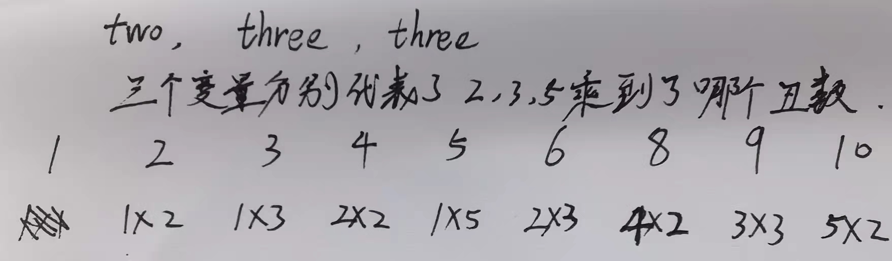

## [丑数](https://leetcode.cn/problems/ugly-number/)

* **题目：**

  >**丑数** 就是只包含质因数 `2`、`3` 和 `5` 的正整数。
  >
  >给你一个整数 `n` ，请你判断 `n` 是否为 **丑数** 。如果是，返回 `true` ；否则，返回 `false` 。

* **示例：**

  * **示例1：**

    ```
    输入：n = 6
    输出：true
    解释：6 = 2 × 3
    ```

  * **示例2：**

    ```
    输入：n = 1
    输出：true
    解释：1 没有质因数，因此它的全部质因数是 {2, 3, 5} 的空集。习惯上将其视作第一个丑数。
    ```

  * **示例3：**

    ```
    输入：n = 14
    输出：false
    解释：14 不是丑数，因为它包含了另外一个质因数 7 。
    ```

  * **提示：**

    * `-231 <= n <= 231 - 1`

* **解析：**

  >就一直除，先除以 2， 2除不尽了再除以 3，3除不尽了再除以5，最后看结果是不是1

* **代码：**

  ```js
  var isUgly = function(n) {
      if (n <= 0) return false;
      while (n % 2 === 0) n /= 2;
      while (n % 3 === 0) n /= 3;
      while (n % 5 === 0) n /= 5;
      return n === 1;
  };
  ```


---


## [丑数 II](https://leetcode.cn/problems/ugly-number-ii/)

* **题目：**

  >给你一个整数 `n` ，请你找出并返回第 `n` 个 **丑数** 。
  >
  >**丑数** 就是只包含质因数 `2`、`3` 和/或 `5` 的正整数。

* **示例：**

  * **示例1：**

    ```
    输入：n = 10
    输出：12
    解释：[1, 2, 3, 4, 5, 6, 8, 9, 10, 12] 是由前 10 个丑数组成的序列。
    ```

  * **示例2：**

    ```
    输入：n = 1
    输出：1
    解释：1 通常被视为丑数。
    ```

  * **提示：**

    * `1 <= n <= 1690`

* **解析：**

  >每个当前的丑数都是有前面的丑数乘以 2,3,5得到的，列入 2,4,6,8,10都是由2乘以1,2,3,4,5得到的，每次得到一个丑数之2 就需要乘以下一个丑数，同理3,6,9是由3 * 1,2,3得来的，5，10是由5乘以1,2得来的，而当前的丑数就是他们之间乘积最小的那个数，看代码。。。<br>

* **代码：**

  ```js
  function nthUglyNumber(num) {
    // 用三个变量表示2,3,5乘到了那个丑数。
    let two = 0, three = 0, five = 0;
    let nums = [1];
    for (let i = 1; i < num; i++) {
      const ctwo = 2 * nums[two];
      const cthree = 3 * nums[three];
      const cfive = 5 * nums[five];
      // 最小的那个即为当前的丑数
      const current = Math.min(ctwo, cthree, cfive);
      /**
      	每次取得当前的丑数得到的丑数需要把对应的索引加1，
      	可能会存在两个都需要增加的情况，例如6 = 2 * 3，
      	那么 2 和 3对应的下一个丑数下标都得加一，所以没个都得判断一遍
      */
      if (ctwo === current) {
        two++;
      }
      if (cthree === current) {
        three++;
      }
      if (cfive === current) {
        five++;
      }
      nums.push(current);
    }
    return nums[num - 1];
  }
  ```


## [丑数 III](https://leetcode.cn/problems/ugly-number-iii/)

* **题目：**

  >给你四个整数：`n` 、`a` 、`b` 、`c` ，请你设计一个算法来找出第 `n` 个丑数。
  >
  >丑数是可以被 `a` **或** `b` **或** `c` 整除的 **正整数** 。

* **示例：**

  * **示例1：**

    ```
    输入：n = 3, a = 2, b = 3, c = 5
    输出：4
    解释：丑数序列为 2, 3, 4, 5, 6, 8, 9, 10... 其中第 3 个是 4
    ```

  * **示例2：**

    ```
    输入：n = 4, a = 2, b = 3, c = 4
    输出：6
    解释：丑数序列为 2, 3, 4, 6, 8, 9, 10, 12... 其中第 4 个是 6。
    ```

  * **示例3：**

    ```
    输入：n = 5, a = 2, b = 11, c = 13
    输出：10
    解释：丑数序列为 2, 4, 6, 8, 10, 11, 12, 13... 其中第 5 个是 10。
    ```

  * **提示：**

    * `1 <= n, a, b, c <= 10^9`
    * `1 <= a * b * c <= 10^18`

* **解析：**

  >//二分查找暂略

* **代码：**

  ```js
  
  ```

  