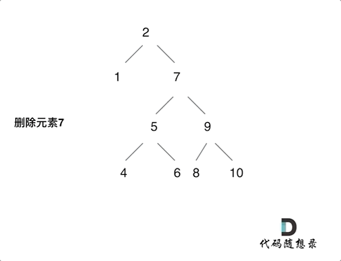

## [删除二叉搜索树中的节点](https://leetcode.cn/problems/delete-node-in-a-bst/)

* **题目：**

  >定一个二叉搜索树的根节点 root 和一个值 key，删除二叉搜索树中的 key 对应的节点，并保证二叉搜索树的性质不变。返回二叉搜索树（有可能被更新）的根节点的引用。
  >
  >一般来说，删除节点可分为两个步骤：
  >
  >1. 首先找到需要删除的节点；
  >2. 如果找到了，删除它。

* **示例：**

  * **示例1：**<br>

    ```
    输入：root = [5,3,6,2,4,null,7], key = 3
    输出：[5,4,6,2,null,null,7]
    解释：给定需要删除的节点值是 3，所以我们首先找到 3 这个节点，然后删除它。
    一个正确的答案是 [5,4,6,2,null,null,7], 如下图所示。
    另一个正确答案是 [5,2,6,null,4,null,7]。
    ```

  * **示例2：**<br>

    ```
    输入: root = [5,3,6,2,4,null,7], key = 0
    输出: [5,3,6,2,4,null,7]
    解释: 二叉树不包含值为 0 的节点
    ```

  * **示例3：**

    ```
    输入: root = [], key = 0
    输出: []
    ```

  * **提示：**

    * 节点数的范围 `[0, 104]`.
    * `-105 <= Node.val <= 105`
    * 节点值唯一
    * `root` 是合法的二叉搜索树
    * `-105 <= key <= 105`

* **解析：**

  >- 第一种情况：没找到删除的节点，遍历到空节点直接返回了
  >
  >- 找到删除的节点
  >
  >  - 第二种情况：左右孩子都为空（叶子节点），直接删除节点， 返回NULL为根节点
  >  - 第三种情况：删除节点的左孩子为空，右孩子不为空，删除节点，右孩子补位，返回右孩子为根节点
  >  - 第四种情况：删除节点的右孩子为空，左孩子不为空，删除节点，左孩子补位，返回左孩子为根节点
  >  - 第五种情况：左右孩子节点都不为空，则将删除节点的左子树头结点（左孩子）放到删除节点的右子树的最左面节点的左孩子上，返回删除节点右孩子为新的根节点。
  >
  >- 第五种情况有点难以理解，看下面动画：<br>
  >
  >- 动画中棵二叉搜索树中，删除元素7， 那么删除节点（元素7）的左孩子就是5，删除节点（元素7）的右子树的最左面节点是元素8。
  >
  >  将删除节点（元素7）的左孩子放到删除节点（元素7）的右子树的最左面节点（元素8）的左孩子上，就是把5为根节点的子树移到了8的左孩子的位置。
  >
  >  要删除的节点（元素7）的右孩子（元素9）为新的根节点。

* **代码：**

  ```js
  var insertIntoBST = function(root, val) {
      function foo(root, val) {
          if (root.val < val) {
              if (!root.right) {
                  root.right = new TreeNode(val);
                  return;
              }
              insertIntoBST(root.right, val);
          }else {
              if (!root.left) {
                  root.left = new TreeNode(val);
                  return;
              }
              insertIntoBST(root.left, val);
          }
      }
      if (!root) return new TreeNode(val);
      foo(root, val);
      return root;
  };
  ```