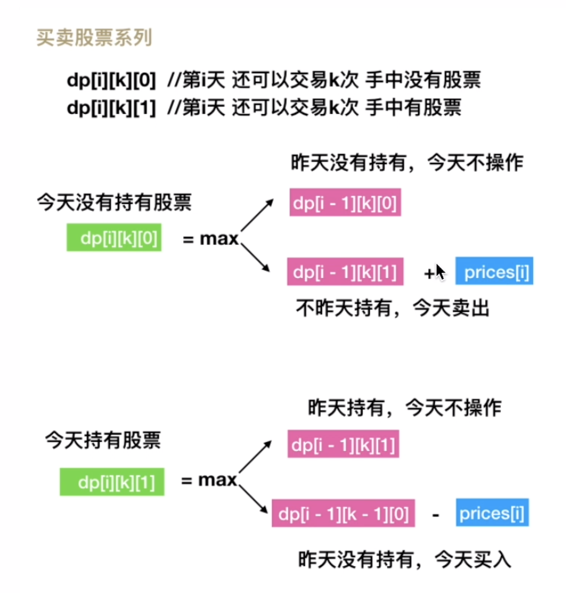

## [买卖股票的最佳时机](https://leetcode.cn/problems/best-time-to-buy-and-sell-stock/)

* **题目：**

  >给定一个数组 prices ，它的第 i 个元素 prices[i] 表示一支给定股票第 i 天的价格。
  >
  >你只能选择 某一天 买入这只股票，并选择在 未来的某一个不同的日子 卖出该股票。设计一个算法来计算你所能获取的最大利润。
  >
  >返回你可以从这笔交易中获取的最大利润。如果你不能获取任何利润，返回 0 。
  >

* **示例：**

  * **示例1：**

    ```
    输入：[7,1,5,3,6,4]
    输出：5
    解释：在第 2 天（股票价格 = 1）的时候买入，在第 5 天（股票价格 = 6）的时候卖出，最大利润 = 6-1 = 5 。
         注意利润不能是 7-1 = 6, 因为卖出价格需要大于买入价格；同时，你不能在买入前卖出股票。
    ```

  * **示例2：**

    ```
    输入：prices = [7,6,4,3,1]
    输出：0
    解释：在这种情况下, 没有交易完成, 所以最大利润为 0。
    ```

  * **提示：**

    * `1 <= prices.length <= 105`
    * `0 <= prices[i] <= 104`

* **解析：**

  >保存前面的最小利润，用当前的价格减去前面最小的价格就是当前的最大利润，每次保存最大利润就好；

* **代码：**

  ```js
  /**
   * @param {number[]} prices
   * @return {number}
   */
  var maxProfit = function(prices) {
      if (prices.length === 1) return 0;
      let profit = 0, start = prices[0];
      for (let i = 1; i < prices.length; i++){
          current = prices[i] - start;
          start = Math.min(start, prices[i]);
          profit = Math.max(profit, current);
      }
      return profit;
  };
  ```

---


## [买卖股票的最佳时机 II](https://leetcode.cn/problems/best-time-to-buy-and-sell-stock-ii/)

* **题目：**

  >给你一个整数数组 prices ，其中 prices[i] 表示某支股票第 i 天的价格。
  >
  >在每一天，你可以决定是否购买和/或出售股票。你在任何时候 最多 只能持有 一股 股票。你也可以先购买，然后在 同一天 出售。
  >
  >返回 你能获得的 最大 利润 。
  >

* **示例：**

  * **示例1：**

    ```
    输入：prices = [7,1,5,3,6,4]
    输出：7
    解释：在第 2 天（股票价格 = 1）的时候买入，在第 3 天（股票价格 = 5）的时候卖出, 这笔交易所能获得利润 = 5 - 1 = 4 。
         随后，在第 4 天（股票价格 = 3）的时候买入，在第 5 天（股票价格 = 6）的时候卖出, 这笔交易所能获得利润 = 6 - 3 = 3 。
         总利润为 4 + 3 = 7 
    ```

  * **示例2：**

    ```
    输入：prices = [1,2,3,4,5]
    输出：4
    解释：在第 1 天（股票价格 = 1）的时候买入，在第 5 天 （股票价格 = 5）的时候卖出, 这笔交易所能获得利润 = 5 - 1 = 4 。
         总利润为 4 。
    ```

  * **示例3：**

    ```
    输入：prices = [7,6,4,3,1]
    输出：0
    解释：在这种情况下, 交易无法获得正利润，所以不参与交易可以获得最大利润，最大利润为 0 。
    ```

  * **提示：**

    * `1 <= prices.length <= 3 * 104`
    * `0 <= prices[i] <= 104`

* **解析：**

  >定义状态 `dp[i][0] `表示第`i`天交易完后手里没有股票的最大利润，`dp[i][1]` 表示第 `i`天交易完后手里持有一支股票的最大利润（`i` 从 0 开始）。
  >
  >动态规划方程
  >
  >`dp[i-1][0] = max(dp[i−1][0], dp[i - i][1] + prices[i]`
  >
  >`dp[i-1][1] = max(dp[i−1][1], dp[i - i][0] - prices[i]`
  >
  >由于每次只用到前面的一个状态，可以把时间复杂度降低到O(1)

* **代码：**

  ```js
  /**
   * @param {number[]} prices
   * @return {number}
   */
  
  function maxProfit(prices) {
    let sale = 0, buy = -prices[0];
    for (let i = 1; i < prices.length; i++) {
      const tempSale = Math.max(sale, buy + prices[i]);
      const buy = Math.max(sale - prices[0], buy);
      sale = tempSale;
    }
    return sale;
  }
  ```


---


## [买卖股票的最佳时机 III](https://leetcode.cn/problems/best-time-to-buy-and-sell-stock-iii/)

* **题目：**

  >给定一个数组，它的第 i 个元素是一支给定的股票在第 i 天的价格。
  >
  >设计一个算法来计算你所能获取的最大利润。你最多可以完成 两笔 交易。
  >
  >注意：你不能同时参与多笔交易（你必须在再次购买前出售掉之前的股票）。
  >

* **示例：**

  * **示例1：**

    ```
    输入：prices = [3,3,5,0,0,3,1,4]
    输出：6
    解释：在第 4 天（股票价格 = 0）的时候买入，在第 6 天（股票价格 = 3）的时候卖出，这笔交易所能获得利润 = 3-0 = 3 。随后，在第 7 天（股票价格 = 1）的时候买入，在第 8 天 （股票价格 = 4）的时候卖出，这笔交易所能获得利润 = 4-1 = 3 
    ```

  * **示例2：**

    ```
    输入：prices = [1,2,3,4,5]
    输出：4
    解释：在第 1 天（股票价格 = 1）的时候买入，在第 5 天 （股票价格 = 5）的时候卖出, 这笔交易所能获得利润 = 5-1 = 4。注意你不能在第 1 天和第 2 天接连购买股票，之后再将它们卖出。因为这样属于同时参与了多笔交易，你必须在再次购买前出售掉之前的股票
    ```

  * **示例3：**

    ```
    输入：prices = [7,6,4,3,1] 
    输出：0 
    解释：在这个情况下, 没有交易完成, 所以最大利润为 0。
    ```

  * **示例4：**

    ```
    输入：prices = [7,6,4,3,1] 
    输出：0 
    解释：在这个情况下, 没有交易完成, 所以最大利润为 0。
    ```

  * **提示：**

    * `1 <= prices.length <= 105`
    * `0 <= prices[i] <= 105`

* **解析：**

  >定义：`dp[i][k][0]` 为第`i`天交易了k次，0代表手里没有股票，`dp[i][k][1]`为第`i`天交易了k次，1代表手里有股票，
  >
  >动态规划方程
  >
  >`dp[i][k][0] = Math.max(dp[i - 1][k][0], dp[i - 1][k][1] + prices[i])`
  >`dp[i][k][1] = Math.max(dp[i - 1][k][1], dp[i - 1][k - 1][0] - prices[i])`
  >
  >```js
  >for (let i = 0; i < n; i++) {
  >      for (let k = maxK; k >= 1; k--) {
  >            dp[i][k][0] = Math.max(dp[i - 1][k][0], dp[i - 1][k][1] + prices[i]);
  >            dp[i][k][1] = Math.max(dp[i - 1][k][1], dp[i - 1][k - 1][0] - prices[i]);
  >      }
  >}
  >
  >//k=2，直接写出循环的结果
  >dp[i][2][0] = Math.max(dp[i - 1][2][0], dp[i - 1][2][1] + prices[i])
  >dp[i][2][1] = Math.max(dp[i - 1][2][1], dp[i - 1][1][0] - prices[i])
  >
  >dp[i][1][0] = Math.max(dp[i - 1][1][0], dp[i - 1][1][1] + prices[i])
  >dp[i][1][1] = Math.max(dp[i - 1][1][1], dp[i - 1][0][0] - prices[i])
  >            = Math.max(dp[i - 1][1][1], -prices[i])// k=0时 没有交易次数，dp[i - 1][0][0] = 0
  >
  >//去掉i这一维度
  >dp[2][0] = Math.max(dp[2][0], dp[2][1] + prices[i])
  >dp[2][1] = Math.max(dp[2][1], dp[1][0] - prices[i])
  >
  >dp[1][0] = Math.max(dp[1][0], dp[1][1] + prices[i])
  >dp[1][1] = Math.max(dp[1][1], dp[0][0] - prices[i])
  >            = Math.max(dp[1][1], -prices[i])// k=0时 没有交易次数，dp[i - 1][0][0] = 0
  >
  >// 语义化
  >buy_1 = dp[1][1];
  >sell1 = dp[1][0];
  >buy2 = dp[2][1];
  >sell2 = dp[2][0];
  >```

* **代码：**

  ```js
  var maxProfit = function(prices) {
      const n = prices.length;
    	// 初始化
      let buy1 = -prices[0], buy2 = -prices[0];
      let sell1 = 0, sell2 = 0;
      for (let i = 1; i < n; i++) {
          buy1 = Math.max(buy1, -prices[i]);
          sell1 = Math.max(sell1, buy1 + prices[i]);
          buy2 = Math.max(buy2, sell1 - prices[i]);
          sell2 = Math.max(sell2, buy2 + prices[i]);
      }
      return sell2;
  };
  ```


---


## [买卖股票的最佳时机 IV](https://leetcode.cn/problems/best-time-to-buy-and-sell-stock-iv/)

* **题目：**

  >给定一个整数数组 prices ，它的第 i 个元素 prices[i] 是一支给定的股票在第 i 天的价格。
  >
  >设计一个算法来计算你所能获取的最大利润。你最多可以完成 k 笔交易。
  >
  >注意：你不能同时参与多笔交易（你必须在再次购买前出售掉之前的股票）。
  >

* **示例：**

  * **示例1：**

    ```
    输入：k = 2, prices = [2,4,1]
    输出：2
    解释：在第 1 天 (股票价格 = 2) 的时候买入，在第 2 天 (股票价格 = 4) 的时候卖出，这笔交易所能获得利润 = 4-2 = 2 。
    ```

  * **示例2：**

    ```
    输入：k = 2, prices = [3,2,6,5,0,3]
    输出：7
    解释：在第 2 天 (股票价格 = 2) 的时候买入，在第 3 天 (股票价格 = 6) 的时候卖出, 这笔交易所能获得利润 = 6-2 = 4 。
    随后，在第 5 天 (股票价格 = 0) 的时候买入，在第 6 天 (股票价格 = 3) 的时候卖出, 这笔交易所能获得利润 = 3-0 = 3 。
    ```

  * **提示：**

    * `0 <= k <= 100`
    * `0 <= prices.length <= 1000`
    * `0 <= prices[i] <= 1000`

* **解析：**

  >动态规划方程
  >
  >`dp[i][k][0] = Math.max(dp[i - 1][k][0], dp[i - 1][k][1] + prices[i])`
  >`dp[i][k][1] = Math.max(dp[i - 1][k][1], dp[i - 1][k - 1][0] - prices[i])`

* **代码：**

  ```js
  /**
   * @param {number} k
   * @param {number[]} prices
   * @return {number}
   */
  function maxProfit(k, prices) {
    // 这里定义 k + 1 次交易，第 0 次不算，只是方便数组越界处理。
    const dp = Array.from({length: k + 1}, () => [0, -prices[0]]);
    for (let i = 1; i < prices.length; i++) {
      for (let j = 1; j <= k; j++) {
        // 定义买入时为一次交易
        dp[j][0] = Math.max(dp[j][0], dp[j][1] + prices[i]);
        dp[j][1] = Math.max(dp[j][1], dp[j - 1][0] - prices[i]);
      }
    }
    return dp[k][0];
  };
  ```


---


## [最佳买卖股票时机含冷冻期](https://leetcode.cn/problems/best-time-to-buy-and-sell-stock-with-cooldown/)

* **题目：**

  >给定一个整数数组prices，其中第  prices[i] 表示第 i 天的股票价格 。
  >
  >设计一个算法计算出最大利润。在满足以下约束条件下，你可以尽可能地完成更多的交易（多次买卖一支股票）:
  >
  >卖出股票后，你无法在第二天买入股票 (即冷冻期为 1 天)。
  >注意：你不能同时参与多笔交易（你必须在再次购买前出售掉之前的股票）。

* **示例：**

  * **示例1：**

    ```
    输入: prices = [1,2,3,0,2]
    输出: 3 
    解释: 对应的交易状态为: [买入, 卖出, 冷冻期, 买入, 卖出]
    ```

  * **示例2：**

    ```
    输入: prices = [1]
    输出: 0
    ```

  * **提示：**

    * `1 <= prices.length <= 5000`
    * `0 <= prices[i] <= 1000`

* **解析：**

  >三种状态
  >
  >buy：买入	sell1：卖出无冷冻期，sell2：卖出有冷冻期
  >
  >`buy = max(buy, sell1 - prices[i])`;	
  >
  >`sell1 = max(sell1, sell2)`	
  >
  >`sell2 = buy + prices[i]`

* **代码：**

  ```js
  function maxProfit(prices) {
      let dp0 = -prices[0], dp1 = 0, dp2 = 0;
      for (let i = 1; i < prices.length; i++) {
          let current0 = Math.max(dp0, dp1 - prices[i]);
          let current1 = Math.max(dp1, dp2);
          let current2 = dp0 + prices[i];
          dp0 = current0;
          dp1 = current1;
          dp2 = current2;
      }
      return Math.max(dp1, dp2);
  };
  ```


---


## [买卖股票的最佳时机含手续费](https://leetcode.cn/problems/best-time-to-buy-and-sell-stock-with-transaction-fee/)

* **题目：**

  >给定一个整数数组 prices，其中 prices[i]表示第 i 天的股票价格 ；整数 fee 代表了交易股票的手续费用。
  >
  >你可以无限次地完成交易，但是你每笔交易都需要付手续费。如果你已经购买了一个股票，在卖出它之前你就不能再继续购买股票了。
  >
  >返回获得利润的最大值。
  >
  >注意：这里的一笔交易指买入持有并卖出股票的整个过程，每笔交易你只需要为支付一次手续费。
  >

* **示例：**

  * **示例1：**

    ```
    输入：prices = [1, 3, 2, 8, 4, 9], fee = 2
    输出：8
    解释：能够达到的最大利润:  
    在此处买入 prices[0] = 1
    在此处卖出 prices[3] = 8
    在此处买入 prices[4] = 4
    在此处卖出 prices[5] = 9
    总利润: ((8 - 1) - 2) + ((9 - 4) - 2) = 8
    ```

  * **示例2：**

    ```
    输入：prices = [1,3,7,5,10,3], fee = 3
    输出：6
    ```

  * **提示：**

    * `1 <= prices.length <= 5 * 104`
    * `1 <= prices[i] < 5 * 104`
    * `0 <= fee < 5 * 104`

* **解析：**

  >这题和买卖股票的最大时间II是一样的，就是加了个手续费

* **代码：**

  ```js
  /**
   * @param {number[]} prices
   * @param {number} fee
   * @return {number}
   */
  function maxProfit(prices, fee) {
      let dp0 = 0, dp1 = -prices[0] - fee;
      for (let i = 1; i < prices.length; i++) {
          const current0 = Math.max(dp0, dp1 + prices[i]);
          const current1 = Math.max(dp1, dp0 - prices[i] - fee);
          dp0 = current0;
          dp1 = current1;
      }
      return dp0;
  };
  ```

  

