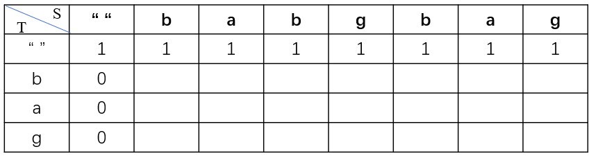
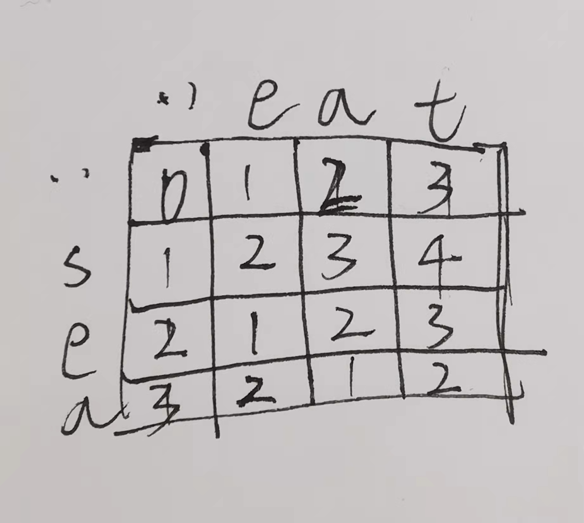
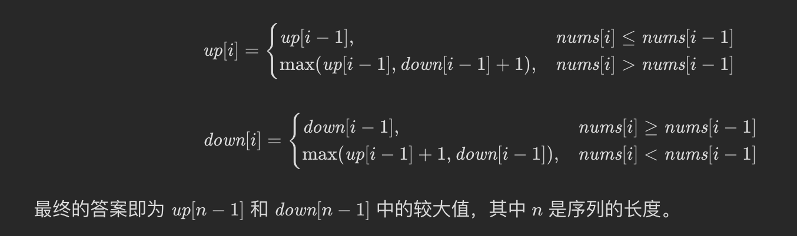
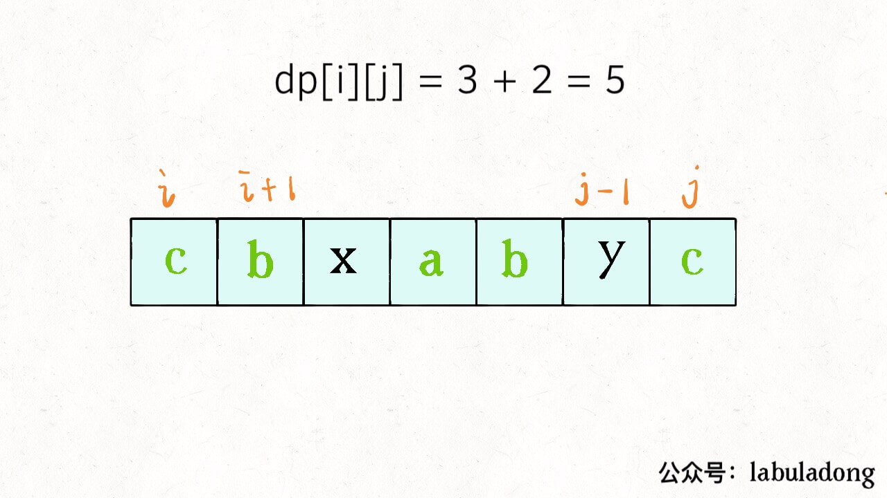
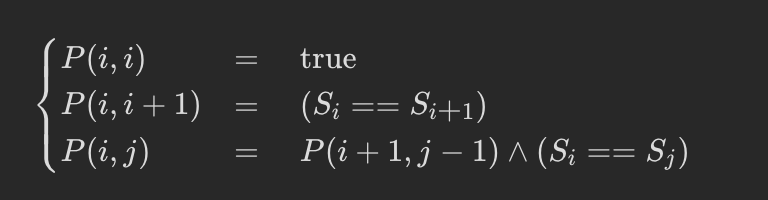

# 子序列

## [判断子序列](https://leetcode.cn/problems/is-subsequence/)

* **题目：**

  >给定字符串 s 和 t ，判断 s 是否为 t 的子序列。
  >
  >字符串的一个子序列是原始字符串删除一些（也可以不删除）字符而不改变剩余字符相对位置形成的新字符串。（例如，"ace"是"abcde"的一个子序列，而"aec"不是）。
  >

* **示例：**

  * **示例1：**

    ```
    输入：s = "abc", t = "ahbgdc"
    输出：true
    ```

  * **示例2：**

    ```
    输入：s = "axc", t = "ahbgdc"
    输出：false
    ```

  * **提示：**

    * `0 <= s.length <= 100`
    * `0 <= t.length <= 10^4`

* **解析：**

  >自创解法：
  >
  >由于子序列的顺序在原字符之间的顺序是不变的，那么只要每次遍历子序列并在原字符串中找到对应的位置，并标记位置，下次再从这个位置后开始匹配对应的字符，知道子序列或者原串遍历完毕即可，判断最后子串是否遍历完即可，遍历完毕说明都在原串找到了，反之没有找到。

* **代码：**

  ```js
  function isSubsequence(s, t) {
      let i = 0, j = 0;
    	// 必须得用while循环不能用for循环，否则匹配只有一个字符的子串时 i === s.length;无论原串匹不匹配都返回true
      while (i < s.length && j < t.length) {
          while (j < t.length) {
              if (s[i] === t[j]) {
                  i++;
                  j++;
                  break;
              }else {
                  j++;
              }
          }
      }
      return i === s.length;
  };
  ```


---

## [***不同的子序列](https://leetcode.cn/problems/distinct-subsequences/)

* **题目：**

  >给定一个字符串` s `和一个字符串` t `，计算在` s `的子序列中` t  `出现的个数。
  >
  >字符串的一个 子序列 是指，通过删除一些（也可以不删除）字符且不干扰剩余字符相对位置所组成的新字符串。（例如，"ACE" 是 "ABCDE" 的一个子序列，而 "AEC" 不是）
  >
  >题目数据保证答案符合 32 位带符号整数范围。
  >

* **示例：**

  * **示例1：**

    ```
    输入：s = "rabbbit", t = "rabbit"
    输出：3
    解释：
    如下图所示, 有 3 种可以从 s 中得到 "rabbit" 的方案。
    ```

    <u>**rabb**</u>b<u>**it**</u>
    <u>**rab**</u>b<u>**bit**</u>
    <u>**ra**</u>b**<u>bbit</u>**

  * **示例2：**

    ```
    输入：s = "babgbag", t = "bag"
    输出：5
    解释：
    如下图所示, 有 5 种可以从 s 中得到 "bag" 的方案。 
    ```

    **ba**b**g**bag

    **ba**bgba**g**
    **b**abgb**ag**
    ba**b**gb**ag**
    babg**bag**

  * **提示：**

    * `0 <= s.length, t.length <= 1000`
    * `s` 和 `t` 由英文字母组成

* **解析：**

  >[题解](https://leetcode.cn/problems/distinct-subsequences/solution/dong-tai-gui-hua-by-powcai-5/)
  >
  >动态规划
  >
  >`dp[i][j]` 代表` T `前` i `字符串可以由` S` 前` j `字符串组成最多个数.
  >
  >对于第一行, `T` 为空,因为空集是所有字符串子集, 所以我们第一行都是 `1`
  >
  >对于第一列, `S` 为空,这样组成 `T` 个数当然为 0` 了
  >
  >所以动态方程:
  >
  >当 `S[j] != T[i] , dp[i][j] = dp[i][j-1]`，当`S[j] != T[i]`，那肯定是需要看`S[j - 1]`的序列组成`T[i]`的个数的
  >
  >当 `S[j] == T[i] , dp[i][j] = dp[i-1][j-1] + dp[i][j-1] `
  >
  >如示例的,状态方程不明白建议自行模拟就懂了<br>

* **代码：**

  ```js
  function numDistinct(s, t) {
      const slen = s.length;
      const tlen = t.length;
    	// 这里dp横向和纵向都加 1 的目的是为了边界处理
      const dp = Array.from({length: tlen + 1}, () => new Array(slen + 1).fill(0));
      for (let i = 0; i <= slen; i++) {
          dp[0][i] = 1;
      }
      for (let i = 1; i <= tlen; i++) {
          for (let j = 1; j <= slen; j++) {
              // 注意这里是索引减一，因为索引 0 对应的字符为空。
              if (t[i - 1] === s[j - 1]) dp[i][j] = dp[i - 1][j - 1] + dp[i][j - 1];
              else dp[i][j] = dp[i][j - 1];
          }
      }
      return dp[tlen][slen];
  };
  ```


---

## [**两个字符串的删除操作](https://leetcode.cn/problems/delete-operation-for-two-strings/)

* **题目：**

  >给定两个单词 `word1` 和 `word2` ，返回使得 `word1` 和 `word2` **相同**所需的**最小步数**。
  >
  >**每步** 可以删除任意一个字符串中的一个字符。

* **示例：**

  * **示例1：**

    ```
    输入: word1 = "sea", word2 = "eat"
    输出: 2
    解释: 第一步将 "sea" 变为 "ea" ，第二步将 "eat "变为 "ea"
    ```

  * **示例2：**

    ```
    输入：word1 = "leetcode", word2 = "etco"
    输出：4
    ```

  * **提示：**

    * `1 <= word1.length, word2.length <= 500`
    * `word1` 和 `word2` 只包含小写英文字母

* **解析：**

  >这题和上面题差不多，
  >
  >定义`dp[i][j]`为word1前`i`个和word前`j`个字符串**相同**所需的**最小步数**
  >
  >可以自己画图理解<br>
  >
  >需要初始化第一行和第一列：都是变为空字符串所需要的删除次数，所以一次是0,1,2,3；
  >
  >然后就是开始求解，当`word1[i] = word2[j]`时，要么是删除 2 个字符得到斜上角结果(`dp[i-1][j-1] + 2`)，要么是删除一个字符得到上面或左边结果`dp[i-1][j] + 1, dp[i][j-1] + 1`。取最小值即可。
  >
  >当`word1[i] == word2[j]` `dp[i][j] = dp[i - 1][j - 1]`;
  >
  >当`word1[i] != word2[j]`  `dp[i][j] = Math.min(dp[i-1][j-1] + 2, dp[i-1][j] + 1, dp[i][j-1] + 1);`

* **代码：**

  ```js
  function minDistance(word1, word2) {
      const len1 = word1.length;
      const len2 = word2.length;
      const dp = Array.from({length: len1 + 1}, () => new Array(len2 + 1).fill(0));
      for (let i = 1; i <= len1; i++) {
          dp[i][0] = i;
      }
      for (let i = 1; i <= len2; i++) {
          dp[0][i] = i;
      }
      for (let i = 1; i <= len1; i++) {
          for (let j = 1; j <= len2; j++) {
              // 这里别忘了 - 1    
              if (word1[i - 1] === word2[j - 1]) {
                  dp[i][j] = dp[i - 1][j - 1];
              }else {
                  dp[i][j] = Math.min(dp[i - 1][j - 1] + 2, dp[i - 1][j] + 1, dp[i][j - 1] + 1);
              }
          }
      }
      return dp[len1][len2];
  };
  ```

  

---


## [**最长公共子序列](https://leetcode.cn/problems/longest-common-subsequence/)

* **题目：**

  >给定两个字符串 `text1` 和 `text2`，返回这两个字符串的最长 **公共子序列** 的长度。如果不存在 **公共子序列** ，返回 `0` 。
  >
  >一个字符串的 **子序列** 是指这样一个新的字符串：它是由原字符串在不改变字符的相对顺序的情况下删除某些字符（也可以不删除任何字符）后组成的新字符串。
  >
  >* 例如，`"ace"` 是 `"abcde"` 的子序列，但 `"aec"` 不是 `"abcde"` 的子序列。
  >
  >两个字符串的 **公共子序列** 是这两个字符串所共同拥有的子序列。

* **示例：**

  * **示例1：**

    ```
    输入：text1 = "abcde", text2 = "ace" 
    输出：3  
    解释：最长公共子序列是 "ace" ，它的长度为 3 。
    ```

  * **示例2：**

    ```
    输入：text1 = "abc", text2 = "abc"
    输出：3
    解释：最长公共子序列是 "abc" ，它的长度为 3 。
    ```

  * **示例3：**

    ```
    输入：text1 = "abc", text2 = "def"
    输出：0
    解释：两个字符串没有公共子序列，返回 0 。
    ```

  * **提示：**

    * `1 <= text1.length, text2.length <= 1000`
    * `text1` 和 `text2` 仅由小写英文字符组成。

* **解析：**

  >[题解](https://leetcode.cn/problems/longest-common-subsequence/solution/zui-chang-gong-gong-zi-xu-lie-by-leetcod-y7u0/)
  >
  >这题和最长回文子序列问题及其相似

* **代码：**

  ```js
  /**
   * @param {string} text1
   * @param {string} text2
   * @return {number}
   */
  function longestCommonSubsequence(text1, text2) {
    const dp = Array.from({length: text1.length + 1}, () => new Array(text2.length + 1).fill(0));
    for (let i = 1; i <= text1.length; i++) { 
      for (let j = 1; j <= text2.length; j++) {
        if (text1[i - 1] === text2[j - 1]) {
          dp[i][j] = dp[i - 1][j - 1] + 1;
        }else {
          dp[i][j] = Math.max(dp[i - 1][j], dp[i][j - 1]);
        }
      }
    }
    return dp[text1.length][text2.length];
  };
  ```


---


## [**编辑距离](https://leetcode.cn/problems/edit-distance/)

* **题目：**

  >给你两个单词 `word1` 和 `word2`， *请返回将 `word1` 转换成 `word2` 所使用的最少操作数* 。
  >
  >你可以对一个单词进行如下三种操作：
  >
  >- 插入一个字符
  >- 删除一个字符
  >- 替换一个字符

* **示例：**

  * **示例1：**

    ```
    输入：word1 = "horse", word2 = "ros"
    输出：3
    解释：
    horse -> rorse (将 'h' 替换为 'r')
    rorse -> rose (删除 'r')
    rose -> ros (删除 'e')
    ```

  * **示例2：**

    ```
    输入：word1 = "intention", word2 = "execution"
    输出：5
    解释：
    intention -> inention (删除 't')
    inention -> enention (将 'i' 替换为 'e')
    enention -> exention (将 'n' 替换为 'x')
    exention -> exection (将 'n' 替换为 'c')
    exection -> execution (插入 'u')
    ```

  * **提示：**

    * `0 <= word1.length, word2.length <= 500`
    * `word1` 和 `word2` 由小写英文字母组成

* **解析：**

  >[题解](https://leetcode.cn/problems/edit-distance/solution/shi-pin-jiang-jie-bian-ji-ju-chi-dong-tai-gui-hua-/)

* **代码：**

  ```js
  /**
   * @param {string} word1
   * @param {string} word2
   * @return {number}
   */
  function minDistance(word1, word2) {
    const height = word1.length + 1;
    const width = word2.length + 1;
    const dp = Array.from({length: height}, () => new Array(width).fill(0));
    for (let i = 1; i < height; i++) {
      dp[i][0] = i;
    }
    for (let j = 1; j < width; j++) {
      dp[0][j] = j;
    }
    for (let i = 1; i < height; i++) {
      for (let j = 1; j < width; j++) {
        if (word1[i - 1] === word2[j - 1]) {
          dp[i][j] = dp[i - 1][j - 1];
        }else{
          dp[i][j] = Math.min(dp[i - 1][j - 1], dp[i][j - 1], dp[i - 1][j]) + 1;
        }
      }
    }
    return dp[height - 1][width - 1];
  };
  ```


---


## [最长等差数列](https://leetcode.cn/problems/longest-arithmetic-subsequence/)

* **题目：**

  >给你一个整数数组 nums，返回 nums 中最长等差子序列的长度。
  >
  >回想一下，nums 的子序列是一个列表 nums[i1], nums[i2], ..., nums[ik] ，且 0 <= i1 < i2 < ... < ik <= nums.length - 1。并且如果 seq[i+1] - seq[i]( 0 <= i < seq.length - 1) 的值都相同，那么序列 seq 是等差的。

* **示例：**

  * **示例1：**

    ```
    输入：nums = [3,6,9,12]
    输出：4
    解释： 
    整个数组是公差为 3 的等差数列。
    ```

  * **示例2：**

    ```
    输入：nums = [9,4,7,2,10]
    输出：3
    解释：
    最长的等差子序列是 [4,7,10]。
    ```

  * **示例3：**

    ```
    输入：nums = [20,1,15,3,10,5,8]
    输出：4
    解释：
    最长的等差子序列是 [20,15,10,5]。
    ```

  * **提示：**

    * `2 <= nums.length <= 1000`
    * `0 <= nums[i] <= 500`

* **解析：**

  >还是和前面一样设`dp[i][j]`为以i，j结尾的等差数列长度；
  >
  >由于前面一直在考虑判断两个数组之间的公差是否相等来作为动态规划的依据，
  >
  >所以就需要存放每两个数之间的公差，如果公差相等则合并。
  >
  >可是等差数列公式：`2b = a + c`;能巧妙解决这个问题
  >
  >若当前来到`dp[i][j]`的位置，需要寻找nums[i]之前的一个数与当前凑为等差数列
  >
  >那`b = nums[i], c = nums[j]`, 我们需要找的就是那个a存不存在前面，
  >
  >即如果`i`前面存在`2nums[i] - nums[j]`就可以组为等差数列，就省去了存放两数只差的问题。
  >
  >而且由于只需要查找`i`前面是否存在目标值，就可以用`Map`来省去一个纬度，降低时间复杂度。

* **代码：**

  ```js
  function longestArithSeqLength(nums) {
    const len = nums.length;
    const dp = Array.from({length: len}, () => new Array(len).fill(2));
    const map = new Map();
    let res = 0;
    for (let i = 0; i < nums.length; i++) {
      dp[0][i] = 2;
      map.set(nums[i], i);
    }
    for (let i = 1; i < len; i++) {
      for (let j = i + 1; j < len; j++) {
        const target = 2 * nums[i] - nums[j];
        if (map.has(target) && map.get(target) < i) {
          dp[i][j] = Math.max(dp[map.get(target)][i] + 1, dp[i][j]);
        }
        res = Math.max(dp[i][j], res);
      }
    }
    return res;
  };
  ```

---


## [最长的斐波那契子序列的长度](https://leetcode.cn/problems/length-of-longest-fibonacci-subsequence/)

* **题目：**

  >如果序列 `X_1, X_2, ..., X_n` 满足下列条件，就说它是 *斐波那契式* 的：
  >
  >* `n >= 3`
  >* 对于所有 `i + 2 <= n`，都有 `X_i + X_{i+1} = X_{i+2}`
  >
  >给定一个**严格递增**的正整数数组形成序列 arr ，找到 arr 中最长的斐波那契式的子序列的长度。如果一个不存在，返回 0 。
  >
  >*回想一下，子序列是从原序列 arr 中派生出来的，它从 arr 中删掉任意数量的元素（也可以不删），而不改变其余元素的顺序。例如， `[3, 5,8]` 是 `[3, 4, 5, 6, 7, 8]` 的一个子序列）*

* **示例：**

  * **示例1：**

    ```
    输入: arr = [1,2,3,4,5,6,7,8]
    输出: 5
    解释: 最长的斐波那契式子序列为 [1,2,3,5,8] 。
    ```

  * **示例2：**

    ```
    输入: arr = [1,3,7,11,12,14,18]
    输出: 3
    解释: 最长的斐波那契式子序列有 [1,11,12]、[3,11,14] 以及 [7,11,18] 。
    ```

  * **提示：**

    * `3 <= arr.length <= 1000`
    * `1 <= arr[i] < arr[i + 1] <= 10^9`

* **解析：**

  >与最长等差数列差不多，

* **代码：**

  ```js
  /**
   * @param {number[]} arr
   * @return {number}
   */
  function lenLongestFibSubseq(arr) {
    const len = arr.length;
    // dp 代表以i，j结尾的斐波那契数列的长度
    const dp = Array.from({length: len}, () => new Array(len).fill(0));
    // 方便查找
    const map = new Map();
    let res = 0;
    for (let i = 0; i < arr.length; i++) {
      dp[0][i] = 2;
      // 初始化map,{值 —> 索引}
      map.set(arr[i], i);
    }
    for (let i = 1; i < len; i++) {
      for (let j = i + 1; j < len; j++) {
        const d = arr[j] - arr[i];
        /** 
        	如果map中存在d,且这个值对应的索引小于i，
        	那么就为一个斐波那契数列，d + arr[i] = arr[j],
        */
        if (map.has(d) && map.get(d) < i) {
          // 合并 dp[map.get(d)][i] 斐波那契数列长度。
          dp[i][j] = Math.max(dp[map.get(d)][i] + 1, dp[i][j]);
        }else {
          dp[i][j] = 2;
        }
        res = Math.max(res, dp[i][j]);
      }
    }
    return res > 2 ? res : 0;
  };
  ```


---

## **[摆动序列](https://leetcode.cn/problems/wiggle-subsequence/)

* **题目：**

  >如果连续数字之间的差严格地在正数和负数之间交替，则数字序列称为 摆动序列 。第一个差（如果存在的话）可能是正数或负数。仅有一个元素或者含两个不等元素的序列也视作摆动序列。
  >
  >​	例如， [1, 7, 4, 9, 2, 5] 是一个 摆动序列 ，因为差值 (6, -3, 5, -7, 3) 是正负交替出现的。
  >
  >​	相反，[1, 4, 7, 2, 5] 和 [1, 7, 4, 5, 5] 不是摆动序列，第一个序列是因为它的前两个差值都是正数，第二个序列是因为它的最后一个差值为零。
  >子序列 可以通过从原始序列中删除一些（也可以不删除）元素来获得，剩下的元素保持其原始顺序。
  >
  >给你一个整数数组 nums ，返回 nums 中作为 摆动序列 的 最长子序列的长度 。
  >

* **示例：**

  * **示例1：**

    ```
    输入：nums = [1,7,4,9,2,5]
    输出：6
    解释：整个序列均为摆动序列，各元素之间的差值为 (6, -3, 5, -7, 3) 。
    ```

  * **示例2：**

    ```
    输入：nums = [1,17,5,10,13,15,10,5,16,8]
    输出：7
    解释：这个序列包含几个长度为 7 摆动序列。
    其中一个是 [1, 17, 10, 13, 10, 16, 8] ，各元素之间的差值为 (16, -7, 3, -3, 6, -8) 。
    ```

  * **示例3：**

    ```
    输入：nums = [1,2,3,4,5,6,7,8,9]
    输出：2
    ```

  * **提示：**

    * `1 <= nums.length <= 1000`
    * `0 <= nums[i] <= 1000`

* **解析：**

  >`up[i]`表示以前 i 个元素中的某一个为结尾的最长的「上升摆动序列」的长度。
  >
  >`down[i]`表示以前 i 个元素中的某一个为结尾的最长的「下降摆动序列」的长度。

* **代码：**

  ```js
  function wiggleMaxLength(nums) {
    const len = nums.length;
    const up = new Array(len).fill(1);
    const down = new Array(len).fill(1);
    for (let i = 1; i < len; i++) {
      if (nums[i] > nums[i - 1]) {
        down[i] = down[i - 1];
        up[i] = Math.max(up[i - 1], down[i - 1] + 1);
      }else if (nums[i] < nums[i - 1]){
        up[i] = up[i - 1];
        down[i] = Math.max(down[i - 1], up[i - 1] + 1);
      }else {
        up[i] = up[i - 1];
        down[i] = down[i - 1];
      }
    }
    return Math.max(down[len - 1], up[len - 1]);
  };
  ```

  

## **[最长递增子序列](https://leetcode.cn/problems/longest-increasing-subsequence/)

* **题目：**

  >给你一个整数数组 nums ，找到其中最长严格递增子序列的长度。
  >
  >子序列 是由数组派生而来的序列，删除（或不删除）数组中的元素而不改变其余元素的顺序。例如，[3,6,2,7] 是数组 [0,3,1,6,2,2,7] 的子序列。
  >

* **示例：**

  * **示例1：**

    ```
    输入：nums = [10,9,2,5,3,7,101,18]
    输出：4
    解释：最长递增子序列是 [2,3,7,101]，因此长度为 4 。
    ```

  * **示例2：**

    ```
    输入：nums = [0,1,0,3,2,3]
    输出：4
    ```

  * **示例3：**

    ```
    输入：nums = [7,7,7,7,7,7,7]
    输出：1
    ```

  * **提示：**

    * `1 <= nums.length <= 2500`
    * `-104 <= nums[i] <= 104`

* **解析：**

  >* 状态定义：`dp[i]` 的值代表 nums 以 `nums[i]` 结尾的最长子序列长度。
  >
  >* 转移方程： 设 j∈[0,i)，考虑每轮计算新 dp[i] 时，遍历 [0,i) 列表区间，做以下判断：
  >  * 当 `nums[i]>nums[j]` 时： nums[i] 可以接在 nums[j] 之后（此题要求严格递增）此情况下最长上升子序列长度为 dp[j] + 1；
  >  * 当 `nums[i]<=nums[j]` 时： nums[i] 无法接在 nums[j] 之后，此情况上升子序列不成立，跳过。
  >  * 上述所有 1. 情况 下计算出的 dp[j]+1 的最大值，为直到 i 的最长上升子序列长度（即 dp[i] ）。实现方式为遍历 j时，每轮执行 `dp[i] = max(dp[i], dp[j] + 1)`。
  >  * 转移方程：` dp[i] = max(dp[i], dp[j] + 1) for j in [0, i)`。
  >
  >* 初始状态：`dp[i]` 所有元素置 1，含义是每个元素都至少可以单独成为子序列，此时长度都为 1。
  >* 返回值：返回 dp 列表最大值，即可得到全局最长上升子序列长度。

* **代码：**

  ```js
  function lengthOfLIS(nums) {
    const len = nums.length;
    const dp = new Array(len).fill(1);
    let res = 1;
    for (let i = 1; i < len; i++) {
      for (let j = 0; j < i; j++) {
        if (nums[i] > nums[j]) {
          dp[i] = Math.max(dp[i], dp[j] + 1);
        }
      }
      res = Math.max(dp[i], res);
    }
    return res
  };
  ```

  

## ***[最长回文子序列](https://leetcode.cn/problems/longest-palindromic-subsequence/)

* **题目：**

  >给你一个字符串 s ，找出其中最长的回文子序列，并返回该序列的长度。
  >
  >子序列定义为：不改变剩余字符顺序的情况下，删除某些字符或者不删除任何字符形成的一个序列

* **示例：**

  * **示例1：**

    ```
    输入：s = "bbbab"
    输出：4
    解释：一个可能的最长回文子序列为 "bbbb" 。
    ```

  * **示例2：**

    ```
    输入：s = "cbbd"
    输出：2
    解释：一个可能的最长回文子序列为 "bb" 。
    ```

  * **提示：**

    * `1 <= s.length <= 1000`
    * `s` 仅由小写英文字母组成

* **解析：**

  >[题解](https://leetcode.cn/problems/longest-palindromic-subsequence/solution/zi-xu-lie-wen-ti-tong-yong-si-lu-zui-chang-hui-wen/)
  >
  > dp 数组的定义是：**在子串 `s[i..j]` 中，最长回文子序列的长度为 `dp[i][j]`**
  >
  >如果我们想求 `dp[i][j]`，假设你知道了子问题 `dp[i+1][j-1]` 的结果（`s[i+1..j-1]` 中最长回文子序列的长度），你是否能想办法算出 `dp[i][j] `的值（s[i..j] 中，最长回文子序列的长度）呢？
  >
  ><br>
  >
  >可以！这取决于 s[i] 和 s[j] 的字符：
  >
  >如果它俩相等，那么它俩加上 s[i+1..j-1] 中的最长回文子序列就是 s[i..j] 的最长回文子序列：<br>
  >
  >如果它俩不相等，说明它俩不可能同时出现在 s[i..j] 的最长回文子序列中，那么把它俩分别加入 s[i+1..j-1] 中，看看哪个子串产生的回文子序列更长即可：<br>
  >
  >以上两种情况写成代码就是这样：
  >
  >```js
  >if (s[i] == s[j])
  >    // 它俩一定在最长回文子序列中
  >    dp[i][j] = dp[i + 1][j - 1] + 2;
  >else
  >    // s[i+1..j] 和 s[i..j-1] 谁的回文子序列更长？
  >    dp[i][j] = max(dp[i + 1][j], dp[i][j - 1]);
  >```
  >
  >代码：
  >
  >首先明确一下 base case，如果只有一个字符，显然最长回文子序列长度是 1，也就是 `dp[i][j] = 1 (i == j)`。
  >
  >因为 i 肯定小于等于 j，所以对于那些 i > j 的位置，根本不存在什么子序列，应该初始化为 0。
  >
  >另外，看看刚才写的状态转移方程，想求 dp[i][j] 需要知道 `dp[i+1][j-1]`，`dp[i+1][j]`，`dp[i][j-1]` 这三个位置；再看看我们确定的 base case，填入 dp 数组之后是这样：<br>
  >
  >**为了保证每次计算 `dp[i][j]`，左下右方向的位置已经被计算出来，只能斜着遍历或者反着遍历**：<br>

* **代码：**

  ```js
  /**
  动态规划：不懂再看题解吧！！，下面的是从右上角往下解的，感觉右上角往下太繁琐了，还是从左下往上更好
   */
  
  function longestPalindromeSubseq(s) {
      const len = s.length;
      // let dp = new Array(len).fill(new Array(len).fill(0)); // 坑，每一个数组都是同一个，修改了一个其他的都会修改。
      let dp = Array.from(Array(len), () => Array(len).fill(0));
      for (let i = 0; i < len; i++) {
          dp[i][i] = 1;
      }
      for (let i = 1; i < len; i++) {
          for (let j = 0; j < len - i; j++) {
              const k = j + i;
              if (s[k] === s[j]) {
                  dp[j][k] = dp[j + 1][k - 1] + 2;
              }else {
                  dp[j][k] = Math.max(dp[j][k - 1], dp[j + 1][k]);
              }
          }
      }
      return dp[0][len - 1];
  };
  
  // 从左下向上
  function longestPalindromeSubseq(s) {
    const len = s.length;
    const dp = Array.from({length: len}, () => new Array(len).fill(0));
    for (let i = 0; i < len; i++) {
      dp[i][i] = 1;
    }
    for (let i = len - 2; i >= 0; i--) {
      for (let j = i + 1; j < len; j++) {
        if (s[i] === s[j]) {
          dp[i][j] = dp[i + 1][j - 1] + 2;
        }else {
          dp[i][j] = Math.max(dp[i + 1][j], dp[i][j - 1]);
        }
      }
    }
    return dp[0][len - 1];
  };
  ```


---

# 子串

## [**最长回文子串](https://leetcode.cn/problems/longest-palindromic-substring/)

* **题目：**

  >给你一个字符串 `s`，找到 `s` 中最长的回文子串。

* **示例：**

  * **示例1：**

    ```
    输入：s = "babad"
    输出："bab"
    解释："aba" 同样是符合题意的答案。
    ```

  * **示例2：**

    ```
    输入：s = "cbbd"
    输出："bb"
    ```

  * **提示：**

    * `1 <= s.length <= 1000`
    * `s` 仅由数字和英文字母组成

* **解析：**

  >[题解](https://leetcode.cn/problems/longest-palindromic-substring/solution/zui-chang-hui-wen-zi-chuan-by-leetcode-solution/)<br>

* **代码：**

  ```js
  // 动态规划+中心扩展
  function longestPalindrome(s) {
    // start与end记录开始与结束的位置
    let start = 0, end = 0, length = 0;
    for (let i = 0; i < s.length; i++) {
      	// 分别从偶数和奇数来求解
        let temp1 = foo(i, i + 1, s); // 不需要判断s[i] === s[i + 1]，如果不成立返回的还是0；
        let temp2 = foo(i, i, s);
        length = length < temp1.length ? (start = temp1.start, end = temp1.end, temp1.length) : length; 
        length = length < temp2.length ? (start = temp2.start, end = temp2.end, temp2.length) : length; 
    }
    return s.slice(start, end + 1);
    
    // 中心扩展
    function foo(start, end, s){
        while (start >= 0 && end < s.length && s[start] === s[end]) {
            start--;
            end++;
        }
        return {length: end - start - 1, start: start + 1, end: end - 1};
    }
  };
  
  // 优化
  var longestPalindrome = function(s) {
      let start = 0, end = 0, length = 0;
      for (let i = 0; i < s.length; i++) {
          found(i, i, 1);
          found(i, i + 1, 2);
      }
      return s.slice(start, end + 1);
  
      function found(left, right, len) {
          if (left >= 0 && right < s.length && s[left] === s[right]) {
              found(left - 1, right + 1, len + 2);
          }
          if (len - 2 > length) {
              start = left + 1;
              end = right - 1;
              length = len - 2;
          }
      }
  };
  ```

---

## [ 回文子串](https://leetcode.cn/problems/palindromic-substrings/)

* **题目：**

  >给你一个字符串 s ，请你统计并返回这个字符串中 回文子串 的数目。
  >
  >回文字符串 是正着读和倒过来读一样的字符串。
  >
  >子字符串 是字符串中的由连续字符组成的一个序列。
  >
  >具有不同开始位置或结束位置的子串，即使是由相同的字符组成，也会被视作不同的子串。
  >

* **示例：**

  * **示例1：**

    ```
    输入：s = "abc"
    输出：3
    解释：三个回文子串: "a", "b", "c"
    ```

  * **示例2：**

    ```
    输入：s = "aaa"
    输出：6
    解释：6个回文子串: "a", "a", "a", "aa", "aa", "aaa"
    ```

  * **提示：**

    * `1 <= s.length <= 1000`
    * `s` 由小写英文字母组成

* **解析：**

  >和上面一样的，中心扩展法，每次扩展累加就好了

* **代码：**

  ```js
  function countSubstrings(s) {
    const len = s.length;
    let sum = 0;
    for (let i = 0; i < len; i++) {
      foo(i, i);
      foo(i, i+1);
    }
    
    function foo(start, end) {
      while(start >= 0 && end < s.length && s[start] === s[end]) {
        sum++;
        start--;
        end++;
      } 
    }
    
    return sum;
  };
  ```
  


# 总结：

除了**最长递增子序列**这题用到了一维数组动态规划，其他基本都是二维数组动态规划。
