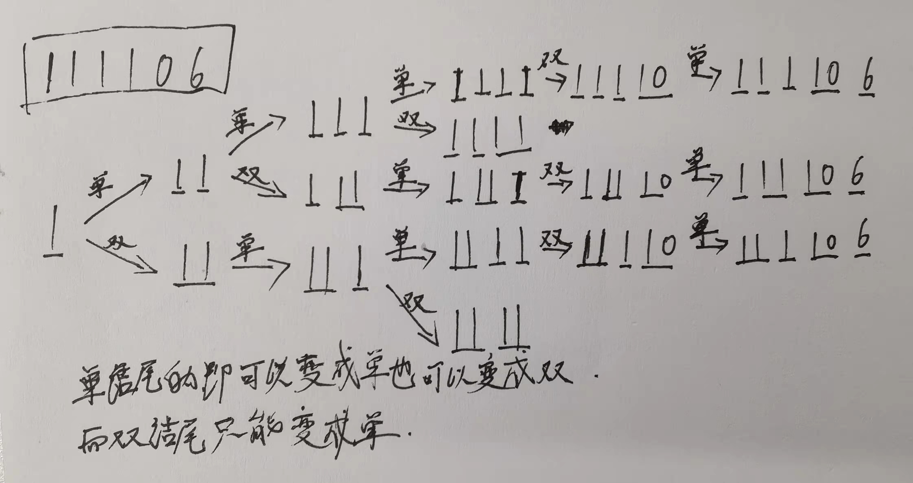

## [解码方法](https://leetcode.cn/problems/decode-ways/)

* **题目：**

  >一条包含字母 A-Z 的消息通过以下映射进行了 编码 ：
  >
  >```
  >'A' -> "1"
  >'B' -> "2"
  >...
  >'Z' -> "26"
  >```
  >
  >要 解码 已编码的消息，所有数字必须基于上述映射的方法，反向映射回字母（可能有多种方法）。例如，"11106" 可以映射为：
  >
  >​	"AAJF" ，将消息分组为 (1 1 10 6)
  >​	"KJF" ，将消息分组为 (11 10 6)
  >注意，消息不能分组为  (1 11 06) ，因为 "06" 不能映射为 "F" ，这是由于 "6" 和 "06" 在映射中并不等价。
  >
  >给你一个只含数字的 非空 字符串 s ，请计算并返回 解码 方法的 总数 。
  >
  >题目数据保证答案肯定是一个 32 位 的整数。
  >

* **示例：**

  * **示例1：**

    ```
    输入：s = "12"
    输出：2
    解释：它可以解码为 "AB"（1 2）或者 "L"（12）。
    ```

  * **示例2：**

    ```
    输入：s = "226"
    输出：3
    解释：它可以解码为 "BZ" (2 26), "VF" (22 6), 或者 "BBF" (2 2 6) 。
    ```

  * **示例3：**

    ```
    输入：s = "0"
    输出：0
    解释：没有字符映射到以 0 开头的数字。
    含有 0 的有效映射是 'J' -> "10" 和 'T'-> "20" 。
    由于没有字符，因此没有有效的方法对此进行解码，因为所有数字都需要映射。
    ```

  * **提示：**

    * `1 <= s.length <= 100`
    * `s` 只包含数字，并且可能包含前导零。

* **解析：**

  ><br>
  >
  >添加两个状态记录单号结尾`single`与双号结尾`both`，每次通过前一次的单号与双号个数来得到当前的单号与双号个数
  >
  >需要注意的是双号的范围是1-26，而单号只要不是0都是可以的。
  >
  >如果当前是0，当前的单号数量就是0；全部转为双号，而且只能从前一个单号来的，所以`both = single`，`single = 0`
  >
  >如果前两个相加大于26或小于10，则`both = 0`，`single = both + single`；
  >
  >其他情况：`single = both + single`；`both = single`；
  >
  >综上所诉：
  >
  >当：**nums[i] = 0 :	`single = 0`**
  >
  >​	   **nums[i - 1] + nums[i] > 26 || nums[i - 1] + nums[i]  < 10 `both = 0`**
  >
  >​	   **其他情况：`single = both + single`; `both = single`;**

* **代码：**

  * Bad第一次写的，bad就别看了 只看good

    ```js
    var numDecodings = function(s) {
        const nums = Array.from(s, (item) => item * 1);
        if (nums[0] === 0) return 0;
        const len = nums.length;
        let single = new Array(len).fill(0), both = new Array(len).fill(0);
        single[0] = 1;
        if (len >= 2) {
          single[1] = nums[1] === 0 ? 0 : 1;
          both[1] = (nums[1] + nums[0] * 10) <= 26 ? 1 : 0;
        }  
        for (let i = 2; i < len; i++) {
          const currentSum = nums[i] + nums[i - 1] * 10;
          if (nums[i] !== 0) single[i] = single[i - 1] + both[i - 1];
          if (currentSum >= 10 && currentSum <= 26) both[i] = single[i - 2] + both[i - 2];
        }
        return single[len - 1] + both[len - 1];
    };
    ```

  * Good优化后

    ```js
    /**
     * @param {string} s
     * @return {number}
     */
    var numDecodings = function(s) {
        // 字符数字化
        const nums = Array.from(s, (item) => item * 1);
        const len = nums.length;
        // 第一个数为0不管后面什么都为0
        if (nums[0] === 0) return 0;
        // 初始化,single和both
        let single = 1;
        let both = 0;
        for (let i = 1; i < len; i++) {
          const currentSum = nums[i] + nums[i - 1] * 10;
          const singleCopy = single;
          if (nums[i] !== 0) {
            single = single + both;
          }else {
            single = 0;
          }
          if (currentSum >= 10 && currentSum <= 26) {
            both = singleCopy
          }else {
            both = 0;
          }
        }
        return single + both;
    };
    ```

    

  