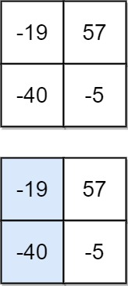

## [下降路径最小和](https://leetcode.cn/problems/minimum-falling-path-sum/)

* **题目：**

  >给你一个 n x n 的 方形 整数数组 matrix ，请你找出并返回通过 matrix 的下降路径 的 最小和 。
  >
  >下降路径 可以从第一行中的任何元素开始，并从每一行中选择一个元素。在下一行选择的元素和当前行所选元素最多相隔一列（即位于正下方或者沿对角线向左或者向右的第一个元素）。具体来说，位置 (row, col) 的下一个元素应当是 (row + 1, col - 1)、(row + 1, col) 或者 (row + 1, col + 1) 。
  >

* **示例：**

  * **示例1：**

    ```
    输入：matrix = [[2,1,3],[6,5,4],[7,8,9]]
    输出：13
    解释：如图所示，为和最小的两条下降路径
    ```

     <br>

  * **示例2：**

    ```
    输入：matrix = [[-19,57],[-40,-5]]
    输出：-59
    解释：如图所示，为和最小的下降路径
    ```

  * **示例3：**

    ```
    n == matrix.length == matrix[i].length
    1 <= n <= 100
    -100 <= matrix[i][j] <= 100
    ```

     <br>

  * **提示：**

    * n == matrix.length == matrix[i].length
    * 1 <= n <= 100
    * -100 <= matrix[i][j] <= 100

* **解析：**

  >这题就是找到每一层对应位置最小的累加到下一曾就好了，最后遍历一下就好了。

* **代码：**

  ```js
  function minFallingPathSum(matrix) {
      const len = matrix.length;
      let res = Number.MAX_VALUE;
      for (let i = 1; i < len; i++) {
          for (let j = 0; j < len; j++) {
              const left = j === 0 ? Number.MAX_VALUE : matrix[i - 1][j - 1];
              const right = j === len - 1 ?  Number.MAX_VALUE : matrix[i - 1][j + 1];
              const min = Math.min(left, matrix[i - 1][j], right);
              matrix[i][j] += min;
          }
      }
      matrix[len - 1].forEach((item) => {
        res = Math.min(res, item);
      })
      return res;
  }
  ```


## [三角形最小路径和](https://leetcode.cn/problems/triangle/)

* **题目：**

  >给定一个三角形 triangle ，找出自顶向下的最小路径和。
  >
  >每一步只能移动到下一行中相邻的结点上。相邻的结点 在这里指的是 下标 与 上一层结点下标 相同或者等于 上一层结点下标 + 1 的两个结点。也就是说，如果正位于当前行的下标 i ，那么下一步可以移动到下一行的下标 i 或 i + 1 。
  >

* **示例：**

  * **示例1：**

    ```
    输入：triangle = [[2],[3,4],[6,5,7],[4,1,8,3]]
    输出：11
    解释：如下面简图所示：
       2
      3 4
     6 5 7
    4 1 8 3
    自顶向下的最小路径和为 11（即，2 + 3 + 5 + 1 = 11）。
    ```

  * **示例2：**

    ```
    输入：triangle = [[-10]]
    输出：-10
    ```

  * **提示：**

    * 1 <= triangle.length <= 200
    * triangle[0].length == 1
    * triangle[i].length == triangle[i - 1].length + 1
    * -104 <= triangle[i][j] <= 104

* **解析：**

  >和上面差不多，直接看代码

* **代码：**

  ```js
  // 从下面向上遍历可以避免数组越界判断问题
  function minimumTotal(matrix) {
      let len = matrix.length;
      for (let i = len - 2; i >= 0; i--) {
          for (let j = 0; j <= i; j++) {
              const min = Math.min(matrix[i + 1][j], matrix[i + 1][j + 1]);
              matrix[i][j] += min;
          }
      }
      return matrix[0][0];
  }
  ```


## [不同路径](https://leetcode.cn/problems/unique-paths/)

* **题目：**

  >一个机器人位于一个 m x n 网格的左上角 （起始点在下图中标记为 “Start” ）。
  >
  >机器人每次只能向下或者向右移动一步。机器人试图达到网格的右下角（在下图中标记为 “Finish” ）。
  >
  >问总共有多少条不同的路径？
  >

* **示例：**

  * **示例1：**<br>

    ```
    输入：m = 3, n = 7
    输出：28
    ```

  * **示例2：**

    ```
    输入：m = 3, n = 2
    输出：3
    解释：
    从左上角开始，总共有 3 条路径可以到达右下角。
    1. 向右 -> 向下 -> 向下
    2. 向下 -> 向下 -> 向右
    3. 向下 -> 向右 -> 向下
    ```

  * **示例3：**

    ```
    输入：m = 7, n = 3
    输出：28
    ```

  * **提示：**

    * `1 <= m, n <= 100`
    * 题目数据保证答案小于等于 `2 * 109`

* **解析：**

  >我们令` dp[i][j]` 是到达` i, j `最多路径
  >
  >动态方程：` dp[i][j] = dp[i-1][j] + dp[i][j-1] `
  >
  >注意，对于第一行` dp[0][j] `，或者第一列 `dp[i][0]`，由于都是在边界，所以只能为 1
  >

* **代码：**

  ```js
  /**
   * @param {number} m
   * @param {number} n
   * @return {number}
   */
  var uniquePaths = function(m, n) {
      const f = new Array(m).fill(0).map(() => new Array(n).fill(0));
    	// 初始化横向与纵向	
      for (let i = 0; i < m; i++) {
          f[i][0] = 1;
      }
      for (let j = 0; j < n; j++) {
          f[0][j] = 1;
      }
      for (let i = 1; i < m; i++) {
          for (let j = 1; j < n; j++) {
              f[i][j] = f[i - 1][j] + f[i][j - 1];
          }
      }
      return f[m - 1][n - 1];
  };
  ```


## [不同路径 II](https://leetcode.cn/problems/unique-paths-ii/)

* **题目：**

  >一个机器人位于一个 m x n 网格的左上角 （起始点在下图中标记为 “Start” ）。
  >
  >机器人每次只能向下或者向右移动一步。机器人试图达到网格的右下角（在下图中标记为 “Finish”）。
  >
  >现在考虑网格中有障碍物。那么从左上角到右下角将会有多少条不同的路径？
  >
  >网格中的障碍物和空位置分别用 1 和 0 来表示。
  >

* **示例：**

  * **示例1：**

    ```
    输入：obstacleGrid = [[0,0,0],[0,1,0],[0,0,0]]
    输出：2
    解释：3x3 网格的正中间有一个障碍物。
    从左上角到右下角一共有 2 条不同的路径：
    1. 向右 -> 向右 -> 向下 -> 向下
    2. 向下 -> 向下 -> 向右 -> 向右
    ```

  * **示例2：**

    ```
    输入：obstacleGrid = [[0,1],[0,0]]
    输出：1
    ```

  * **提示：**

    * m == obstacleGrid.length
    * n == obstacleGrid[i].length
    * 1 <= m, n <= 100
    * obstacleGrid[i][j] 为 0 或 1

* **解析：**

  >和上面差不多无非没走一步多一个判断，与障碍物就把当前步数置为0

* **代码：**

  ```js
  /**
   * @param {number[][]} obstacleGrid
   * @return {number}
   */
  var uniquePathsWithObstacles = function(dp) {
    if (dp[0][0]) return 0; 
    const m = dp.length;
    const n = dp[0].length;
    dp[0][0] = 1;
    for (let i = 1; i < m; i++) {
      if (dp[i][0] === 1) {
        dp[i][0] = 0;
      }else {
        dp[i][0] = dp[i - 1][0];
      }
    }
    for (let j = 1; j < n; j++) {
      if (dp[0][j] === 1) {
        dp[0][j] = 0;
      }else {
        dp[0][j] = dp[0][j - 1];
      }
    }
    for (let i = 1; i < m; i++) {
      for (let j = 1; j < n; j++) {
        if (dp[i][j] === 1) {
          dp[i][j] = 0;
        }else {
          dp[i][j] = dp[i - 1][j] + dp[i][j - 1];
        }
      }
    }
    return dp[m - 1][n - 1];
  };
  ```


## [ 最小路径和](https://leetcode.cn/problems/minimum-path-sum/)

* **题目：**

  >给定一个包含非负整数的 m x n 网格 grid ，请找出一条从左上角到右下角的路径，使得路径上的数字总和为最小。
  >
  >说明：每次只能向下或者向右移动一步。
  >

* **示例：**

  * **示例1：**<br>

    ```
    输入：grid = [[1,3,1],[1,5,1],[4,2,1]]
    输出：7
    解释：因为路径 1→3→1→1→1 的总和最小。
    ```

  * **示例2：**

    ```
    输入：grid = [[1,2,3],[4,5,6]]
    输出：12
    ```

  * **提示：**

    * `m == grid.length`
    * `n == grid[i].length`
    * `1 <= m, n <= 200`
    * `0 <= grid[i][j] <= 100`

* **解析：**

  >`grid[i][j] = min(grid[i - 1][j], grid[i][j - 1]) + grid[i][j]`
  >
  >**对于边界得特殊处理**

* **代码：**

  ```js
  /**
   * @param {number[][]} grid
   * @return {number}
   */
  var minPathSum = function(grid) {
      const row = grid[0].length;
      const clomn = grid.length; 
      for (let i = 0; i < clomn; i++) {
          for (let j = 0; j < row; j++) {
              let min = 0;
              if (i !== 0 && j !== 0) {
                  min = Math.min(grid[i - 1][j], grid[i][j - 1]);
              }else if (i !== 0 && j === 0) {
                  min = grid[i - 1][j];
              }else if (i == 0 && j !== 0) {
                  min = grid[i][j - 1];
              }
              grid[i][j] += min;
          }
      }
      return grid[clomn - 1][row -1];
  };
  ```
