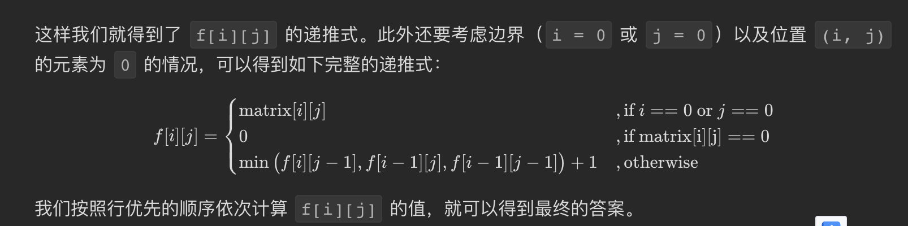
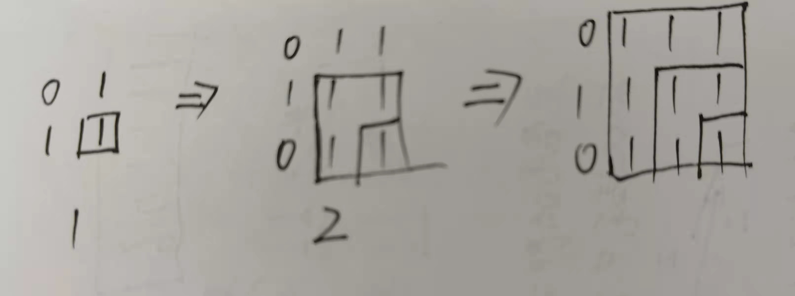

## [统计全为 1 的正方形子矩阵](https://leetcode.cn/problems/count-square-submatrices-with-all-ones/)

* **题目：**

  >给你一个 `m * n` 的矩阵，矩阵中的元素不是 `0` 就是 `1`，请你统计并返回其中完全由 `1` 组成的 **正方形** 子矩阵的个数。

* **示例：**

  * **示例1：**

    ```
    输入：matrix =
    [
      [0,1,1,1],
      [1,1,1,1],
      [0,1,1,1]
    ]
    输出：15
    解释： 
    边长为 1 的正方形有 10 个。
    边长为 2 的正方形有 4 个。
    边长为 3 的正方形有 1 个。
    正方形的总数 = 10 + 4 + 1 = 15.
    ```

  * **示例2：**

    ```
    输入：matrix = 
    [
      [1,0,1],
      [1,1,0],
      [1,1,0]
    ]
    输出：7
    解释：
    边长为 1 的正方形有 6 个。 
    边长为 2 的正方形有 1 个。
    正方形的总数 = 6 + 1 = 7.
    ```

  * **提示：**

    * `1 <= arr.length <= 300`
    * `1 <= arr[0].length <= 300`
    * `0 <= arr[i][j] <= 1`

* **解析：**

  >[leetcode题解](https://leetcode.cn/problems/count-square-submatrices-with-all-ones/solution/tong-ji-quan-wei-1-de-zheng-fang-xing-zi-ju-zhen-2/)
  >
  >
  >
  >`f[i][j]` 表示以 `(i, j)` 为右下角的正方形的最大边长，那么除此定义之外，`f[i][j]` = x 也表示以 `(i, j)` 为右下角的正方形的数目为 x（即边长为 1, 2, ..., x 的正方形各一个）
  >
  >
  >
  >当前的`matrix[i][j]`矩形为①的个数不会包含前面的矩形吗？
  >
  >每个`matrix[i][j]`是`matrix[i][j]` 这个点为矩形的，肯定不会包含以前的矩形

* **代码：**

  ```js
  function maximalSquare(matrix) {
      const m = matrix.length;
      const n = matrix[0].length;
      let res = 0; 
      for (let i = 0; i < m; i++) {
        for (let j = 0; j < n; j++) {
          if (i === 0 || j === 0 || matrix[i][j] === '0') {
            matrix[i][j] = parseInt(matrix[i][j]);
          }else {
            matrix[i][j] = Math.min(matrix[i - 1][j], matrix[i][j - 1], matrix[i - 1][j - 1]) + 1;
          }
          // 累加每次和就是最后答案了
          res += matrix[i][j];
        }
      }
      return res;
    }
  ```
  


## **[最大正方形](https://leetcode.cn/problems/maximal-square/)

* **题目：**

  >在一个由 `'0'` 和 `'1'` 组成的二维矩阵内，找到只包含 `'1'` 的最大正方形，并返回其面积。

* **示例：**

  * **示例1：**<br>

    ```
    输入：matrix = [["1","0","1","0","0"],["1","0","1","1","1"],["1","1","1","1","1"],["1","0","0","1","0"]]
    输出：4
    ```

  * **示例2：**<br>

    ```
    输入：matrix = [["0","1"],["1","0"]]
    输出：1
    ```

  * **示例3：**

    ```
    输入：matrix = [["0"]]
    输出：0
    ```

  * **提示：**

    * `m == matrix.length`
    * `n == matrix[i].length`
    * `1 <= m, n <= 300`
    * `matrix[i][j] 为 '0' 或 '1'`

* **解析：**

  >和上面一样，只是求每次的最大值

* **代码：**

  ```js
  /**
   * @param {character[][]} matrix
   * @return {number}
   */
  function maximalSquare(matrix) {
      const m = matrix.length;
      const n = matrix[0].length;
      let maxLen = 0; 
      for (let i = 0; i < m; i++) {
        for (let j = 0; j < n; j++) {
          if (i === 0 || j === 0 || matrix[i][j] === '0') {
            matrix[i][j] = parseInt(matrix[i][j]);
          }else {
            matrix[i][j] = Math.min(matrix[i - 1][j], matrix[i][j - 1], matrix[i - 1][j - 1]) + 1;
          }
          maxLen = Math.max(matrix[i][j], maxLen);
        }
      }
      console.log('matrix=',matrix);
      return maxLen * maxLen;
  }
  ```

  