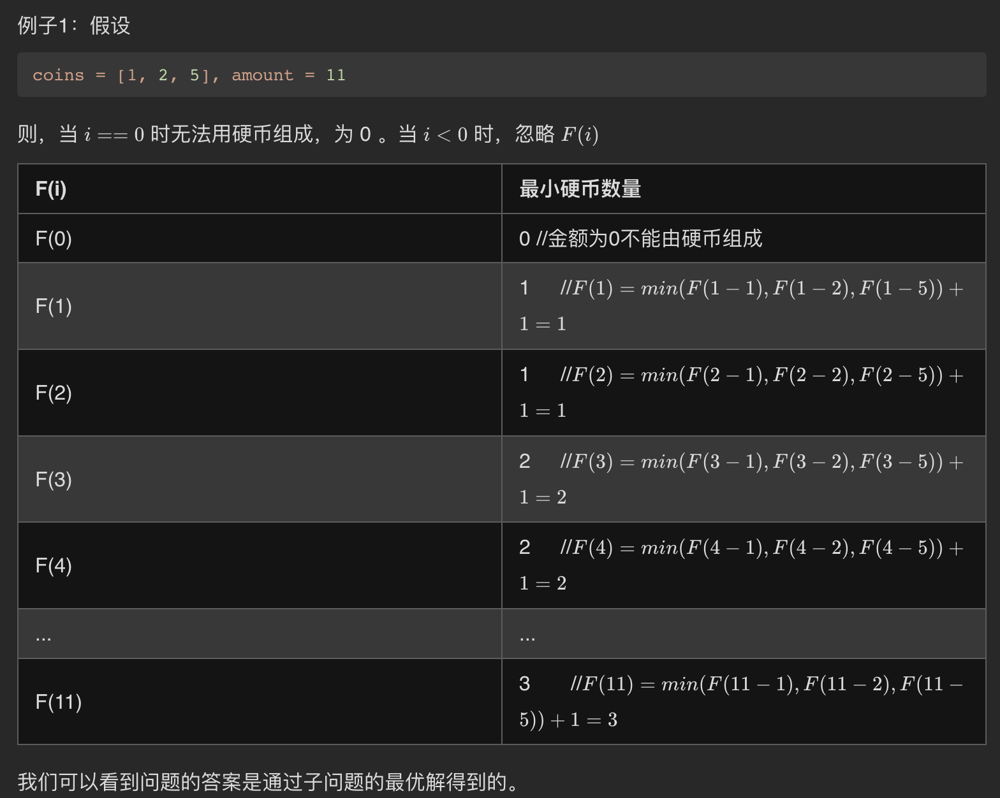

## [零钱兑换](https://leetcode.cn/problems/coin-change/)

* **题目：**

  >给你一个整数数组 coins ，表示不同面额的硬币；以及一个整数 amount ，表示总金额。
  >
  >计算并返回可以凑成总金额所需的 最少的硬币个数 。如果没有任何一种硬币组合能组成总金额，返回 -1 。
  >
  >你可以认为每种硬币的数量是无限的。
  >

* **示例：**

  * **示例1：**

    ```
    输入：coins = [1, 2, 5], amount = 11
    输出：3 
    解释：11 = 5 + 5 + 1
    ```

  * **示例2：**

    ```
    输入：coins = [2], amount = 3
    输出：-1
    ```

  * **示例3：**

    ```
    输入：coins = [1], amount = 0
    输出：0
    ```

  * **提示：**

    * `1 <= coins.length <= 12`
    * `1 <= coins[i] <= 231 - 1`
    * `0 <= amount <= 104`

* **解析：**

  ><br>

* **代码：**

  ```js
  /**
   * @param {number[]} coins
   * @param {number} amount
   * @return {number}
   */
   function coinChange(coins, amount) {
    const dp = new Array(amount + 1).fill(amount + 1);
    dp[0] = 0;
    for (let i = 1; i <= amount; i++) {
      coins.forEach((item, index) => {
        const current = i - item;
        if (current >= 0) {
          dp[i] = Math.min(dp[current] + 1, dp[i]);
        }
      })
    }
    return dp[amount] > amount ? -1 : dp[amount];
  };
  ```


## **[零钱兑换 II](https://leetcode.cn/problems/coin-change-2/)

* **题目：**

  >给你一个整数数组 coins 表示不同面额的硬币，另给一个整数 amount 表示总金额。
  >
  >请你计算并返回可以凑成总金额的硬币组合数。如果任何硬币组合都无法凑出总金额，返回 0 。
  >
  >假设每一种面额的硬币有无限个。 
  >
  >题目数据保证结果符合 32 位带符号整数。
  >

* **示例：**

  * **示例1：**

    ```
    输入：amount = 5, coins = [1, 2, 5]
    输出：4
    解释：有四种方式可以凑成总金额：
    5=5
    5=2+2+1
    5=2+1+1+1
    5=1+1+1+1+1
    ```

  * **示例2：**

    ```
    输入：amount = 3, coins = [2]
    输出：0
    解释：只用面额 2 的硬币不能凑成总金额 3 。
    ```

  * **示例3：**

    ```
    输入：amount = 10, coins = [10] 
    输出：1
    ```

  * **提示：**

    * 1 <= coins.length <= 300
    * 1 <= coins[i] <= 5000
    * coins 中的所有值 互不相同
    * 0 <= amount <= 5000

* **解析：**

  >首先这题是组合问题，不能依据上面的思路来写，如果这样写就和`爬楼梯`是一个解法了！！
  >例如：
  >
  >f( )代表结果，y( )代表由什么构成
  >
  >f(0) = 1;
  >
  >f(1) = y(0 + 1) = 1;
  >
  >f(2) = y(1 + 1) + y(0 + 2) = 1 + 1 = 2;
  >
  >f(3) = y(2 + 1) + y(1 + 2) = 2 + 1 = 3;
  >
  >问题就出现了f(3),y(2 + 1) = 1 + 1 + 1 || 2 + 1, 而y(1 + 2) = 1 + 2,与前的2 + 1重复了。
  >
  >这就出现了排列问题，而不是组合问题。所以不能这样解。
  >
  >而先遍历硬币，从每一种硬币开始动态求解，能解决排序问题，

* **代码：**

  ```js
  /**
   * @param {number} amount
   * @param {number[]} coins
   * @return {number}
   */
  function change(amount, coins) {
    const dp = new Array(amount + 1).fill(0);
    dp[0] = 1;
    for (let i = 0; i < coins.length; i++) {
      /**
      	这里 j 可以从 0 开始，但没有意义，当j < coins[i]的时候，还是需要加个条件判断，所以直接从coins[i]开始，毕竟小于				cons[i]的情况不能由conis[i]组成，探讨也没有意义
      */
      for(let j = coins[i]; j <= amount; j++) {
        dp[j] += dp[j - coins[i]];
      } 
    }
    return dp[amount];
  };
  ```
  
  