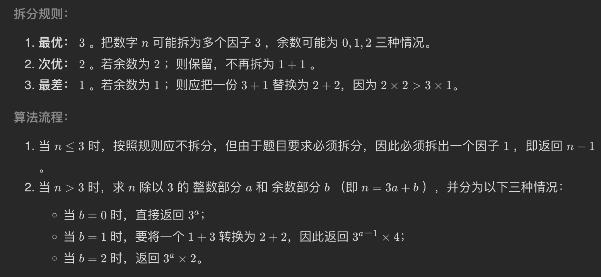

## [整数拆分](https://leetcode.cn/problems/integer-break/)

* **题目：**

  >给定一个正整数 `n` ，将其拆分为 `k` 个 **正整数** 的和（ `k >= 2` ），并使这些整数的乘积最大化。
  >
  >返回 *你可以获得的最大乘积* 。

* **示例：**

  * **示例1：**

    ```
    输入: n = 2
    输出: 1
    解释: 2 = 1 + 1, 1 × 1 = 1。
    ```

  * **示例2：**

    ```
    输入: n = 10
    输出: 36
    解释: 10 = 3 + 3 + 4, 3 × 3 × 4 = 36。
    ```

  * **提示：**

    * `2 <= n <= 58`

* **解析：**

  >[动态规划](https://leetcode.cn/problems/integer-break/solution/zheng-shu-chai-fen-by-leetcode-solution/)
  >
  >

* **代码：**

  ```js
  // 方法一：数学法：尽可能拆分为 3 积最大
  function integerBreak(n) {
      if (n <= 3) return n - 1;
      const a = n / 3 >> 0;
      const b = n % 3;
      if (b === 1) return Math.pow(3, a - 1) * 4
      if (b === 2) return Math.pow(3, a) * 2;
      return Math.pow(3, a);
  };
  
  // 动态规划
  var integerBreak = function(n) {
      let dp = new Array(n + 1).fill(0)
      dp[2] = 1
  
      for (let i = 3; i <= n; i++) {
          for (let j = 1; j < i; j++) {
              dp[i] = Math.max(dp[i], dp[i - j] * j, (i - j) * j)
          }
      }
      return dp[n]
  };
  
  ```

  