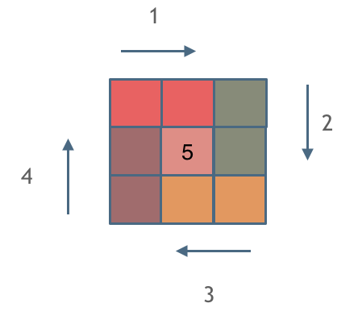

## [螺旋矩阵 II](https://leetcode.cn/problems/spiral-matrix-ii/)

* **题目：**

  >给你一个正整数 `n` ，生成一个包含 `1` 到 `n2` 所有元素，且元素按顺时针顺序螺旋排列的 `n x n` 正方形矩阵 `matrix` 。

* **示例：**

  * **示例1：**

    ```
    输入：n = 3
    输出：[[1,2,3],[8,9,4],[7,6,5]]
    ```

  * **示例2：**

    ```
    输入：n = 1
    输出：[[1]]
    ```

  * **提示：**

    * `1 <= n <= 20`

* **解析：**

  >模拟顺时针画矩阵的过程:
  >
  >- 填充上行从左到右
  >- 填充右列从上到下
  >- 填充下行从右到左
  >- 填充左列从下到上
  >
  >由外向内一圈一圈这么画下去。
  >
  >可以发现这里的边界条件非常多，在一个循环中，如此多的边界条件，如果不按照固定规则来遍历，那就是**一进循环深似海，从此offer是路人**。
  >
  >这里一圈下来，我们要画每四条边，这四条边怎么画，每画一条边都要坚持一致的左闭右开，或者左开右闭的原则，这样这一圈才能按照统一的规则画下来。<br>

* **代码：**

  ```js
  var generateMatrix = function(n) {
      let startX = startY = 0;   // 起始位置
      let loop = Math.floor(n/2);   // 旋转圈数
      let mid = loop;    // 中间位置
      let offset = 1;    // 控制每一层填充元素个数
      let count = 1;     // 更新填充数字
      let res = new Array(n).fill(0).map(() => new Array(n).fill(0));
  
      while (loop--) {
          let row = startX, col = startY;
          // 上行从左到右（左闭右开）
          for (; col < startY + n - offset; col++) {
              res[row][col] = count++;
          }
          // 右列从上到下（左闭右开）
          for (; row < startX + n - offset; row++) {
              res[row][col] = count++;
          }
          // 下行从右到左（左闭右开）
          for (; col > startY; col--) {
              res[row][col] = count++;
          }
          // 左列做下到上（左闭右开）
          for (; row > startX; row--) {
              res[row][col] = count++;
          }
  
          // 更新起始位置
          startX++;
          startY++;
  
          // 更新offset
          offset += 2;
      }
      // 如果n为奇数的话，需要单独给矩阵最中间的位置赋值
      if (n % 2 === 1) {
          res[mid][mid] = count;
      }
      return res;
  };
  ```