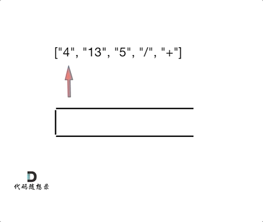

## [逆波兰表达式求值](https://leetcode.cn/problems/evaluate-reverse-polish-notation/)

* **题目：**

  >根据[ 逆波兰表示法](https://baike.baidu.com/item/逆波兰式/128437)，求表达式的值。
  >
  >有效的算符包括 `+`、`-`、`*`、`/` 。每个运算对象可以是整数，也可以是另一个逆波兰表达式。
  >
  >**注意** 两个整数之间的除法只保留整数部分。
  >
  >可以保证给定的逆波兰表达式总是有效的。换句话说，表达式总会得出有效数值且不存在除数为 0 的情况。

* **示例：**

  * **示例1：**

    ```
    输入：tokens = ["2","1","+","3","*"]
    输出：9
    解释：该算式转化为常见的中缀算术表达式为：((2 + 1) * 3) = 9
    ```

  * **示例2：**

    ```
    输入：tokens = ["4","13","5","/","+"]
    输出：6
    解释：该算式转化为常见的中缀算术表达式为：(4 + (13 / 5)) = 6
    ```

  * **示例3：**

    ```
    输入：tokens = ["10","6","9","3","+","-11","*","/","*","17","+","5","+"]
    输出：22
    解释：该算式转化为常见的中缀算术表达式为：
      ((10 * (6 / ((9 + 3) * -11))) + 17) + 5
    = ((10 * (6 / (12 * -11))) + 17) + 5
    = ((10 * (6 / -132)) + 17) + 5
    = ((10 * 0) + 17) + 5
    = (0 + 17) + 5
    = 17 + 5
    = 22
    ```

  * **提示：**

    * `1 <= tokens.length <= 104`
    * `tokens[i]` 是一个算符（`"+"`、`"-"`、`"*"` 或 `"/"`），或是在范围 `[-200, 200]` 内的一个整数

* **解析：**

  >[题解](https://programmercarl.com/0150.%E9%80%86%E6%B3%A2%E5%85%B0%E8%A1%A8%E8%BE%BE%E5%BC%8F%E6%B1%82%E5%80%BC.html#%E9%A2%98%E5%A4%96%E8%AF%9D)<br>
  >
  >表达式如何转逆波兰表达式<br>

* **代码：**

  ```js
  var evalRPN = function(tokens) {
      const map = {
          '+' : (b, a) => a + b,
          '-' : (b, a) => a - b,
          '*' : (b, a) => (a * b) >> 0,
          '/' : (b, a) => (a / b) >> 0,
      }
      const stack = [];
      for (let i = 0; i < tokens.length; i++) {
          if (map.hasOwnProperty(tokens[i])) {
              const res = map[tokens[i]](stack.pop(), stack.pop());
              stack.push(res);
          }else {
              stack.push(Number(tokens[i]));
          }
      }
      return stack.pop();
  };
  ```