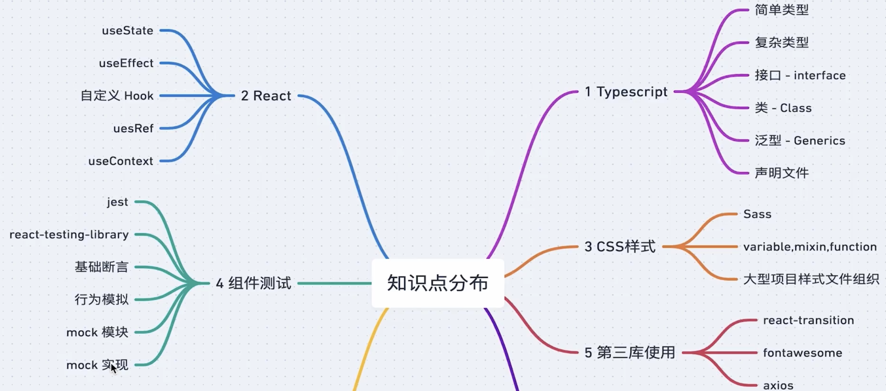
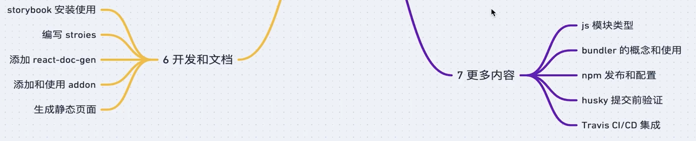
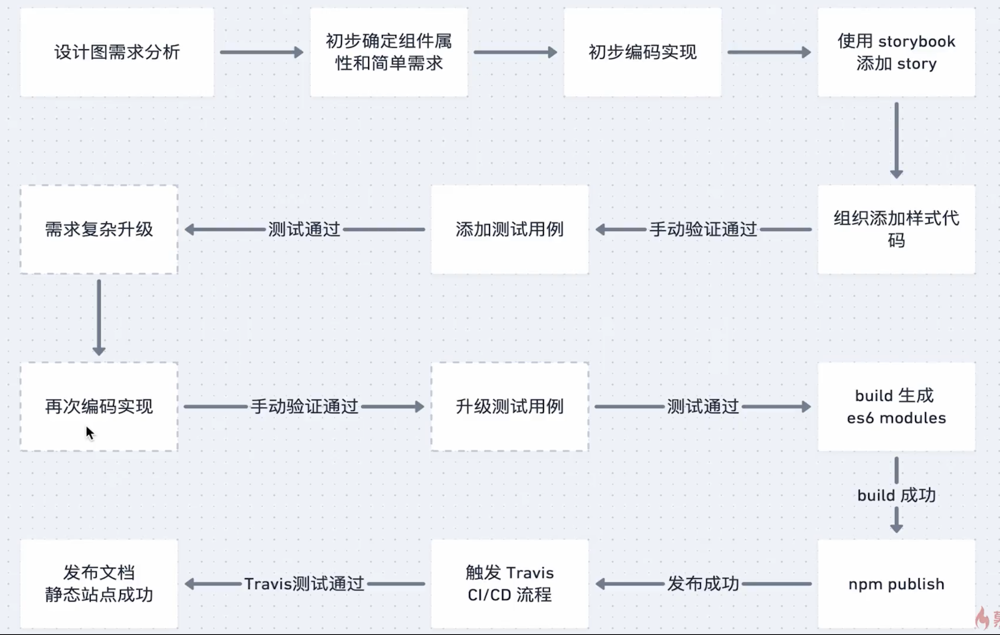
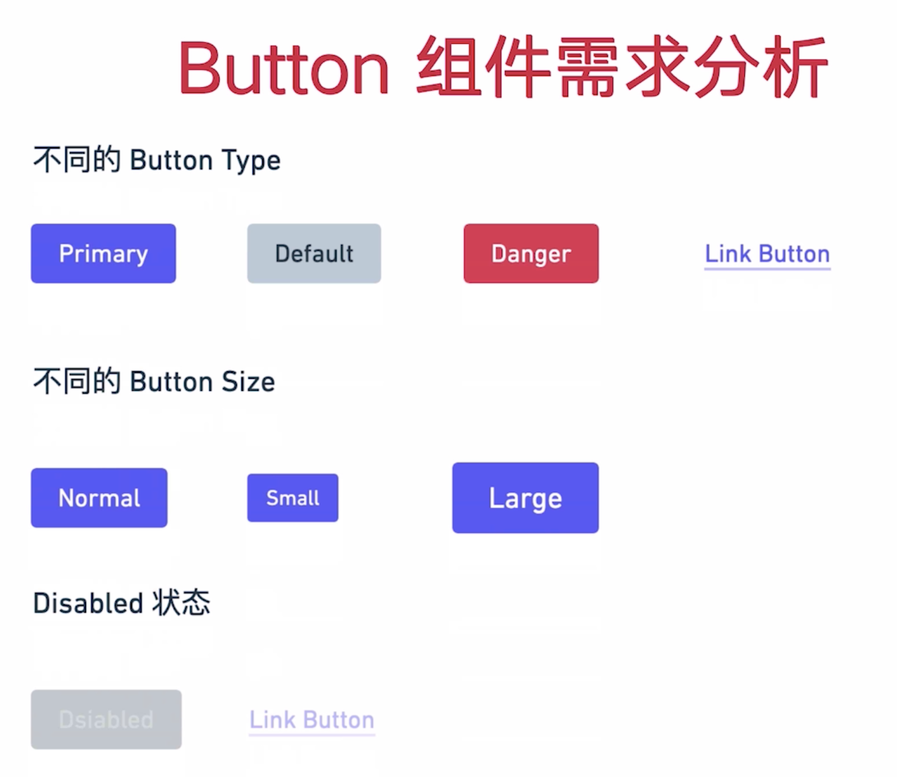

## 01.所需用到的技术

## 02、开发流程

### 03、如何规划文件结构

1. 按模块功能来规划文件结构
2. 按文件类型来规划文件结构

个人比较倾向于第二种文件结构，一般会分为pages`组件`，componets`公共组件`，request`请求`，router`路由`，`assest`公共样式`。

注意：文件结构层级不要过复杂，开始不要想着把文件结构优化特别的完美，最好几分钟规划好，随着项目的搭建，自然而然的回知道如何搭建文件结构。

## 04、主题样式

## 05、需求分析

### 1.button组件

