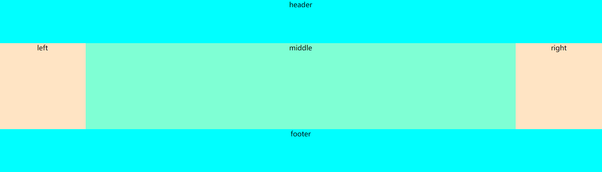
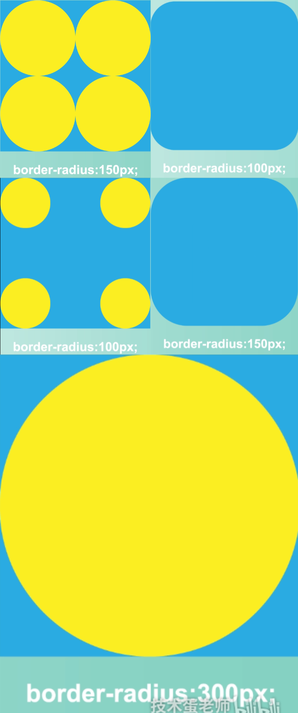
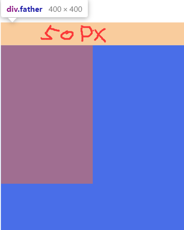
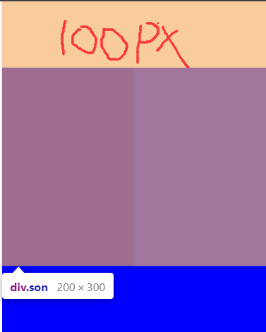
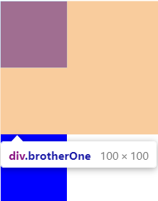
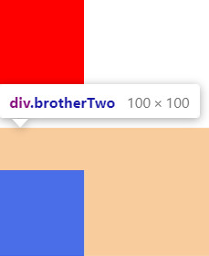

## padding百分比面试相关的题

### 实现大小为父元素宽度一半的正方形

* **利用padding百分比来填充盒子，padding百分比是相对父盒子的宽度**

```html
<style>
      .outer {
        width: 400px;
        height: 600px;
        background: red;
      }

      .inner {
        width: 50%;
        padding-bottom: 50%;/*盒子的高度会被填充为父盒子宽度的50%*/
        background: blue;
      }
</style>

  <body>
    <div class="outer">
      <div class="inner"></div>
    </div>
  </body>
```

### 实现自适应正方形、等宽高比矩形

```html
<style>
  .box {
    /* with为body的25%，高度置为0，通过padding来填充高度 */
    padding-top: 25%;
    width: 25%;
    height: 0;
    background: #ccc;
  }
</style>

<body>
  <div class="box">
  </div>
</body>
```

---

## 圣杯布局，双飞翼布局

* 要求：
  * 三个父盒子，header，content，footer，content中有三个子盒子left，mian，right
  * 三个父盒子header，content，footer的宽度为整个浏览器的宽度
  * 三个子盒子中，left和right的宽度是固定的，而middle的内容的宽度是自适应占满中间位置的。
  * 

### 圣杯布局

通过给content盒子设置左右内边距，让left与right盒子通过margin负值和相对定位来填充左右边距，而mian为100%。实现左右固定，中间自适应

```html
<style>
  .header, .footer {
    height: 100px;
    background: aqua;
  }
    
  .content {
    padding: 0 200px;
    overflow: hidden;
  }
    
  .left, .middle, .right {
    float: left;
  }
    
  .left, .right {
    width: 200px;
    height: 200px;
    background-color: bisque;
  }
    
  .left {
    position: relative;
    margin-left: -100%;
    right: 200px;
  }
    
  .right {
    position: relative;
    margin-left: -200px;
    right: -200px;
  }
    
  .middle {
    width: 100%;
    height: 200px;
    background-color: aquamarine;
  }
</style>

<body>
  <div class="header">header</div>
  <div class="content">
    <div class="middle">middle</div>
    <div class="left">left</div>
    <div class="right">right</div>
  </div>
  <div class="footer">footer</div>
</body>
```

### 双飞翼布局

不给content盒子设置左右内边距，直接让middle盒子100%填充整行，然后让left与right通过magrin负值覆盖掉middle左右，实现固定大小

```html
<style>
  * {
    margin: 0;
    padding: 0;
    text-align: center;
  }
    
  .wrap {
    min-width: 600px;
  }
    
  #header, #footer {
    height: 50px;
    background: grey;
  }
    
  #left, #right {
    width: 200px;
    height: 200px;
    background: green;
  }
    
  #middle {
    float: left;
    width: 100%;
    height: 200px;
    background: pink;
  }
    
  #content {
    overflow: hidden;
  }
    
  #left {
    float: left;
    margin-left: -100%;
  }
    
  #right {
    float: left;
    margin-left: -200px;
  }
</style>

<body>
  <div class="wrap">
    <div id="header">header</div>
    <div id="content">
      <div id="middle">middle
      </div>
      <div id="left">left</div>
      <div id="right">right</div>
    </div>
    <div id="footer">footer</div>
  </div>
</body>
```


## 等高布局

### 1.margin与padding结合解决，无兼容性问题

```html
  <style>
    /* 
      父盒子高度不给定，通过子盒子的高度来撑开父盒子的高度
      每个子盒子都设padding-bottom: 9999px;margin-bottom: -9999px;
      这样每个子盒子外边距距离底边的高度还是原来的高度，即父盒子也是原来的高度
      唯一的区别就是每个子盒子的背景延伸为9999px(9999px足够用了)，
      消除父盒子外边的多余部分即可实现子盒子显示的高度相同。
    */
    .Article {
      overflow: hidden;
    }

    .Article>li {
      float: left;
      padding-bottom: 9999px;
      margin: 0 10px -9999px 0;
      list-style: none;
      width: 200px;
      background: #4577dc;
      color: #fff;
    }

    .Article>li>p {
      padding: 10px;
    }
  </style>

<body>
  <ul class="Article">
    <li>
      <p>
        一家将客户利益置于首位的经纪商，
        为客户提供专业的交易工具一家将客户利益置于首位的经纪商，
        为客户提供专业的交易工具一家将客户利益置于首位的经纪商，
        为客户提供专业的交易工具一家将客户利益置于首位的经纪商，为客户提供专业的交易工具
      </p>
    </li>
    <li>
      <p>一家将客户利益置于首位的经纪商，为客户提供专业的交易工具
        一家将客户利益置于首位的经纪商，为客户提供专业的交易工具</p>
    </li>
    <li>
      <p>一家将客户利益置于首位的经纪商</p>
    </li>
  </ul>
</body>
```

## 水平居中相关的问题

### 文字水平居中text-align: center;

```html
  <style>
    /* 
    块级元素使用text-align: center;可以使文字居中
    但行内元素或者行类块使用text-align: center;不能使文字居中
    可以给父级添加text-align: center;或者改变为block模式，使子元素文字居中
    */
      
    /* body {
      text-align: center;
    } */

    h1 {
      text-align: center;
    }

    p {
      text-align: center;
    }

    span {
      /* 并没有生效 */
      display: inline-block;
      text-align: center;
    }
  </style>

<body>
  <h1>h1</h1>
  <p>p</p>
  <span>span</span>
</body>
```

### margin: 0 auto实现盒子水平居中

**`margin: 0 auto;`只能让块级盒子水平居中，不能让行类元素或行类块元素水平居中**

### 浮动元素实现居中

```html
<style>
  .float {
    float: left;
    position: absolute;
    left: 50%;
    transform: translateX(-50%);
    height: 100px;
    width: 100px;
    background: orangered;
  }
</style>

<body>
  <span class="float">浮动</span>
</body>
```

## 垂直居中

1. 利用 `line-height` 实现居中，这种方法适合纯文字类
3. 弹性布局 flex :父级设置display: flex; 子级设置`align-items:center`
4. 父级设置相对定位，子级设置绝对定位，并且通过位移 transform 实现
5. `table 布局`，父级通过转换成表格形式，`然后子级设置 vertical-align 实现`。（需要注意的是：vertical-align: middle使用的前提条件是内联元素以及display值为table-cell的元素）。

## 实现三角形

```html
 <style>
    /* 四个100px边框设置为不同的颜色，结果四个边框显示为三角形 */
    .one {
      width: 0;
      height: 0;
      border-top: 100px solid green;
      border-right: 100px solid blue;
      border-left: 100px solid orange;
      border-bottom: 100px solid red;
    }

    /* 依据上面的影藏掉三个边框只显示一个，就那么是三角形了 */
    .two {
      width: 0;
      height: 0;
      border: 100px solid transparent;
      border-bottom-color: red;
    }

  </style>

<body>
  <div class="one"></div>
  <div class="two"></div>
</body>
```

## 实现圆形

**`border-radius`原理**

* 下面三个都是长宽高为600px的正方形
* 下面使用px为单位的半径<br>
* **还可以设置百分比，10%即为正方形宽度的10%,如果要设置为圆形即设置为50%**
* **如果设置的半径长度大于了正方形的一半圆形就已经超出正方形了，css不会做出超出正方形的处理，还是会按照圆形设置。**


## 溢出文字省略号显示

### 单行文本

1. **首先设置宽度**
2. **再强制一行内显示文本`white-space:nowarp`**
3. **超出的部分隐藏`overflow: hidden;`**
4. **文字用省略号替代超出的部分`text-overflow: ellipsis;`**

* **white-space**
  * white-space设或检索对象内文本显示方式。通常我们使用于强制一行显示内容
  * `white-space:nomal `:默认处理方式
  * `white-space:nowrap `: 强制在同一行内显示所有文本，直到文本结束或者语遇br标签才换行。
* **text-overflow**文字溢出
  * 设置或检素是否使用个省略标记(..)标示对象内文本的溢出
  * `text-overflow：clip ;`不显示省略标记(...)，而是简单的裁切
  * `text-overflow：ellipsis ;`当对象内文本灌出时显示省略标记 (...)

**注意:一定要首先强制一行内显示，再和overflow属性搭配使用**

### 两行或者三行文本

关于-webkit-box的解析：https://blog.csdn.net/weixin_50948265/article/details/115308116?ops_request_misc=%257B%2522request%255Fid%2522%253A%2522165804666116781685339954%2522%252C%2522scm%2522%253A%252220140713.130102334.pc%255Fall.%2522%257D&request_id=165804666116781685339954&biz_id=0&utm_medium=distribute.pc_search_result.none-task-blog-2~all~first_rank_ecpm_v1~rank_v31_ecpm-2-115308116-null-null.142^v32^new_blog_fixed_pos,185^v2^control&utm_term=display%3A%20-webkit-box%3B&spm=1018.2226.3001.4187

```html
<style>
  p {
    width: 200px;
    /*私有属性：-webkit 代表Chrome私有属性*/
    display: -webkit-box;
    -webkit-box-orient: vertical;/*将子元素从上往下排列，在此时未设置子元素的宽度的时候，子元素默认和父元素一样宽，会直接无视父元素的高度*/
    -webkit-line-clamp: 2; /* 这里是超出几行省略，如果是3行就填写3 */
    word-break: break-all; /* 可以让浏览器实现在任意位置的换行，允许在单词内换行 */
    overflow: hidden;
  }
</style>
<body>
  <p>
    JavaScript ( JS ) 是一种具有函数优先的轻量级，解释型或即时编译型的编程语言。虽然它是作为开发 Web 页面的脚本语言而出名的，但是它也被用到了很多非浏览器环境中，例如 Node.js、 Apache CouchDB 和 Adobe Acrobat。JavaScript 是一种基于原型编程、多范式的动态脚本语言，并且支持面向对象、命令式和声明式（如函数式编程）风格。了解更多 JavaScript。
  </p>
</body>

```


### 多行文本

>经过项目实战使用该方法并是不全部通用。因产品可能会没有左内边距留着给你填省略号，那么省略号就需要覆盖掉原来的文字来实现，而你偏移`right`多少是固定的，就意味着覆盖的大小是固定的，由于文字之间可能有标点符号，也能有英文和数字，就会导致并不会全部覆盖掉所有文字，可能只覆盖了一半。

```html
  <style>
    .textBox {
      position: relative;
      padding-right: 1rem;
      overflow: hidden;
      height: 135px;
      width: 400px;
      background-color: aquamarine;
    }

    /* 先使用一个伪元素固定定位显示... */
    .textBox::before {
      position: absolute;
      content: "....";
      right: 0;
      bottom: 0;
    }

    /* 再用一个颜色与父元素相同伪元素在文字没超过盒子时覆盖掉... */
    .textBox::after {
      position: absolute;
      margin-top: 0.5rem;
      right: 0;
      content: "";
      height: 1rem;
      width: 1rem;
      background-color: aquamarine;
    }
  </style>

<body>
  <div class="textBox">
    这是她自己获得的首个冬奥会奖牌！这也是中国运动员第一次参加冬奥会大跳台的比赛！
    不过，这里有件事大家可能不知道：今天拿了冠军的谷爱凌，昨夜还在怼美媒！
    事情是这样的：北京时间2月7日晚，美国媒体“Insider”在社交媒体平台Instagram上，
    发布了一张中国花样滑冰女运动员朱易泪洒北京冬奥会赛场的照片，并配上了这样的一段文字：
    “在冬奥赛场摔倒后，放弃美籍而代表中国参赛的朱易正遭受着来自中国社交媒体用户的攻击。”
  </div>
</body>
```


## 隐藏盒子的方法

1. `display:none;`隐藏盒子，而且不占位置。`display:block;`显示盒子
2. `visibility:hidden;`隐藏盒子，但占位置。`visibility:visible;`显示盒子
3. `opacity:0;`设置透明度为0
4. 使用(相对/绝对)定位使盒子移除显示范围

## 清除浮动

https://segmentfault.com/a/1190000004865198

1. **额外标签法(隔墙法)**

   1. 通过在浮动元素末尾添加一个空的标签例如`<div style="clear :both"></div>`,或则其他标签`br`等亦可

2. **邻接元素处理**

   1. 给浮动元素后面的元素添加clear属性。

3. **父级添加overflow属性方法**

   1. 可以给父级添加: overflow为 hidden/ auto/ scroll 都可以实现。

4. **给父元素添加浮动**

5. **使用after伪元素清除浮动，本质也是添加clear：both**

   1. ```css
      .clearfix::after { 
          content: " "; 
          display: block; 
          height: 0; 
          clear: both; 
          visibilty: hidden; 
      }
      ```

---

## margin负值

* `margin-top` 元素自身会向上移动，同时会影响下方的元素会向上移动；
* `margin-botom` 元素自身不会位移，但是会减少自身供css读取的高度，从而影响下方的元素会向上移动。
* `margin-left` 元素自身会向左移动，同时会影响其它元素；
* `margin-right` 元素自身不会位移，但是会减少自身供css读取的宽度，从而影响右侧的元素会向左移动；

---

## 外边距塌陷/合并

**首先声明：外边距塌陷是故意这样设计的，初始是为了解决段落之间的空隙。只有块级元素才会发生**

**外边距塌陷(针对父子嵌套盒子来说的)，外边距合并(针对兄弟盒子来说的），是指两个在正常流中相邻（兄弟或父子关系）的块级元素的外边距，组合在一起变成单个外边距，不过只有上下外边距才会有塌陷，左右外边距不会出现这种问题。**

* **当外边距塌陷时，外边距之间的计算方式是怎样的？**
  * 1.两个都是正数，取较大的值
  * 2.两个都是负数，取绝对值较大的值
  * 3.一正一负，取两个值得和

### **父子关系的外边距塌陷**

```html
<style>
    .son {
      width: 200px;
      height: 300px;
      margin-top: 100px;
      background: red;
    }
	/* father距离body的外边距是100px,而不是50，外边距合并了，取最大的那个外边距 */
    .father {
      width: 400px;
      height: 400px;
      margin-top: 50px;
      background: blue;
    }
</style>

<body>
  <div class="father">
    <div class="son"></div>
  </div>
</body>
```

父元素外边距，子元素外边距<br>、


### **兄弟关系的外边距合并**

````html
<style>
  .brotherOne {
    width: 100px;
    height: 100px;
    margin-bottom: 100px;
    background: red;
  }
  /*两个盒子的距离为100px，合并最大的那个*/
  .brotherTwo {
    width: 100px;
    height: 100px;
    margin-top: 50px;
    background: blue;
  }
</style>

<body>
  <div class="brotherOne"></div>
  <div class="brotherTwo"></div>
</body>
````

!

### 解决margin塌陷的问题

通过触发`BFC`来解决！那是什么是`BFC`呢？


## 实现BFC的方法

`BFC` 全称：`Block Formatting Context`， 名为 "块级格式化上下文"。

`W3C`官方解释为：`BFC`它决定了元素如何对其内容进行定位，以及与其它元素的关系和相互作用，当涉及到可视化布局时，`Block Formatting Context`提供了一个环境，`HTML`在这个环境中按照一定的规则进行布局。

简单来说就是，**`BFC`是一个完全独立的空间（布局环境），让空间里的子元素不会影响到外面的布局。那么怎么使用`BFC`呢，`BFC`可以看做是一个`CSS`元素属性**

* `BFC`就是一个块级元素，块级元素会在垂直方向一个接一个的排列
* `BFC`就是页面中的一个隔离的独立容器，容器里的标签不会影响到外部标签
* 垂直方向的距离由margin决定， 属于同一个`BFC`的两个相邻的标签外边距会发生重叠
* 计算`BFC`的高度时，浮动元素也参与计算

**触发BFC**

1. `position:absolute或者fixed`

2. `float:left/right`

3. `overflow:不是visible`

4. `disply:inline-block或者flex`

   