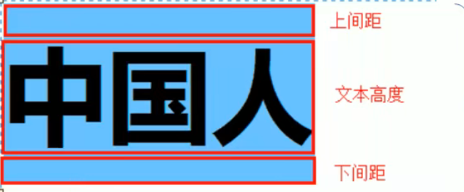
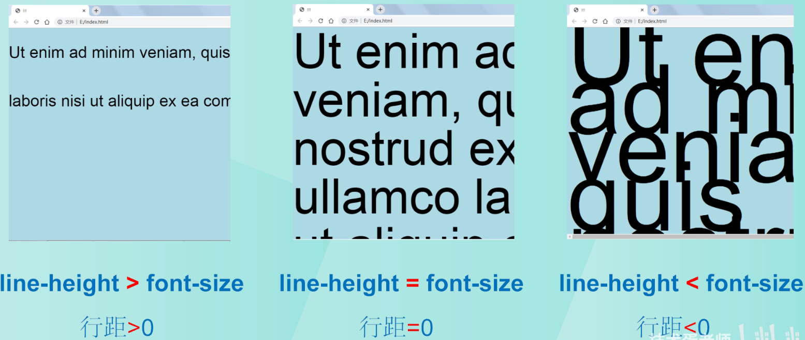
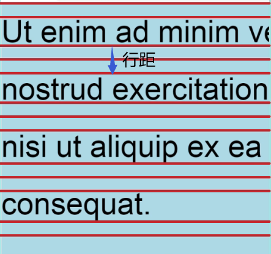
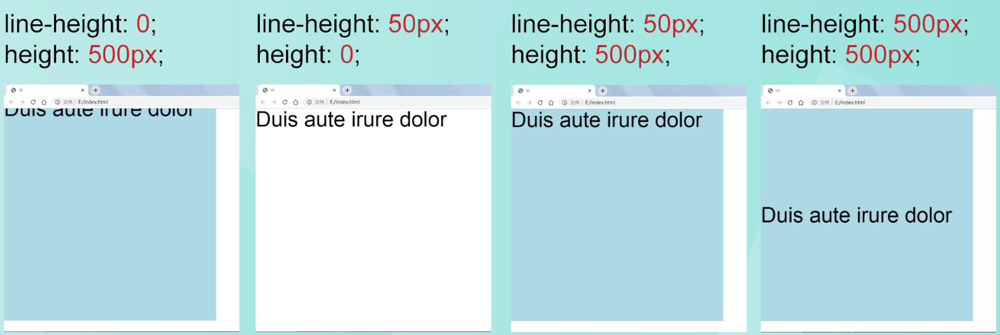
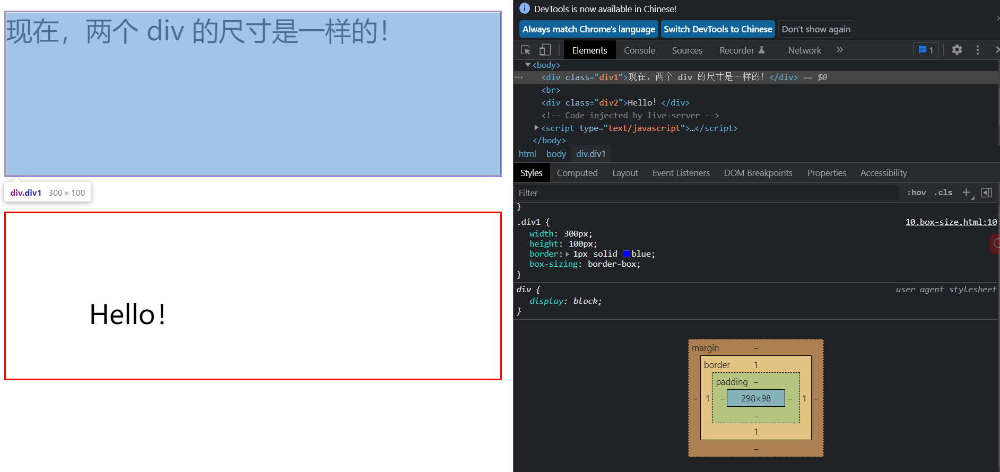
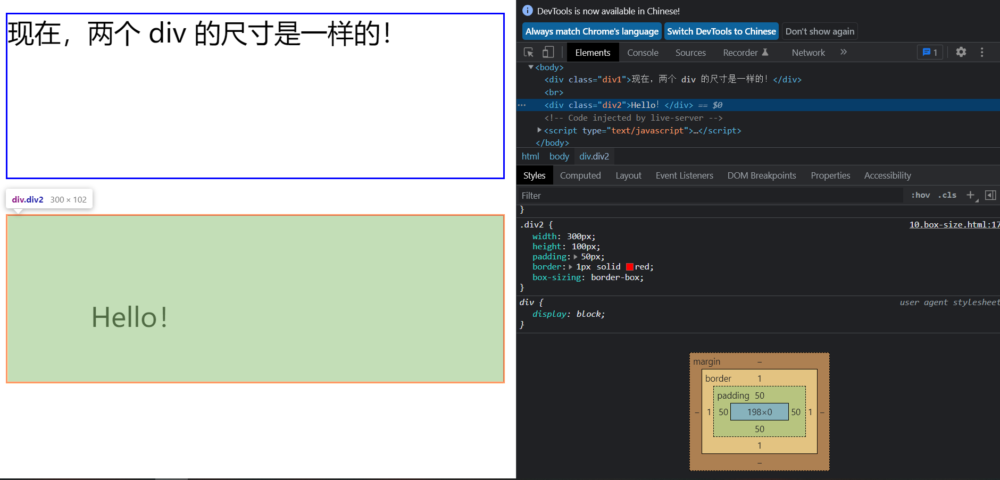

## CSS书写顺序

1. **布局定位属性**:display / position / float / clear / visibility / overflow(建议 display第一个写，毕竟关系到模式)
2. **自身属性**: width / height / margin / padding / border / background
3. **文本属性**:color / font / text-decoration / text-align / vertical-align / white- space / break-word
4. **其他属性**(CSS3 ) : content / cursor / border-radius / box-shadow / text-shadow / background:linear-gradient...

---


## 并集选择器

* 当有两个同类的标签需要显示相同的样式，可以使用并集选择器

  ```html
  <style>
      /*选择器之间用逗号隔开*/
  	.top,
  	.bottom {
    		color: aqua;
  	}
  </style>
  
  <body>
    <div>
      <div class="top">和下面一样颜色</div>
      <div class="bottom">和上面一样颜色</div>
    </div>
  </body>
  ```

---


## 伪类选择器

* `a:link `选择所有未访问的链接
* `a:visited` 选择所有已访问的链接
* `a:hover` 当鼠标移动到标签上变化样式
* `a:active` 选定的链接(鼠标按下但还没有弹起的时候
* `input:focus`伪类选择器用于选取获得焦点(光标)的表单元素,一般情况<input>类表单元素才能获取，因此这个选择器也主要针对于表单元素来说。

---


## padding的百分比设定

padding的值可以设置为数值，当然也可以设置为百分比值，但是不允许设置为负值。
**当值为百分比值时：无论是宽度还是高度，都以父级对象的width作为参考基准（基于高度自适应的特性）。**

---

## line-height

`line-height`行间距代表文字上边距+下边距+文本高度<br>

line-height与font-size的各种情况的比较<br>

### 行距

**行距：**两行文字之间的差距，即line-height与font-size之差<br>

**对于多行元素，line-height大小就是每行元素基线之间的长度**

### line-height的赋值方式

**注：line-height具有继承性**

1. **数字方式：**当父元素设置了`line-height:2;`子元素都会继承该属性，子元素实际的line-height长度就为**font-size * line-height**
2. **长度单位方式：**若父元素设置了`line-height:20px`，那么子元素都会为`line-height:20px`，不会参照子元素字体大小
3. **百分比方式：**若父元素设置了`line-height:80%`,则实际的行高就为**font-size * line-height**，子元素就为父元素的line-height，不会参照自己的font-size

**总结：只有父元素设置数字的方式，子元素才会根据的font-size大小来定义line-height大小，其他两种情况是直接继承父元素**

### line-height与height的关系

**当容器高度正好等于行高时，文字正好垂直居中，这个很好理解**



5. 

---


## 鼠标经过某个标签，另一个标签发送变化

```html
<style>
/*当经过btn，color会改变颜色，中间用+隔开*/
#btn:hover + #color { /*element+element选择器用于选取第一个指定的元素之后（不是内部）紧跟的元素。*/
  color: red;
}   
/*鼠标经过box第三个span显示，离开则隐藏*/
.box:hover .three{
  visibility:visible;
}
.three{
  visibility:hidden;
}
</style>

<body>
  <div>
    <button id='btn'>经过</button>
    <span id="color">变色</span>
  </div>
  <div class="box">
    <span>1</span>  
    <span>2</span>  
    <span calss="three">3</span>  
    </div>
</body>
```

---


## 物理像素，CSS像素，视口

* **物理像素**
  * 如屏幕显示由1080*1920，那物理像素就是1080**1920个小方块的数量来显示屏幕。
* **CSS像素**
  * 在编写网页是都是使用CSS像素，游览器在显示网页时会将CSS像素转化为物理像素显示
  * 而一个CSS像素对应几个物理像素是由浏览器决定的，默认情况100%窗口下一个CSS像素对应一个物理像素
* **视口**
  * 视口是显示网页的区域的大小
  * 可以通过查看视口大小来计算出CSS像素与物理像素的比值
  * 电脑100%缩放情况下
    * 视口宽度1920px(忽略高度，因为高度是自适应的)
    * 物理像素1920px
    * 那么此时CSS像素与物理像素就是1:1关系
  * 将游览器放大200%
    * 视口宽度960px
    * 物理像素1920px
    * CSS像素：物理像素 = 1 ：2
  * 由于浏览器显示的内容就是视口的内容，所以当css像素超过视口宽度大小时只会显示视口宽度大小的CSS像素。

---

## rem与em

> em大小是相对于父元素字体大小来的，而rem是相对于html根元素来决定的
>
> 一般用rem做屏幕大小缩放问题，根据媒体查询来动态设置html字体大小，使用rem元素的标签都会随着html字体大小变化而发送变化

* **rem**:

  ```html
  <style>
    html{
      font-size: 12px;
    }
    
    .father {
      font-size: 14px;
    }
  
    .em {
      height: 10em; // 140px
      width: 10em; // 140px
      background-color: aqua;
    }
  
    .rem {
      height: 10rem; // 120px
      width: 10rem; // 120px
      background-color: blueviolet;
    }
  </style>
  
  <body>
    <div class="father">
      <div class="em">em</div>
      <div class="rem">rem</div>
    </div>
  </body>
  ```

  

## mate视口标签

在移动端中，视口大小默认一般为960px，而想iphone6/7/8这样的手机像素为375像素，那么一个CSS像素对应的就为0.39物理像素。
这样画面的显示就会太小，而mate视口标签就可以解决这个问题，将自适应设备的物理像素，使视口像素为物理像素

`  <meta name="viewport" content="width=device-width, initial-scale=1.0">`

|     属性      |                       解释说明                       |
| :-----------: | :--------------------------------------------------: |
|     width     | 宽度设置的是viewport宽度，可以设置device-width特殊值 |
| initial-scale |               初始缩放比，大于0的数字                |
| maximum-scale |               最大缩放比，大于0的数字                |
| minimum-scale |               最小缩放比，大于0的数字                |
| user-scalable |          用户是否可以缩放，yes或no ( 1或0)           |

---


## box-sizing 属性

* 属性：
  * content-box （默认值）
  * border-box

* `content-box`默认情况下，元素的宽度和高度是这样计算的：
  * width + padding + border = 元素的实际宽度
  * height + padding + border = 元素的实际高度

**`box-sizing `**属性解决了这个问题。**box-sizing 属性允许我们在元素的总宽度和高度中包括内边距和边框。如果在元素上设置了 box-sizing: border-box; 则宽度和高度会包括内边距和边框：**

```html
<style>
    .div1 {
      width: 300px;
      height: 100px;
      border: 1px solid blue;
      box-sizing: border-box;
    }

    .div2 {
      width: 300px;
      height: 100px;
      padding: 50px;
      border: 1px solid red;
      box-sizing: border-box;
    }
  </style>

<body>
  <div class="div1">现在，两个 div 的尺寸是一样的！</div>
  <br>
  <div class="div2">Hello！</div>
</body>
```

* div1

  

* div2

---


## 置换元素

* **什么是置换元素**
  * “置换元素”又叫做“替换元素”，它们所具有的特征为：在不使用[css](https://so.csdn.net/so/search?q=css&spm=1001.2101.3001.7020)修饰时，元素的标签和属性也会影响元素的显示。
  * 比如`` 标签，浏览器会根据src属性读取图片并显示，且图片大小会影响``标签大小。
  * 再比如，input标签的type属性会影响input的显示是输入还是选择。  
* **置换元素的定义：**
  * 一个**内容**不受CSS视觉格式化[模型](https://so.csdn.net/so/search?q=模型&spm=1001.2101.3001.7020)控制，CSS渲染模型并不考虑对此内容的渲染，且元素本身一般拥有固有尺寸（宽度，高度，宽高比）的元素，被称之为置换元素。
* **常见的置换元素**`img、input、textarea、select、object、iframe、canvas`**

